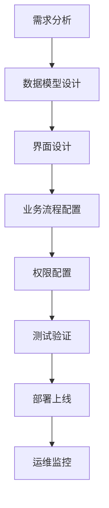
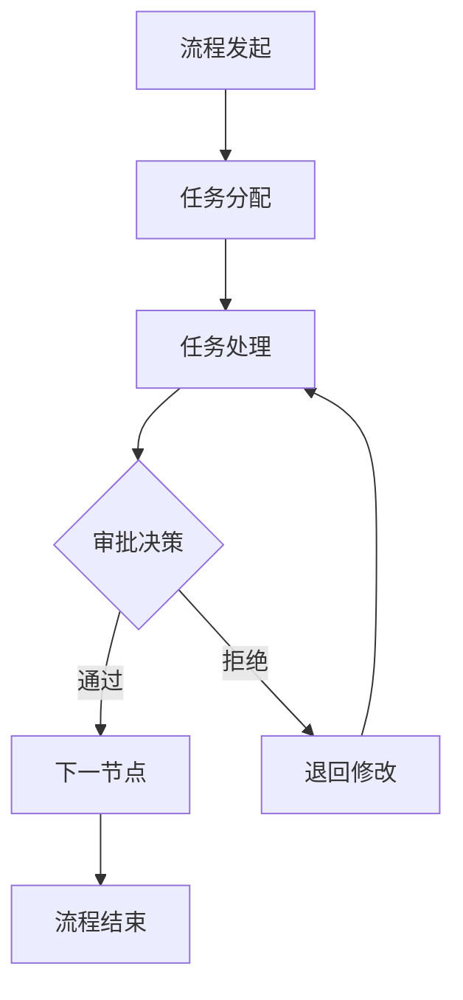
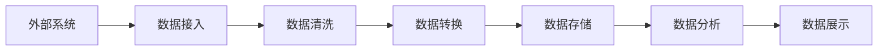

# APaaS平台产品需求文档

## 文档信息

- **文档名称**：APaaS平台产品需求文档
- **文档版本**：V2.0
- **文档状态**：草稿
- **编写人员**：产品团队
- **编写日期**：2025-04-05
- **审核人员**：技术团队、业务团队

## 版本历史

| 版本号 | 修改内容 | 修改人 | 修改日期 | 审核人 |
|--------|----------|--------|----------|--------|
| V1.0 | 初始版本 | 产品团队 | 2024-12-01 | 技术团队 |
| V2.0 | 全面优化完善，增加技术架构设计、接口设计规范、安全设计规范、部署与运维、性能优化与故障恢复等章节 | 产品团队 | 2025-04-05 | 技术团队 |

## 文档目录

1. [产品概述](#1-产品概述)
2. [业务需求分析](#2-业务需求分析)
3. [核心功能模块](#3-核心功能模块)
4. [核心数据模型](#4-核心数据模型)
5. [技术架构设计](#5-技术架构设计)
6. [接口设计规范](#6-接口设计规范)
7. [安全设计规范](#7-安全设计规范)
8. [部署与运维](#8-部署与运维)
9. [性能优化与故障恢复](#9-性能优化与故障恢复)
10. [多语言与国际化](#10-多语言与国际化)
11. [附录](#11-附录)

## 1. 产品概述

### 1.1 产品愿景

构建业界领先的企业级APaaS平台，通过低代码/无代码技术赋能企业数字化转型，实现业务应用的快速构建、智能运行和高效管理。

### 1.2 产品定位

APaaS（Application Platform as a Service）平台是一个面向企业级应用开发、运行和管理的综合性云平台，旨在为企业提供：

- **应用开发平台**：支持低代码/无代码应用开发，降低技术门槛
- **业务流程引擎**：提供完整的BPMN流程引擎，实现业务流程自动化
- **数据集成中心**：统一数据接入、处理和治理能力
- **智能决策支持**：集成AI能力，提供智能化业务辅助
- **运维管理平台**：全方位的应用监控、管理和运维支持

### 1.3 核心价值主张

| 价值维度 | 具体价值点 | 目标用户 |
|---------|-----------|---------|
| **开发效率** | 降低开发成本70%，缩短应用上线周期60% | 开发团队、业务人员 |
| **运营效率** | 提升业务流程效率50%，减少人工干预80% | 业务运营人员 |
| **数据价值** | 实现数据统一治理，提升数据利用率300% | 数据分析师、管理者 |
| **智能化水平** | 集成AI能力，提升决策准确性40% | 决策层、业务人员 |

### 1.4 目标用户画像

#### 1.4.1 系统管理员
- **角色描述**：负责平台的整体管理和维护
- **核心需求**：系统稳定性、安全性、可扩展性
- **使用场景**：系统配置、用户管理、权限分配、监控告警

#### 1.4.2 租户管理员
- **角色描述**：企业内部的平台管理员
- **核心需求**：组织管理、用户权限、业务流程配置
- **使用场景**：部门管理、用户授权、流程模板配置

#### 1.4.3 普通用户
- **角色描述**：平台的实际使用者
- **核心需求**：操作便捷性、功能完整性、响应速度
- **使用场景**：流程审批、数据查询、报表查看

#### 1.4.4 开发人员
- **角色描述**：基于平台进行应用开发的工程师
- **核心需求**：开发效率、代码质量、调试便利性
- **使用场景**：模型设计、代码生成、API开发

### 1.5 业务场景分析

#### 1.5.1 企业内部管理系统构建
- **场景描述**：快速构建HR、财务、采购等内部管理系统
- **核心需求**：表单设计、流程配置、权限控制、数据报表
- **价值体现**：降低开发成本，提升系统一致性

#### 1.5.2 业务流程数字化
- **场景描述**：将线下业务流程迁移到线上，实现自动化
- **核心需求**：流程设计、任务分配、审批流转、状态跟踪
- **价值体现**：提升流程效率，减少人工错误

#### 1.5.3 数据整合与分析
- **场景描述**：整合多系统数据，提供统一的数据视图和分析
- **核心需求**：数据接入、清洗转换、可视化分析、智能洞察
- **价值体现**：数据驱动决策，发现业务机会

#### 1.5.4 智能化业务辅助
- **场景描述**：通过AI技术辅助业务决策和操作
- **核心需求**：智能推荐、自动分类、预测分析、自然语言交互
- **价值体现**：提升决策质量，降低操作复杂度

## 2. 业务需求分析

### 2.1 业务目标与指标

#### 2.1.1 核心业务目标

| 业务目标 | 具体指标 | 衡量标准 | 优先级 |
|---------|---------|---------|--------|
| **提升开发效率** | 应用开发周期缩短60% | 从需求到上线时间 | P0 |
| **降低开发成本** | 开发成本降低70% | 人力投入、工具成本 | P0 |
| **提高运营效率** | 业务流程效率提升50% | 流程处理时间、人工干预率 | P1 |
| **数据价值挖掘** | 数据利用率提升300% | 数据查询频率、分析报告数量 | P1 |
| **智能化水平** | 智能决策准确率提升40% | AI推荐采纳率、预测准确率 | P2 |

#### 2.1.2 关键绩效指标(KPI)

**开发效率指标**
- 应用平均开发周期：目标≤2周
- 代码复用率：目标≥80%
- 低代码组件覆盖率：目标≥90%

**运营效率指标**
- 流程平均处理时间：目标≤1小时
- 人工干预率：目标≤10%
- 系统可用性：目标≥99.9%

**数据价值指标**
- 数据查询响应时间：目标≤3秒
- 报表生成效率：目标≤30秒
- 数据质量评分：目标≥95分

### 2.2 用户故事分析

#### 2.2.1 系统管理员用户故事

**故事1：多租户系统管理**
- **作为** 系统管理员
- **我希望** 能够管理多个租户的系统配置
- **以便** 确保不同企业的数据隔离和系统稳定性
- **验收标准**：
  - 支持创建、修改、删除租户
  - 每个租户有独立的数据库schema
  - 支持租户级别的资源配额管理
  - 提供租户使用情况监控

**故事2：系统监控与告警**
- **作为** 系统管理员
- **我希望** 实时监控系统运行状态
- **以便** 及时发现和处理系统异常
- **验收标准**：
  - 提供CPU、内存、磁盘使用率监控
  - 支持服务健康状态检查
  - 配置告警规则和通知渠道
  - 提供历史性能数据分析

#### 2.2.2 租户管理员用户故事

**故事3：组织架构管理**
- **作为** 租户管理员
- **我希望** 管理企业的组织架构
- **以便** 实现精细化的权限控制
- **验收标准**：
  - 支持多级部门结构
  - 支持岗位和角色定义
  - 提供用户批量导入功能
  - 支持组织架构变更历史

**故事4：业务流程配置**
- **作为** 租户管理员
- **我希望** 配置业务流程模板
- **以便** 快速部署标准业务流程
- **验收标准**：
  - 支持BPMN 2.0流程设计
  - 提供表单设计器
  - 支持流程版本管理
  - 提供流程测试和验证功能

#### 2.2.3 普通用户用户故事

**故事5：待办任务处理**
- **作为** 普通用户
- **我希望** 快速查看和处理待办任务
- **以便** 提高工作效率
- **验收标准**：
  - 提供任务列表和筛选功能
  - 支持批量处理任务
  - 提供任务优先级标识
  - 支持任务转交和委托

**故事6：数据查询与分析**
- **作为** 普通用户
- **我希望** 方便地查询和分析业务数据
- **以便** 支持业务决策
- **验收标准**：
  - 提供灵活的数据查询条件
  - 支持数据导出功能
  - 提供可视化图表展示
  - 支持自定义报表生成

#### 2.2.4 开发人员用户故事

**故事7：低代码应用开发**
- **作为** 开发人员
- **我希望** 使用低代码工具快速开发应用
- **以便** 提高开发效率
- **验收标准**：
  - 提供可视化界面设计器
  - 支持数据模型定义
  - 提供业务逻辑配置
  - 支持应用一键部署

**故事8：API集成开发**
- **作为** 开发人员
- **我希望** 方便地集成外部系统API
- **以便** 实现系统间数据交换
- **验收标准**：
  - 提供API管理界面
  - 支持API测试和调试
  - 提供API文档自动生成
  - 支持API权限控制

### 2.3 业务流程分析

#### 2.3.1 核心业务流程

**流程1：应用开发流程**


**流程2：业务流程处理**


#### 2.3.2 数据流转流程

**数据集成流程**


### 2.4 竞争分析

#### 2.4.1 主要竞品分析

| 竞品名称 | 优势 | 劣势 | 差异化策略 |
|---------|------|------|-----------|
| **竞品A** | 市场成熟度高，功能完善 | 价格昂贵，定制化能力弱 | 提供更灵活的定制化方案，更有性价比 |
| **竞品B** | 用户体验优秀，界面美观 | 功能相对简单，扩展性差 | 提供更强大的扩展能力和企业级功能 |
| **竞品C** | 技术先进，云原生架构 | 实施复杂度高，学习曲线陡 | 提供更友好的低代码工具，降低使用门槛 |

#### 2.4.2 市场定位策略

**目标市场细分**
- **大型企业**：提供完整的企业级解决方案
- **中型企业**：提供标准化的产品套餐
- **小型企业**：提供SaaS化的轻量级服务

**差异化竞争优势**
- **技术优势**：微服务架构，云原生技术栈
- **功能优势**：完整的低代码开发平台
- **服务优势**：本地化部署支持，定制化服务

## 3. 核心功能模块

### 3.1 系统基础服务

#### 3.1.1 数据字典管理

- **功能描述**：统一管理系统中的各类数据字典，支持字典的增删改查、分类管理和层级结构
- **主要功能点**：
  - 字典分类管理
  - 字典项的添加、修改、删除
  - 字典数据的查询与缓存
  - 字典数据的导入导出

#### 3.1.2 系统配置管理

- **功能描述**：集中管理系统的各项配置参数，支持配置的动态更新和版本管理
- **主要功能点**：
  - 配置项的增删改查
  - 配置分组管理
  - 配置的版本历史与回滚
  - 配置的动态生效机制

#### 3.1.3 国际化多语言

- **功能描述**：支持系统界面的多语言切换，方便国际化部署和使用
- **主要功能点**：
  - 多语言包管理
  - 界面元素翻译维护
  - 用户语言偏好设置
  - 动态语言切换

#### 3.1.4 通知与提醒

- **功能描述**：统一的消息通知机制，支持多种通知渠道和消息模板
- **主要功能点**：
  - 通知模板管理
  - 多渠道通知（站内信、邮件、短信等）
  - 消息发送与接收管理
  - 通知状态跟踪

### 3.2 权限中心服务

#### 3.2.1 多租户管理

- **功能描述**：支持多租户隔离，确保不同租户数据和资源的独立性和安全性
- **主要功能点**：
  - 租户的创建、修改、删除
  - 租户信息管理
  - 租户资源分配与限制
  - 租户状态管理

#### 3.2.2 组织机构管理

- **功能描述**：管理企业的组织架构和部门层级关系
- **主要功能点**：
  - 组织树形结构管理
  - 部门的增删改查
  - 组织与用户关联
  - 组织数据权限控制

#### 3.2.3 用户管理

- **功能描述**：管理系统用户，包括用户基本信息、账号状态和认证信息
- **主要功能点**：
  - 用户的增删改查
  - 用户密码管理与重置
  - 用户状态管理
  - 用户与组织、岗位关联

#### 3.2.4 角色与权限管理

- **功能描述**：基于RBAC模型的权限管理，支持细粒度的权限控制
- **主要功能点**：
  - 角色的创建、修改、删除
  - 角色权限分配
  - 用户角色分配
  - 权限项管理
  - 数据权限控制

### 3.3 系统监控服务

#### 3.3.1 操作审计

- **功能描述**：记录用户在系统中的关键操作行为，用于安全审计和问题追溯
- **主要功能点**：
  - 操作日志记录与存储
  - 操作日志查询与分析
  - 敏感操作告警
  - 审计报表生成

#### 3.3.2 链路追踪

- **功能描述**：跟踪和分析服务调用链路，定位系统性能瓶颈和故障点
- **主要功能点**：
  - 调用链路数据采集
  - 链路拓扑图展示
  - 链路性能分析
  - 异常链路识别

#### 3.3.3 异常监控

- **功能描述**：实时监控系统运行状态，及时发现和告警异常情况
- **主要功能点**：
  - 异常日志收集与分析
  - 系统指标监控
  - 自定义告警规则配置
  - 多渠道告警通知

#### 3.3.4 日志分析

- **功能描述**：集中管理和分析系统日志，提供日志查询、搜索和可视化功能
- **主要功能点**：
  - 日志统一收集与存储
  - 多维度日志查询
  - 日志搜索与过滤
  - 日志统计分析

### 3.4 流程引擎服务

#### 3.4.1 流程设计与管理

- **功能描述**：提供可视化的流程设计工具，支持BPMN标准的流程定义和管理
- **主要功能点**：
  - 流程可视化设计器
  - 流程版本管理
  - 流程分类与查询
  - 流程部署与激活

#### 3.4.2 表单引擎

- **功能描述**：提供灵活的表单设计和管理能力，支持各类表单控件和数据验证
- **主要功能点**：
  - 表单可视化设计器
  - 表单模板管理
  - 表单字段配置
  - 表单数据校验
  - 表单版本控制

### 3.5 流程执行服务

#### 3.5.1 流程运行与控制

- **功能描述**：负责流程实例的创建、运行、暂停、恢复和终止等操作
- **主要功能点**：
  - 流程实例管理
  - 流程变量管理
  - 流程状态控制
  - 流程实例查询

#### 3.5.2 审批与会签

- **功能描述**：支持各类审批场景，包括单人审批、多人会签、或签等模式
- **主要功能点**：
  - 任务分配与认领
  - 任务办理与转交
  - 会签规则配置
  - 审批意见记录
  - 审批历史查询

### 3.6 数据引擎服务

#### 3.6.1 数据采集与调度

- **功能描述**：支持从多种数据源采集数据，提供定时和实时数据采集能力
- **主要功能点**：
  - 数据源连接管理
  - 数据采集任务配置
  - 采集调度策略设置
  - 采集状态监控

#### 3.6.2 数据处理与存储

- **功能描述**：对采集的数据进行清洗、转换和存储，支持数据的结构化和半结构化处理
- **主要功能点**：
  - 数据转换规则配置
  - 数据质量校验
  - 数据存储策略管理
  - 数据处理日志

#### 3.6.3 数据治理与查询

- **功能描述**：对系统中的数据进行治理和管理，提供高效的数据查询能力
- **主要功能点**：
  - 数据质量管理规则
  - 数据标准化处理
  - 数据索引管理
  - 复杂查询支持

#### 3.6.4 数据资产管理

- **功能描述**：对企业的数据资产进行盘点、分类和管理，提升数据价值
- **主要功能点**：
  - 数据资产目录
  - 数据资产分类
  - 数据资产权限管理
  - 数据资产使用统计

### 3.7 调度任务服务

#### 3.7.1 任务调度管理

- **功能描述**：提供统一的任务调度管理能力，支持定时任务、周期任务的配置和管理
- **主要功能点**：
  - 任务定义与配置
  - 调度策略设置
  - 任务依赖管理
  - 任务优先级设置

#### 3.7.2 调度引擎

- **功能描述**：负责任务的调度执行和状态管理，确保任务按照预定计划执行
- **主要功能点**：
  - 任务调度执行
  - 执行状态监控
  - 调度日志记录
  - 调度节点管理

#### 3.7.3 任务执行

- **功能描述**：负责具体任务的执行逻辑，支持多种任务类型和执行策略
- **主要功能点**：
  - 多种任务类型支持
  - 任务执行环境隔离
  - 执行结果反馈
  - 执行日志记录

### 3.8 集成服务

#### 3.8.1 API集成

- **功能描述**：提供标准化的API集成能力，支持与外部系统的接口对接
- **主要功能点**：
  - API接口定义与管理
  - API访问认证与授权
  - API调用监控与日志
  - API文档生成

#### 3.8.2 WebHook配置

- **功能描述**：支持通过WebHook机制与外部系统进行事件通知和数据同步
- **主要功能点**：
  - WebHook端点配置
  - 事件触发规则设置
  - WebHook调用日志
  - 重试机制配置

#### 3.8.3 外部系统集成

- **功能描述**：提供与各类外部业务系统的集成能力，实现数据互通和业务协同
- **主要功能点**：
  - 外部系统连接配置
  - 数据映射与转换
  - 集成流程配置
  - 集成状态监控

### 3.9 报表服务

#### 3.9.1 报表定义

- **功能描述**：提供灵活的报表设计和定义能力，支持多种报表类型和数据来源
- **主要功能点**：
  - 报表模板设计
  - 数据源配置
  - 数据字段映射
  - 报表参数设置

#### 3.9.2 报表生成与展示

- **功能描述**：根据报表定义生成各类报表，并提供丰富的展示和导出功能
- **主要功能点**：
  - 定时报表生成
  - 按需报表生成
  - 多格式报表导出（PDF、Excel等）
  - 报表数据可视化

### 3.10 开发平台服务

#### 3.10.1 元数据管理

- **功能描述**：管理系统中的各类元数据信息，为开发和运行提供数据支持
- **主要功能点**：
  - 元数据定义与存储
  - 元数据版本管理
  - 元数据查询与分析
  - 元数据导入导出

#### 3.10.2 模型设计

- **功能描述**：提供数据模型和业务模型的设计能力，支持模型的可视化编辑
- **主要功能点**：
  - 数据模型设计
  - 业务模型设计
  - 模型关系配置
  - 模型版本管理

#### 3.10.3 代码模板管理

- **功能描述**：管理系统中的代码生成模板，支持模板的自定义和扩展
- **主要功能点**：
  - 代码模板的增删改查
  - 模板分类管理
  - 模板版本控制
  - 模板变量配置

#### 3.10.4 代码生成器

- **功能描述**：根据模型和模板自动生成代码，提高开发效率和代码质量
- **主要功能点**：
  - 多语言代码生成
  - 多层级代码生成（实体、服务、接口等）
  - 前端页面生成
  - 生成配置定制

### 3.11 企业人工智能助手

#### 3.11.1 RAG大模型智能检索增强服务

- **功能描述**：提供基于RAG技术的大模型检索增强能力，提升AI回答的准确性和相关性
- **主要功能点**：
  - 知识库管理
  - 文档解析与向量存储
  - 检索策略配置
  - RAG查询接口

#### 3.11.2 企业级大模型服务

- **功能描述**：提供企业级的大模型服务能力，支持多种大模型的接入和调用
- **主要功能点**：
  - 大模型接入配置
  - 模型参数调优
  - 模型推理管理
  - 模型使用监控

#### 3.11.3 企业级MCP应用服务

- **功能描述**：提供基于大模型的MCP（Model as a Co-Pilot）应用服务，辅助业务人员提升工作效率
- **主要功能点**：
  - MCP应用开发与部署
  - 应用权限管理
  - 应用使用统计
  - 应用版本更新

#### 3.11.4 企业级Agent智能体引擎

- **功能描述**：提供企业级智能体引擎，支持多智能体协作和任务编排
- **主要功能点**：
  - 智能体定义与配置
  - 智能体能力管理
  - 智能体任务编排
  - 智能体交互管理

## 4. 技术栈

### 4.1 后端技术栈

| 技术/组件           | 版本       | 用途                     |
| ------------------- | ---------- | ------------------------ |
| JDK                 | 25         | Java开发环境             |
| Spring Boot         | 3.5.6      | 微服务基础框架           |
| Spring Cloud        | 2025.0.0   | 微服务生态组件           |
| Spring Cloud Alibaba | 2025.0.0.0-preview | 微服务生态增强组件 |
| MyBatis Plus        | -          | ORM框架                  |
| PostgreSQL          | 16.1       | 关系型数据库             |
| Redis               | 7.2.4      | 分布式缓存               |
| RabbitMQ/Kafka      | -          | 消息队列                 |
| Nacos               | -          | 服务发现与配置中心       |
| Seata               | -          | 分布式事务框架           |
| Resilience4j        | -          | 容错框架                 |
| ShardingSphere      | -          | 分库分表中间件           |

### 4.2 前端技术栈

| 技术/组件           | 版本       | 用途                     |
| ------------------- | ---------- | ------------------------ |
| Vue                 | 3.5.22     | 前端框架                 |
| TypeScript          | 5.x        | 类型系统                 |
| Vite                | -          | 构建工具                 |
| Element Plus        | -          | UI组件库                 |
| Axios               | -          | HTTP客户端               |
| ECharts             | -          | 数据可视化图表库         |
| Pinia               | -          | 状态管理                 |

### 4.3 中间件与工具

| 技术/工具           | 用途                     |
| ------------------- | ------------------------ |
| Docker              | 容器化部署               |
| Kubernetes          | 容器编排与管理           |
| Jenkins             | CI/CD工具                |
| Prometheus          | 监控系统                 |
| Grafana             | 可视化监控面板           |
| Jaeger              | 分布式追踪系统           |
| ELK                 | 日志收集与分析           |

## 5. 技术架构设计

### 5.1 架构概述

APaaS平台采用云原生优先的设计理念，基于DDD领域驱动设计和微服务架构，构建了一个高可用、可扩展、易维护的企业级应用平台。平台整体架构分为前端展示层、API网关层、微服务层、中间件层和数据存储层。

### 5.2 架构设计原则

1. **云原生优先**：所有服务容器化，支持Kubernetes编排
2. **领域驱动设计**：基于DDD划分微服务边界
3. **前后端分离**：独立开发、部署、扩展
4. **可观测性**：全面的监控、日志、链路追踪，确保系统运行透明、可调试
5. **可扩展性**：采用微服务架构，支持水平扩展与服务替换
6. **高可用性**：关键组件采用高可用配置，如主备切换、负载均衡

### 5.3 微服务架构

平台采用DDD+微服务架构，划分为以下核心服务模块：

1. **系统基础服务**：提供数据字典、系统配置、国际化、通知等基础功能
2. **权限中心服务**：包括系统资源管理、角色与权限管理、多租户管理、组织机构与用户管理
3. **系统监控服务**：覆盖操作审计、流程追踪、异常监控、日志分析等
4. **流程引擎服务**：提供流程设计、表单引擎、流程执行等核心流程功能
5. **数据引擎服务**：涵盖数据采集、处理、治理、分析等数据相关功能
6. **调度任务服务**：含任务调度管理、调度引擎、任务执行与错误处理
7. **集成服务**：支持API集成、WebHook、外部系统集成
8. **报表服务**：提供报表定义、生成与展示功能
9. **开发平台服务**：涵盖元数据管理、模型设计、代码生成等低代码能力
10. **企业人工智能助手**：集成RAG、大模型、MCP应用、智能体引擎等AI能力

### 5.4 微服务内分层架构

每个后端微服务遵循统一分层结构：

1. **接口层（interfaces）**：外部交互适配（负责与外部系统进行交互，包括 API、消息监听等）请求处理、参数校验、响应封装，例如、RESTful API、 Spring WebFlux 的非阻塞响应式编程模型、Kafka/MQ 消息消费者、将领域对象与DTO相互转换
2. **应用层（application）**：业务编排（服务组合与编排，事务管理，DTO转换，防腐层），例如，流程启动、任务分配、数据处理等业务流程的编排
3. **领域层（domain）**：领域模型（聚合根、实体、值对象、领域服务、仓储接口、领域事件），例如，流程定义、任务实例、用户、角色等核心领域模型
4. **基础设施层（infrastructure）**：技术实现（仓储实现、防腐层实现、消息生产者、第三方服务适配），例如，数据库访问、消息队列、外部API调用等技术实现

### 5.5 前端架构

前端基于Vue 3等技术栈，采用分层架构设计：

1. **框架核心**：Vue 3.5.22 + TypeScript 5.x + Vite
2. **UI组件**：Element Plus组件库
3. **核心服务**：状态管理(Pinia)、路由管理(Vue Router)、HTTP客户端(Axios)
4. **视图层**：页面组件、业务组件、基础组件

### 5.6 服务通信

采用RESTful API，支持版本控制与安全校验（HTTPS、签名验证），定义关键业务时序（如流程启动、带审计的登录）。

### 5.7 技术栈选型

#### 5.7.1 后端技术栈

| 技术/组件           | 版本       | 用途                     |
| ------------------- | ---------- | ------------------------ |
| JDK                 | 25         | Java开发环境             |
| Spring Boot         | 3.5.6      | 微服务基础框架           |
| Spring Cloud        | 2025.0.0   | 微服务生态组件           |
| Spring Cloud Alibaba | 2025.0.0.0-preview | 微服务生态增强组件 |
| MyBatis Plus        | -          | ORM框架                  |
| PostgreSQL          | 16.1       | 关系型数据库             |
| Redis               | 7.2.4      | 分布式缓存               |
| RabbitMQ/Kafka      | -          | 消息队列                 |
| Nacos               | -          | 服务发现与配置中心       |
| Seata               | -          | 分布式事务框架           |
| Resilience4j        | -          | 容错框架                 |
| ShardingSphere      | -          | 分库分表中间件           |

#### 5.7.2 前端技术栈

| 技术/组件           | 版本       | 用途                     |
| ------------------- | ---------- | ------------------------ |
| Vue                 | 3.5.22     | 前端框架                 |
| TypeScript          | 5.x        | 类型系统                 |
| Vite                | -          | 构建工具                 |
| Element Plus        | -          | UI组件库                 |
| Axios               | -          | HTTP客户端               |
| ECharts             | -          | 数据可视化图表库         |
| Pinia               | -          | 状态管理                 |

#### 5.7.3 中间件与工具

| 技术/工具           | 用途                     |
| ------------------- | ------------------------ |
| Docker              | 容器化部署               |
| Kubernetes          | 容器编排与管理           |
| Jenkins             | CI/CD工具                |
| Prometheus          | 监控系统                 |
| Grafana             | 可视化监控面板           |
| Jaeger              | 分布式追踪系统           |
| ELK                 | 日志收集与分析           |

## 6. 接口设计规范

### 6.1 设计原则

1. **RESTful API**：遵循RESTful设计风格，使用标准HTTP方法（GET、POST、PUT、DELETE等）
2. **版本控制**：通过URL路径进行API版本控制（如/v1/api/resource）
3. **安全性**：采用HTTPS传输、JWT身份验证、请求签名等安全机制
4. **一致性**：统一的错误响应格式、命名规范、状态码使用
5. **可扩展性**：支持分页、过滤、排序等查询参数
6. **文档化**：提供完整的API文档，使用OpenAPI 3.0规范

### 6.2 URL设计

1. **资源路径**：使用名词复数形式表示资源集合（如/users、/orders）
2. **层级关系**：使用斜杠表示资源间的层级关系（如/users/{userId}/orders）
3. **版本控制**：在URL中包含API版本（如/v1/users）
4. **命名规范**：使用小写字母和连字符（如/user-profiles）

### 6.3 HTTP方法

| 方法   | 用途                     | 幂等性 | 安全性 |
| ------ | ------------------------ | ------ | ------ |
| GET    | 获取资源                 | 是     | 是     |
| POST   | 创建资源                 | 否     | 否     |
| PUT    | 更新资源（全量更新）     | 是     | 否     |
| PATCH  | 更新资源（部分更新）     | 否     | 否     |
| DELETE | 删除资源                 | 是     | 否     |

### 6.4 状态码

| 状态码 | 描述                     | 说明                           |
| ------ | ------------------------ | ------------------------------ |
| 200    | OK                       | 请求成功                       |
| 201    | Created                  | 创建成功                       |
| 204    | No Content               | 删除成功                       |
| 400    | Bad Request              | 请求参数错误                   |
| 401    | Unauthorized             | 未认证                         |
| 403    | Forbidden                | 无权限                         |
| 404    | Not Found                | 资源不存在                     |
| 409    | Conflict                 | 资源冲突                       |
| 500    | Internal Server Error    | 服务器内部错误                 |
| 503    | Service Unavailable      | 服务不可用                     |

### 6.5 请求与响应格式

1. **Content-Type**：统一使用application/json
2. **日期格式**：ISO 8601标准（如2023-01-01T12:00:00Z）
3. **字段命名**：使用小写字母和下划线（如user_name）

### 6.6 错误响应格式

```json
{
  "error_code": "USER_NOT_FOUND",
  "message": "用户不存在",
  "details": {
    "user_id": "12345"
  },
  "timestamp": "2023-01-01T12:00:00Z",
  "path": "/v1/users/12345"
}
```

### 6.7 安全设计

1. **身份认证**：使用JWT Token进行身份验证
2. **权限控制**：基于RBAC模型进行接口访问控制
3. **数据加密**：敏感数据传输使用HTTPS，存储时进行加密
4. **防重放攻击**：通过时间戳和随机数防止请求重放
5. **输入验证**：严格验证所有输入参数，防止SQL注入、XSS等攻击

### 6.8 分页与排序

1. **分页参数**：
   - page：页码（从1开始）
   - size：每页大小
2. **排序参数**：
   - sort：排序字段（如name,asc或created_time,desc）
3. **分页响应**：
```json
{
  "content": [...],
  "page": {
    "number": 1,
    "size": 10,
    "total_elements": 100,
    "total_pages": 10
  }
}
```

### 6.9 版本管理

1. **向后兼容**：新版本API应保持向后兼容
2. **版本标识**：在URL中明确标识版本号
3. **废弃策略**：明确废弃API的通知和迁移时间表

## 7. 安全设计规范

### 7.1 身份认证

1. **JWT Token认证**：
   - 采用JWT（JSON Web Token）进行无状态认证
   - Token包含用户基本信息和权限信息
   - 支持Token刷新机制，延长用户会话
   - Token过期时间可配置，默认2小时

2. **多因素认证（MFA）**：
   - 支持短信验证码、邮箱验证码等二次验证
   - 关键操作需要MFA验证
   - 可配置MFA策略（如特定角色或敏感操作）

3. **单点登录（SSO）**：
   - 集成企业级SSO系统（如CAS、OAuth2）
   - 支持SAML、OAuth2等标准协议
   - 统一身份管理，提升用户体验

### 7.2 权限控制

1. **基于RBAC的权限模型**：
   - 用户-角色-权限三层模型
   - 支持角色继承和权限继承
   - 细粒度权限控制（功能权限、数据权限）
   - 权限动态分配和回收

2. **基于ABAC的权限模型**：
   - 支持属性基的访问控制
   - 根据用户属性、资源属性、环境属性动态判断权限
   - 适用于复杂业务场景的权限控制

3. **数据权限隔离**：
   - 支持组织架构级别的数据隔离
   - 行级数据权限控制
   - 数据访问范围可配置

4. **操作权限审计**：
   - 记录所有关键操作行为
   - 权限变更历史可追溯
   - 敏感操作二次确认机制

### 7.3 数据安全

1. **数据传输安全**：
   - 所有数据传输使用HTTPS协议
   - 敏感数据字段加密传输
   - API接口签名验证，防止数据篡改

2. **数据存储安全**：
   - 敏感信息加密存储（如密码、身份证号等）
   - 数据库访问权限严格控制
   - 定期数据备份与恢复机制

3. **数据访问控制**：
   - 数据访问日志完整记录
   - 异常数据访问行为告警
   - 数据脱敏处理（如日志输出、测试环境）

### 7.4 操作审计

1. **审计日志**：
   - 记录用户登录、操作行为、数据变更等
   - 审计日志不可篡改
   - 审计日志存储与业务数据分离

2. **异常行为监控**：
   - 异常登录检测（如异地登录、频繁登录失败）
   - 异常操作行为检测（如批量删除、异常时间操作）
   - 实时告警机制

3. **合规性报告**：
   - 生成合规性审计报告
   - 支持自定义审计维度
   - 审计报告导出功能

### 7.5 安全防护

1. **防攻击机制**：
   - SQL注入防护
   - XSS攻击防护
   - CSRF攻击防护
   - 文件上传安全检查

2. **限流与熔断**：
   - API接口限流（防止恶意刷接口）
   - 服务熔断机制（防止雪崩效应）
   - 黑名单机制（IP、用户等）

3. **安全监控**：
   - 实时监控安全事件
   - 安全漏洞扫描
   - 安全风险评估
## 8. 部署与运维

### 8.1 部署架构

1. **容器化部署**：
   - 所有服务均采用Docker容器化部署
   - 使用多阶段构建优化镜像大小
   - 镜像仓库管理（Harbor或类似方案）
   - 镜像版本控制与标签策略

2. **Kubernetes编排**：
   - 基于Kubernetes进行服务编排和管理
   - 使用Deployment管理应用副本
   - 通过Service暴露服务
   - 利用Ingress进行外部访问控制
   - ConfigMap和Secret管理配置和敏感信息

3. **多环境隔离**：
   - 开发环境（dev）：用于开发人员日常开发和测试
   - 测试环境（test）：用于功能测试和集成测试
   - 预发布环境（staging）：用于上线前的最终验证
   - 生产环境（prod）：正式运行环境
   - 不同环境通过命名空间进行隔离

4. **高可用设计**：
   - 无状态服务水平扩展
   - 数据库主从复制和读写分离
   - Redis集群部署
   - 消息队列集群部署
   - 负载均衡器（如Nginx）实现流量分发

### 8.2 环境规划

1. **开发环境**：
   - 配置要求：最低资源配置
   - 数据隔离：使用独立数据库实例
   - 访问方式：开发人员本地访问

2. **测试环境**：
   - 配置要求：中等资源配置
   - 数据隔离：使用独立数据库实例
   - 访问方式：内网访问

3. **预发布环境**：
   - 配置要求：接近生产环境配置
   - 数据隔离：使用独立数据库实例，定期从生产环境同步数据
   - 访问方式：受限访问

4. **生产环境**：
   - 配置要求：高性能资源配置
   - 数据隔离：独立的生产数据库实例
   - 访问方式：公网访问，严格的安全控制

### 8.3 部署流程

1. **代码管理**：
   - 使用Git进行代码版本控制
   - Git分支策略：主分支、开发分支、特性分支、发布分支
   - 代码审查机制（Pull Request/Merge Request）

2. **持续集成**：
   - 代码提交后自动触发构建流程
   - 自动化单元测试和集成测试
   - 代码质量检查（静态代码分析、安全扫描）
   - 构建成功后自动推送镜像到仓库

3. **持续部署**：
   - 基于Jenkins Pipeline-as-Code实现CI/CD流水线
   - 支持蓝绿部署和金丝雀发布
   - 灰度发布策略，逐步扩大用户范围
   - 自动回滚机制，部署失败时自动回退

4. **配置管理**：
   - 使用Nacos作为配置中心
   - 环境相关的配置通过ConfigMap管理
   - 敏感信息通过Secret管理
   - 配置热更新，无需重启服务

### 8.4 监控告警

1. **系统监控**：
   - 主机监控：CPU、内存、磁盘、网络使用情况
   - 容器监控：Pod状态、资源使用情况
   - Kubernetes监控：集群状态、节点健康状况
   - 中间件监控：数据库连接数、缓存命中率、消息队列积压情况

2. **应用监控**：
   - 响应时间监控
   - 错误率监控
   - 吞吐量监控
   - JVM指标监控（堆内存、GC情况等）

3. **业务监控**：
   - 关键业务指标监控（如流程创建数量、任务处理数量）
   - 用户活跃度监控
   - 业务成功率监控
   - 自定义业务指标监控

4. **链路追踪**：
   - 基于Jaeger实现分布式链路追踪
   - 跨服务调用链路可视化
   - 性能瓶颈定位
   - 错误传播路径分析

5. **日志管理**：
   - 统一日志收集（ELK Stack）
   - 结构化日志输出
   - 日志分级管理（DEBUG、INFO、WARN、ERROR）
   - 日志查询和分析

6. **告警策略**：
   - 多级别告警（警告、严重、紧急）
   - 多渠道通知（邮件、短信、钉钉、企业微信）
   - 告警升级机制
   - 告警抑制和去重
## 9. 性能优化与故障恢复

### 9.1 性能优化

1. **数据库优化**：
   - 索引优化：为常用查询字段建立合适的索引
   - SQL优化：避免全表扫描，优化复杂查询
   - 分库分表：对大数据量表进行水平拆分
   - 读写分离：主库负责写操作，从库负责读操作
   - 连接池优化：合理配置数据库连接池参数

2. **应用优化**：
   - 异步处理：对耗时操作采用异步处理机制
   - 批量操作：合并多个操作为批量操作，减少IO次数
   - 缓存策略：合理使用本地缓存和分布式缓存
   - 资源池化：数据库连接池、线程池等资源复用
   - 延迟加载：按需加载数据，减少初始加载时间

3. **前端优化**：
   - 资源压缩：对CSS、JavaScript、图片等静态资源进行压缩
   - 懒加载：按需加载页面资源，提升首屏加载速度
   - 缓存策略：合理设置浏览器缓存策略
   - CDN加速：使用CDN分发静态资源
   - Vue 3.6 Vapor Mode：利用Vue 3.6的新特性提升渲染性能

4. **网络优化**：
   - HTTP/2：使用HTTP/2协议提升传输效率
   - 负载均衡：通过负载均衡分散请求压力
   - 内容分发：使用CDN加速静态资源访问
   - 压缩传输：启用Gzip压缩减少传输数据量

### 9.2 故障恢复

1. **服务自愈**：
   - 健康检查：定期检查服务健康状态
   - 自动重启：异常退出时自动重启服务
   - 节点剔除：自动剔除不健康的节点
   - 故障转移：主节点故障时自动切换到备用节点

2. **数据恢复**：
   - 定期备份：对重要数据进行定期备份
   - 增量备份：采用增量备份策略减少备份时间
   - 备份验证：定期验证备份数据的完整性和可恢复性
   - 快速恢复：建立快速数据恢复机制

3. **灾难备份**：
   - 异地备份：在不同地域建立备份数据中心
   - 冷备/热备：根据业务需求选择合适的备份策略
   - 容灾演练：定期进行容灾演练，验证恢复流程
   - 数据同步：保证主备数据中心数据一致性

4. **故障演练**：
   - 混沌工程：通过混沌工程发现系统薄弱环节
   - 故障注入：模拟各种故障场景，验证系统稳定性
   - 恢复验证：验证故障发生后的恢复能力
   - 改进措施：根据演练结果持续改进系统可靠性

### 9.3 限流熔断

1. **API网关限流**：
   - 全局限流：对整个API网关设置请求速率限制
   - 接口限流：针对特定接口设置限流规则
   - 用户限流：基于用户维度进行限流控制
   - IP限流：基于客户端IP进行限流控制

2. **服务级限流**：
   - Redis+Lua：基于Redis和Lua脚本实现分布式限流
   - 令牌桶算法：控制请求的处理速率
   - 滑动窗口：统计最近一段时间内的请求数量
   - 自适应限流：根据系统负载动态调整限流阈值

3. **熔断降级**：
   - Resilience4j：集成Resilience4j实现熔断降级
   - 熔断策略：设置熔断触发条件和恢复机制
   - 降级处理：提供友好的降级响应
   - 半开状态：熔断后尝试性恢复服务调用

4. **队列削峰**：
   - 消息队列：使用RabbitMQ/Kafka缓冲突发请求
   - 异步处理：将同步处理转为异步处理
   - 批量处理：合并多个请求为批量处理
   - 流量控制：通过队列控制处理速率
## 10. 多语言与国际化

### 10.1 多语言支持

1. **系统界面多语言**：
   - 支持多种语言界面切换（如简体中文、英文、日文、韩文等）
   - 语言包管理机制，支持动态添加新语言
   - 前端组件国际化适配
   - 第三方组件国际化支持

2. **动态语言切换**：
   - 用户可随时切换界面语言
   - 语言设置持久化存储
   - 切换语言时保持用户操作状态
   - 实时生效，无需刷新页面

3. **语言包管理**：
   - 语言包版本管理
   - 在线编辑和更新语言包
   - 导入/导出语言包功能
   - 语言包审核机制

### 10.2 多时区支持

1. **用户时区设置**：
   - 用户可设置个人时区偏好
   - 系统默认时区配置
   - 时区信息存储与识别

2. **时间自动转换**：
   - 系统内部统一使用UTC时间存储
   - 前端显示时根据用户时区自动转换
   - 日期时间选择器支持时区选择

3. **日志时间标准化**：
   - 系统日志统一使用UTC时间记录
   - 审计日志时间标准化处理
   - 跨时区操作时间一致性保证

## 11. 附录

### 11.1 术语表

| 术语           | 定义                               |
| -------------- | ---------------------------------- |
| APaaS          | 应用平台即服务                     |
| BPMN           | 业务流程模型和标记法               |
| RBAC           | 基于角色的访问控制                 |
| ABAC           | 基于属性的访问控制                 |
| RAG            | 检索增强生成                       |
| MCP            | 模型辅助（Model as a Co-Pilot）    |
| SSO            | 单点登录                           |
| MFA            | 多因素认证                         |
| CI/CD          | 持续集成/持续部署                  |
| JWT            | JSON Web Token                     |
| OAuth2         | 开放授权协议                       |
| SAML           | 安全断言标记语言                   |
| CDN            | 内容分发网络                       |
| SLA            | 服务等级协议                       |
| QPS            | 每秒查询率                         |
| TPS            | 每秒事务处理量                     |

### 11.2 参考文档

- 《APaaS平台详细设计文档》
- 《微服务架构设计指南》
- 《数据安全与隐私保护规范》
- 《系统运维手册》
- 《RESTful API设计规范》
- 《Kubernetes权威指南》
- 《DDD领域驱动设计》
- 《企业级DevOps实践指南》