# APaaS 系统详细设计文档

## 一、系统概述

定位为面向企业的云原生智能应用构建、业务流程审批、业务动态处理、数据可视化处理的分布式智能平台，核心支持分布式任务处理、审批流、有向无环图流程引擎，具备在线 API 开发、数据模型设计、数据集成、治理、分析和应用构建能力。采用 DDD 架构与前后端分离模式，满足多租户隔离、多语言适配、高并发处理及全流程可视化管理需求，保障可扩展性、可靠性与易用性。

### **1.1. 文档目的**

本⽂档旨在为"新一待企业级智能应用云平台 (APaaS)"项⽬提供全⾯、详细的设计⽅案，作为开发团队进⾏编码、测试和部署的主要依据。本文档详细描述了系统架构、领域模型、接⼝设计、数据结构和核⼼业务流程，确保开发⼯作的⼀致性、规范性和⾼效率。

### **1.2. 项目背景与愿景**

新一待企业级智能应用云平台 (APaaS) 是一个面向企业的云原生智能应用平台，通过零代码/低代码方式，帮助企业快速构建数据驱动的业务应用。平台提供统一的数据调度、集成、治理、分析、应用；业务流程引擎动态驱动，构建智能化应用服务平台，支持多租户、高并发、高可用的企业级应用场景。

### **1.3. 设计范围**

本设计覆盖了APaaS平台的平台概述、架构设计、技术栈选型、数据管理、安全体系、运维监控、用户体验及非功能性需求。

#### **1.4. 设计原则**

1. **云原生优先**：所有服务容器化，支持Kubernetes编排
2. **领域驱动设计**：基于DDD划分微服务边界
3. **事件驱动架构**：服务间通过领域事件解耦
4. **前后端分离**：独立开发、部署、扩展
5. **安全优先**：零信任安全模型，全链路加密
6. **可观测性**：全面的监控、日志、链路追踪，确保系统运行透明、可调试
7. **可扩展性**：采用微服务架构，支持水平扩展与服务替换
8. **高可用**：关键组件采用高可用配置，如主备切换、负载均衡
9. **易维护**：代码质量高、注释完善、文档详尽，方便后续维护与升级

### **1.5. 术语表**

| 术语 | 英文 | 解释 |
| :--- | :--- | :--- |
| 租户 | Tenant | 系统的独立使用实例，拥有隔离的用户、项目和数据 |
| 项目 | Project | 租户内的一个逻辑工作空间，用于隔离和管理资源 |
| 应用 | Application | 基于零代码平台构建的业务应用 |
| 工作流 | Workflow | 由用户定义的自动化业务流程 |
| RBAC | Role-Based Access Control | 基于角色的访问控制 |
| DDD | Domain-Driven Design | 领域驱动设计 |
| 限界上下文 | Bounded Context | DDD术语，一个清晰的业务边界 |
| 聚合根 | Aggregate Root | 聚合的主要入口实体 |
| DTO | Data Transfer Object | 数据传输对象 |
| API | Application Programming Interface | 应用程序接口 |

## 二、系统功能设计

按服务模块划分核心功能，涵盖9大核心服务：
1. **系统基础服务**：含数据字典（系统/业务字典管理）、参数配置（系统/业务参数管理）、国际化多语言（多语言切换与翻译）、通知与提醒（多渠道通知、模板与订阅管理）。
2. **权限中心服务**：包括系统资源管理（目录/菜单/按钮等资源的树形结构与权限控制）、角色与权限管理（RBAC模型与数据权限控制）、多租户管理（租户生命周期与资源分配）、组织机构与用户管理（组织树、岗位及用户认证授权）。
3. **系统监控服务**：覆盖操作审计（全链路追踪与敏感操作记录）、流程追踪（可视化与深度分析）、异常监控（智能检测与多维度告警）、日志分析（结构化与预测分析）等。
4. **流程引擎服务**：支持流程设计（审批流/DAG图建模、节点类型与版本控制）、表单引擎（多字段类型、校验规则与动态布局）。
5. **流程执行服务**：负责流程运行控制（实例管理、任务分配与异常处理）、审批与会签（审批操作、会签模式与电子签名）。
6. **调度任务服务**：含任务调度管理（多类型任务与生命周期）、调度引擎（策略与分布式调度）、任务执行与错误处理（执行模式与重试机制）、监控与编排。
7. **集成服务**：支持API、表单、认证及业务系统集成。
8. **报表服务**：提供流程/任务/用户分析、自定义报表与大屏监控。
9. **开发平台服务**：涵盖元数据管理、模型设计、代码生成、多数据源管理、API接口定义与数据安全等低代码能力。

### 2.1 系统基础服务

#### 2.1.1. 数据字典管理

- **数据字典类型**：系统字典、业务字典
- **数据字典项**：每个字典类型下有多个字典项，每个字典项有唯一的编码、名称、值、描述等属性
- **数据字典项状态**：正常、停用
- **数据字典项操作**：创建、查询、更新、删除、停用/启用
- **数据字典项导入导出**：支持 JSON 格式批量导入导出

#### 2.1.2.参数配置管理

- **参数类型**：系统参数、业务参数
- **参数编名称**：每个参数类型下有多个参数项，每个参数项有唯一的编码、名称、值、描述等属性
- **参数键**: 用于管理端设置每一个参数的 Key
- **参数编码**: 用于前端直接根据 code 编码获取当前配置详情
- **参数值**: 用于管理端设置每一个参数的值
- **参数项状态**：正常、停用
- **参数项操作**：创建、查询、更新、删除、停用/启用
- **参数项导入导出**：支持 JSON 格式批量导入导出

#### 2.1.3. 国际化多语言

- **多语言支持**：支持系统多语言切换，如中文、英文、日文、阿拉伯等
- **资源翻译**：支持对系统资源（如目录、菜单、按钮、通知等）进行多语言翻译
- **消息翻译**：支持对系统消息进行多语言翻译
- **自定义翻译**：支持自定义翻译文件，如 JSON 格式的翻译文件

#### 2.1.4. 通知与提醒

- **通知渠道**：系统消息、邮件、短信、企业微信、钉钉
- **触发条件**：任务分配、审批完成、超时提醒、流程异常
- **模板管理**：通知内容模板化，支持多语言
- **订阅管理**：用户自定义订阅通知类型

### 2.2 权限中心服务

#### 2.2.3. 系统资源管理

- **资源类型**：目录、菜单、按钮、API 接口、数据字段
- **树形结构**：采用邻接表模型实现无限层级，通过 parent_id 建立父子关系，支持路径查询(如获取所有祖先/子孙节点)和层级移动
- **资源路径**：采用 URL 风格的唯一路径标识(如"/system/resource")，支持快速定位和权限校验
- **权限继承**：子资源默认继承父资源权限，可单独配置差异化权限
- **资源操作**：创建、查询、更新、删除、启用/禁用
- **资源导入导出**：支持 JSON 格式批量导入导出
- **权限配置**：为资源分配角色权限，支持精细化权限控制（查看/新增/编辑/删除/导出/导入等），权限粒度到按钮和 API 接口级别

#### 2.2.4. 角色与权限管理

- **角色管理**：角色定义、角色成员管理、角色权限管理

- **权限类型**：

  - 资源权限：基于 RBAC 模型，通过角色-资源关联实现菜单、按钮、API 访问控制
  - 数据权限：通过数据范围(DataScope)控制可访问数据范围，支持组合条件

- **权限分配**：

  - 图形化配置：通过资源树勾选分配权限
  - 批量操作：支持角色模板快速复制权限
  - 权限预览：查看角色拥有的所有资源权限和数据权限范围

- **数据权限示例**：

  | 数据范围       | 说明             | 应用场景     |
  | -------------- | ---------------- | ------------ |
  | all_tenants    | 查看所有租户数据 | 系统管理员   |
  | current_tenant | 查看当前租户数据 | 租户管理员   |
  | current_dept   | 查看当前部门数据 | 部门经理     |
  | current_user   | 查看个人数据     | 普通员工     |
  | custom_depts   | 查看指定部门数据 | 跨部门负责人 |

- **权限校验**：

  - 前端：基于资源权限动态渲染菜单和按钮
  - 后端：通过拦截器验证 API 权限和数据权限过滤

#### 2.2.5. 多租户管理

- **隔离策略**：共享数据库，通过租户 ID 进行数据隔离
- **租户生命周期**：创建、配置、启用、禁用、删除
- **资源分配**：按租户设置资源配额（CPU/内存/存储）
- **数据迁移**：支持租户数据跨环境迁移

#### 2.2.6. 组织机构管理

- **组织管理**：组织树结构、组织成员管理、组织权限管理
- **岗位管理**：岗位定义、岗位成员管理、岗位权限管理

#### 2.2.7. 用户管理

- **用户类型**：普通用户、系统管理员、租户管理员、部门管理员、岗位管理员
- **用户生命周期**：创建、配置、启用、禁用、删除
- **用户认证**：支持 LDAP、OAuth2.0、SAML 等认证方式
- **用户授权**：基于角色的访问控制（RBAC）
- **用户管理**：用户列表、用户详情、用户操作（重置密码、锁定/解锁、删除等）

### 2.3 系统监控服务

#### 2.3.1. 操作审计

- **全链路追踪**：
  - 请求 ID 透传（TraceID/SpanID）
  - 跨服务调用追踪
  - 数据库操作记录（SQL+参数）
- **细粒度审计**：
  - 敏感操作识别（密码修改、权限变更）
  - 数据变更记录（新旧值对比）
  - 双人复核操作（关键操作需二次确认）
- **审计策略**：
  - 自定义审计规则（正则表达式匹配）
  - 操作风险评级（低/中/高风险）
  - 实时告警（高风险操作即时通知）

#### 2.3.2. 流程追踪

- **可视化追踪**：
  - 流程拓扑图展示
  - 节点耗时热力图
  - 时间轴视图（甘特图）
- **深度分析**：
  - 关键路径识别
  - 瓶颈节点定位
  - 异常传播追踪
- **对比分析**：
  - 版本间流程性能对比
  - 租户间流程效率对比
  - 历史同期数据对比

#### 2.3.3. 异常监控

- **智能检测**：
  - 异常模式识别（机器学习）
  - 根因分析（依赖图谱）
  - 异常传播预测
- **多维度监控**：
  - 应用层：异常堆栈分析
  - 系统层：CPU/内存/磁盘
  - 网络层：延迟/丢包/抖动
- **告警管理**：
  - 多级告警（提醒/警告/严重）
  - 告警合并（相似告警聚合）
  - 告警闭环（确认/处理/关闭）

#### 2.3.4. 日志分析

- **智能日志处理**：
  - 日志结构化（自动提取字段）
  - 日志模式识别（自动聚类）
  - 敏感信息脱敏（自动掩码）
- **高级分析**：
  - 关联分析（跨服务日志串联）
  - 时序分析（异常模式发现）
  - 根因定位（故障诊断树）
- **预测分析**：
  - 故障预测（基于历史模式）
  - 容量预测（基于增长趋势）
  - 性能预测（基于负载模型）

#### 2.3.5. 统一监控门户

- **全局仪表盘**：
  - 系统健康状态（红/黄/绿）
  - 关键指标一览（QPS/错误率/延迟）
  - 实时事件流
- **多维钻取**：
  - 租户维度：资源使用/性能指标
  - 服务维度：调用链/依赖关系
  - 时间维度：趋势分析/同比环比
- **自定义视图**：
  - 拖拽式仪表盘构建
  - 可视化查询构建器
  - 报表模板市场

#### 2.3.6. 智能诊断

- **自动根因分析**：
  - 异常传播图谱
  - 关联事件挖掘
  - 概率因果推理
- **修复建议**：
  - 配置优化建议
  - 代码缺陷定位
  - 资源扩容建议
- **自愈能力**：
  - 自动重启服务
  - 流量自动切换
  - 配置热修复

#### 2.3.7. 安全监控

- **威胁检测**：
  - 异常登录行为分析
  - 敏感数据访问监控
  - API 安全防护（注入/XSS）
- **合规审计**：
  - GDPR 合规检查
  - 等保合规检查
  - 操作合规性验证
- **安全防护**：
  - 实时阻断恶意请求
  - 自动封禁可疑 IP
  - 敏感操作二次认证

### 2.4 流程引擎服务

#### 2.4.1. 流程设计与管理

- **流程建模**：基于流程标准，支持审批流（分支节点、子流程、并行节点、串行节点、会签节点、条件节点等）和 DAG 无向换图、任务处理流、以及自定义扩展属性
- **节点类型**：开始、结束、审批、会签、条件、并行、子流程、服务（API、RPC、文件处理、数据库操作等）调用、任务处理（数据处理、业务处理等）等
- **流程版本**：版本控制、灰度发布、版本回滚
- **导入导出**：支持 JSON 格式导入导出，以及流程图的导出
- **流程模板市场**：内置常用流程模板，支持自定义模板共享；模板分类，模板管理、一键应用、模板导入、参数化配置（预置变量替换）、依赖检查（资源依赖验证）

#### 2.4.2. 表单引擎

- **字段类型**：基础字段，文本、数字、日期、单选、多选、下拉；高级字段，附件、子表单、关联查询选择、扩展字段，自定义组件注册。
- **校验规则**：必填、长度、正则、自定义脚本、跨字段校验
- **布局设计**：响应式布局（PC/移动自适应）、自由布局、栅格布局、分组布局、分组折叠（字段分组展示）
- **动态表单**：根据上下文动态显示/隐藏字段，动态加载选项数据
- **表单权限**：字段级权限控制（查看/编辑）
- **动态规则**：显示/隐藏规则（基于字段值）, 必填规则（条件必填）, 计算字段（公式计算）, 联动加载（级联选择）

### 2.5. 流程执行服务

#### 2.5.1. 流程运行与控制

- **实例管理**：创建、启动、暂停、恢复、终止、重启
- **流转规则**：条件路由、并行分支、串行分支、循环、补偿
- **任务分配**：按角色、用户、部门、岗位、规则表达式、监听器动态分配
- **代理人设置**：临时代理、永久代理、代理范围控制
- **超时处理**：提醒、自动处理、升级、转办
- **异常处理**：流程回滚、重试、故障转移

#### 2.5.2. 审批与会签

- **审批操作**：通过、驳回、转办、委派、退回、加签、减签
- **会签模式**：并行会签（一票通过/全票通过/比例通过）、串行会签
- **审批意见**：富文本、附件、语音输入
- **审批策略**：代理审批、逐级审批、越级审批、终审设置
- **电子签名**：支持手写签名、CA 证书签名

### 2.6. 调度任务服务

#### 2.6.1. 任务调度管理

- **任务类型支持**：

  - 定时任务：基于 Cron 表达式的定时调度
  - 延时任务：指定时间后执行
  - 周期性任务：固定间隔重复执行
  - 依赖任务：任务间依赖关系管理
  - 分布式任务：支持分片执行

- **任务生命周期**：

  - 创建：定义任务执行逻辑、调度策略
  - 启用/禁用：动态控制任务状态
  - 修改：更新任务配置
  - 删除：移除任务及历史记录

- **任务配置**：
  - 执行器选择：Java 方法、HTTP 接口、消息队列等
  - 重试策略：固定间隔、指数退避等
  - 超时控制：任务执行超时阈值
  - 优先级设置：任务执行优先级

#### 2.6.2. 调度引擎

- **调度策略**：

  - 立即调度：任务创建后立即执行
  - 定时调度：基于 Cron 表达式
  - 事件触发：基于消息/事件触发

- **分布式调度**：

  - 集群部署：多节点负载均衡
  - 故障转移：节点故障自动切换
  - 分片执行：大数据量任务分片处理

- **调度控制**：
  - 暂停/恢复：临时停止任务调度
  - 手动触发：管理员手动执行任务
  - 调度日志：记录调度决策过程

#### 2.6.3. 任务执行

- **执行模式**：

  - 同步执行：阻塞式等待结果
  - 异步执行：非阻塞后台执行
  - 并行执行：多任务并发处理

- **执行控制**：

  - 超时中断：超时自动终止任务
  - 资源隔离：CPU/内存资源限制
  - 执行上下文：传递任务参数

- **执行器管理**：
  - 内置执行器：Java 方法执行
  - HTTP 执行器：调用远程 API
  - 脚本执行器：Groovy/Python 脚本
  - 消息执行器：发送 MQ 消息

#### 2.6.4. 错误处理与重试

- **错误检测**：

  - 异常捕获：自动捕获执行异常
  - 超时检测：执行时间监控
  - 资源监控：CPU/内存超限检测

- **重试机制**：

  - 重试策略：固定间隔、指数退避
  - 最大重试次数：防止无限重试
  - 重试队列：失败任务入队重试

- **死信处理**：
  - 死信队列：存储多次失败任务
  - 告警通知：管理员干预提醒
  - 手动重试：管理员手动处理

#### 2.6.5. 任务监控

- **实时监控**：

  - 执行状态：运行中、成功、失败、超时
  - 执行进度：长时间任务进度跟踪
  - 资源消耗：CPU/内存/网络监控

- **历史记录**：

  - 执行日志：详细执行过程记录
  - 结果存储：任务执行结果持久化
  - 性能统计：执行时间、成功率等

- **告警系统**：
  - 失败告警：任务执行失败通知
  - 超时告警：任务执行超时通知
  - 堆积告警：任务队列积压预警

#### 2.6.6. 任务编排

- **工作流支持**：

  - 任务依赖：定义任务执行顺序
  - 条件分支：基于结果选择执行路径
  - 并行执行：多个任务同时执行

- **参数传递**：
  - 上下文传递：任务间共享数据
  - 结果引用：引用前置任务结果
  - 动态参数：运行时参数注入

#### 2.6.7. 可视化控制台

- **任务看板**：
  - 任务列表：所有任务概览
  - 状态分布：任务状态统计
  - 执行历史：最近执行记录
- **任务操作**：
  - 创建向导：引导式任务创建
  - 批量操作：启用/禁用/删除
  - 日志查看：执行日志详情
- **监控大屏**：
  - 实时监控：任务执行热力图
  - 性能分析：执行耗时分布
  - 资源监控：集群资源使用

### 2.7. 集成服务

- **API 集成**：RESTful API、WebHook、SDK
- **表单集成**：支持外部表单系统集成
- **认证集成**：LDAP、OAuth2、SAML2.0
- **业务系统集成**：支持与 OA、ERP、HR 系统数据同步
- **文档管理**：与企业网盘/文档系统集成

### 15. **报表服务**

- **流程分析**：流程耗时分析、节点效率分析、瓶颈识别
- **任务分析**：待办任务统计、处理效率分析、超时统计
- **用户分析**：用户活跃度、审批工作量、响应速度
- **自定义报表**：拖拽式报表设计，支持数据导出
- **大屏监控**：实时监控系统运行状态、关键指标

### 16. **开发平台服务**

- **元数据管理**：支持元数据的定义、管理、查询、导入导出，与 JAVA 类型的映射
- **模型设计**：支持数据模型的设计，包括实体类、关联关系、索引、视图等
- **代码模板管理**：支持代码模板的定义、管理、查询、导入导出
- **代码生成器**：支持根据元数据生成 JAVA 代码、前端代码，包括实体类、DAO、Service、Resource、前端页面等
- **数据源管理**：支持 PostgreSQL、PostgreSQL、ClickHouse、Doris、 MongoDB、Redis、Elasticsearch 等
- **API 接口**：支持定义、管理、查询、导入导出 API 接口，支持接口版本管理，通过封装 SQL 语句脚本来生成 API（
  1、对于通过 SQL 语句脚本生成的 API，引入更严格的安全沙箱机制，并对 SQL 进行语法分析和潜在风险检测。同时，提供 SQL 性能分析和优化建议工具；
  2、在开发平台中集成 SQL 语法校验器和安全过滤器，限制用户自定义 API 的 SQL 权限。
  3、考虑提供一个“SQL 健康度”评估工具，自动检测潜在的性能问题（如全表扫描、缺乏索引等）。
  4、优先推荐通过配置数据模型和 ORM 方式生成 API，而非直接编写 SQL，以提高安全性和维护性）。
  ）
- **数据同步**：支持数据同步，如 PostgreSQL、PostgreSQL、ClickHouse、Doris、 MongoDB、Redis、Elasticsearch 等多数据源之间的数据同步。
- **数据导入导出**：支持数据导入导出，如 CSV、Excel、PDF、Word、JSON 等
- **数据可视化**：支持数据可视化，如折线图、柱状图、饼图等
- **数据挖掘**：支持数据挖掘，如关联规则、聚类分析、异常检测等
- **数据安全**：支持数据加密、数据脱敏、数据备份、数据恢复等
- **业务大屏**：支持自定义业务大屏，如报表、图表、地图等

## 三、系统架构设计

1. **整体架构**：分为展示层（统一门户、设计器等）、接口层（API网关）、服务层（9大核心服务及下属模块）、数据层（各服务对应数据库）。
2. **服务拆分**：明确10个核心服务的端口、职责、功能模块与数据实体（如系统服务负责基础配置，权限中心负责认证授权等）。
3. **服务通信**：采用RESTful API，支持版本控制与安全校验（HTTPS、签名验证），定义关键业务时序（如流程启动、带审计的登录）。
4. **分层架构**：微服务内部分为接口层（请求处理）、应用层（业务编排）、领域层（领域模型）、基础设施层（数据持久化）；前端基于Vue 3等技术栈，分框架核心、UI组件、核心服务、视图层等。
5. **技术栈选型**：后端采用JDK 25、Spring Boot 3.5.6等，前端采用Vue 3.5.18、Element Plus等，中间件含PostgreSQL、Redis、RabbitMQ等，部署依赖Docker、Jenkins等工具。

### 3.1. 整体架构

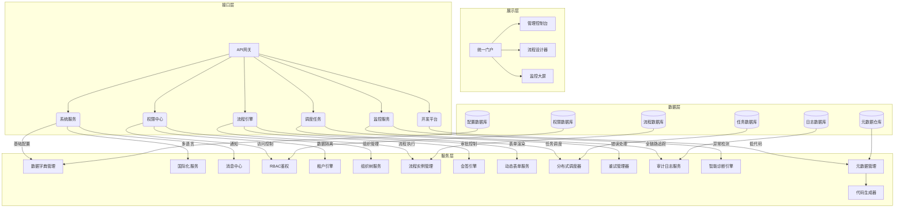

#### 3.1.1 服务拆分

采用 DDD+微服务架构，分为以下核心服务：
| **服务名称** | **端口** | **核心职责** | **功能模块** | **数据模型实体** |
|--------------|----------|--------------|--------------|------------------|
| **系统基础服务** | 5081 | 系统基础配置管理 | 1. 数据字典管理<br>2. 系统参数配置<br>3. 多语言管理 <br>4.消息通知管理<br>5. 多通道通知<br>6. 模板管理<br>7. 订阅配置 | DataDictionary, DataDictionaryItem, SystemConfig, Locale、MessageTemplate, MessageChannel, MessageSubscription |
| **权限中心服务** | 5082 | 认证授权与访问控制 | 1. 资源管理<br>2. 角色管理<br>3. 数据权限管理<br>4. 多租户管理<br>5. 组织管理<br>6. 岗位管理<br>7. 用户管理 | Resource, Role, RoleResource, DataPermission, Tenant, Organization, Position, User, UserRole |
| **系统监控服务** | 5083 | 系统监控与审计 | 1. 操作审计<br>2. 流程追踪<br>3. 异常监控<br>4. 日志分析 | OperationLog, FlowTrace, ExceptionRecord, LogAnalysis |
| **流程引擎服务** | 5084 | 流程建模与表单设计 | 1. 流程版本管理<br>2. 表单引擎<br>3. 模板市场 | FlowDefinition, FlowModelVersion, FormTemplate, NodeTemplate |
| **流程执行服务** | 5085 | 流程实例运行控制 | 1. 流程运行与控制<br>2. 任务管理<br>3. 审批控制<br>4. 异常处理 | FlowInstance, WorkflowTask, ActivityInstance, FlowVariable |
| **数据引擎服务** | 5086 | 数据调度、治理、应用 | 1. 数据源管理<br>2. 元数据采集<br>3. 数据血缘<br>4. 数据资产<br>5. 数据治理 <br>5. 数据应用 | DatasourceConfig, Metadata, MetadataCollection, MetadataLineage, DataAsset, DataGovernance, DataApplication |
| **调度任务服务** | 5087 | 调度任务服务 | 1. 调度任务管理<br>2. 调度触发<br>3. 任务执行<br>4. 错误重试 <br>5.任务状态查询 <br>6. 任务日志查询 | SchedulerTask, SchedulerTrigger, TaskExecution, TaskLog |
| **集成服务** | 5088 | 系统集成与连接 | 1. API 集成<br>2. 表单集成<br>3. 认证集成<br>4. 业务系统对接 | IntegrationEndpoint, Connector, IntegrationMapping, ApiAccessLog |
| **报表服务** | 5089 | 数据分析可视化 | 1. 流程分析<br>2. 用户分析<br>3. 自定义报表 | AnalysisTask, ReportDefinition, AnalysisResult, DashboardConfig |
| **开发平台服务** | 5090 | 低代码开发支持 | 1. 元数据管理<br>2. 代码生成<br>3. 数据管理 | Metadata, CodeTemplate, DataSource, DataSyncTask |
| **API 网关服务** | 5091 | API 网关服务 | 1.请求路由<br/>2.限流熔断<br/>（基于令牌桶算法，支持按租户/接口粒度配置 QPS）<br/>3.认证鉴权<br>4. 请求监控 | ApiRoute, RateLimit, Auth, AccessLog |
| **单体应用服务** | 5092 | 单体应用服务 | 除网关外、将其他所有的服务集成到一个工程里面进行打包 | 无 |

#### 3.1.2 服务间通信设计

##### 3.1.2.1 服务依赖矩阵
| 依赖方 \ 被依赖方 | 系统服务 | 权限中心 | 日志服务 | 流程引擎 | 流程执行 | 数据引擎 | 调度任务 | 集成服务 | 报表服务 | 开发平台 |
|-------------------|----------|----------|----------|----------|----------|----------|----------|----------|----------|----------|
| **系统服务**      | -        | ✅        | ✅        |          |       |          |          |          |          | ✅        |
| **权限中心**      | ✅        | -        | ✅        |          |       |          |          |          |          | ✅        |
| **日志服务**      |          |          | -        |          |       |          |          |          |          | ✅        |
| **流程引擎**      | ✅        | ✅        | ✅        | -        |       |          |          |          |          | ✅        |
| **流程执行**      |          | ✅        | ✅        | ✅        | -     | ✅        | ✅        |          |          | ✅        |
| **数据引擎**      |          |          | ✅        |          | ✅     | -        | ✅        |          |          | ✅        |
| **调度任务**      |          |          | ✅        |          | ✅     | -        | ✅        |          |          | ✅        |
| **集成服务**      | ✅        | ✅        | ✅        |          |       |          | -        |          |          | ✅        |
| **报表服务**      |          |          | ✅        |          | ✅     | ✅        |          | -        |          | ✅        |
| **开发平台**      | ✅        | ✅        | ✅        |          |       |          | ✅        |          | -        | ✅        |


##### 3.1.2.2 流程启动时序图

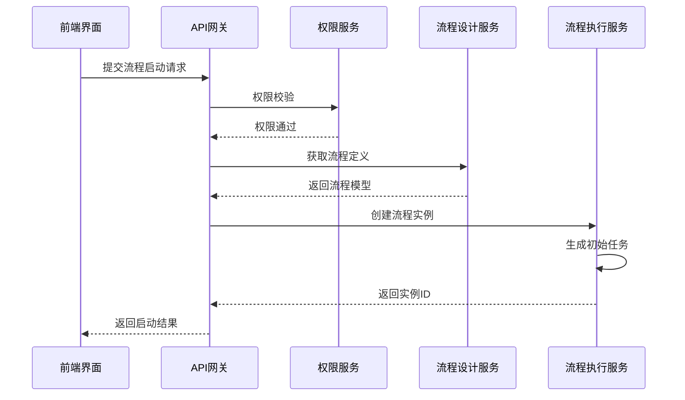

##### 3.1.2.3 服务间通信协议

- 采用 RESTful API 设计
- 接口版本控制（如 `/api/v1/processes`）
- 接口文档（Swagger/OpenAPI）
- 接口安全（HTTPS、签名验证）
- 统一响应与异常处理

**基础规范**
- **协议**：HTTPS
- **基础路径**：`https://domain.com/api/v1`
- **版本管理**：URL路径版本控制
- **命名规范**：
    - 使用小写字母和连字符
    - 资源使用复数名词：`/users`, `/projects`
    - 动词使用HTTP方法：GET, POST, PUT, DELETE, PATCH

**HTTP状态码规范**
| 状态码 | 场景 | 响应格式 |
| --- | --- | --- |
| 200 | 成功 | `{code: 0, message: "Success", data: {...}}` |
| 201 | 创建成功 | `{code: 0, message: "Created", data: {...}}` |
| 400 | 参数错误 | `{code: 400, message: "Invalid parameters", data: null}` |
| 401 | 未认证 | `{code: 401, message: "Unauthorized", data: null}` |
| 403 | 无权限 | `{code: 403, message: "Forbidden", data: null}` |
| 404 | 资源不存在 | `{code: 404, message: "Not found", data: null}` |
| 500 | 服务器错误 | `{code: 500, message: "Internal server error", data: null}` |

##### 3.1.2.4 服务间通信安全

- 采用 HTTPS 协议
- 接口签名验证
- 接口限流与防护
- 认证与授权机制

**认证流程**
1. 用户登录：`POST /api/v1/iam/auth/login`
2. 返回JWT：包含access_token和refresh_token
3. 后续请求：在Header中添加 `Authorization: Bearer <token>`
4. 网关验证：统一在API网关层验证JWT
5. 权限传递：将用户信息透传给下游服务

#### 3.1.3. 系统用例图

```mermaid
flowchart LR
    %% 角色
    SA([系统管理员])
    TA([租户管理员])
    User([普通用户])

    %% 系统基础服务
    subgraph 系统基础服务
        DD(管理数据字典)
        SP(配置系统参数)
        I18N(管理国际化多语言)
        NS(配置通知服务)
    end

    %% 权限中心服务
    subgraph 权限中心服务
        TI(管理租户信息)
        OA(维护组织架构)
        TU(管理租户用户)
        TR(管理租户角色)
        TRP(分配租户权限)
        TDP(配置租户数据权限)
        UAR(分配用户角色)
        UOP(配置用户组织岗位)
        UPA(修改个人信息)
    end

    %% 系统监控服务
    subgraph 系统监控服务
        EXC(监控系统异常)
        OAL(查看操作审计日志)
        BT(追踪业务流程)
        SLOG(查看系统运行日志)
        AR(配置告警规则)
        UOL(查看我的操作记录)
    end

    %% 流程引擎与执行服务
    subgraph 流程引擎与执行服务
        FDL(设计流程定义)
        FDF(管理表单定义)
        FCT(管理流程分类)
        TRF(管理租户流程)
        UFA(发起流程申请)
        UTD(处理待办任务)
        ATP(审批流程任务)
        UVIW(查看我的流程)
        FD(查看流程详情)
    end

    %% 调度任务服务
    subgraph 调度任务服务
        GTD(管理全局任务定义)
        RTC(配置租户定时任务)
        TM(监控任务执行情况)
    end

    %% 集成服务
    subgraph 集成服务
        API(配置API集成)
        ESC(管理外部系统连接)
        WH(配置租户WebHook)
    end

    %% 报表服务
    subgraph 报表服务
        GR(设计全局报表)
        VBR(查看业务报表)
    end

    %% 开发平台服务
    subgraph 开发平台服务
        DPM(开发平台管理)
        MMD(管理元数据)
        BM(定义业务模型)
        CGT(管理代码生成模板)
        DSC(管理数据源配置)
        CAI(定义自定义API接口)
        DST(管理数据同步任务)
    end

    %% 角色到用例的关系
    SA --> DD
    SA --> SP
    SA --> I18N
    SA --> NS

    SA --> TI
    TA --> OA
    TA --> TU
    TA --> TR
    TR -. extends .-> TRP
    TR -. extends .-> TDP
    TU -. extends .-> UAR
    TU -. extends .-> UOP
    User --> UPA

    SA --> EXC
    TA --> OAL
    TA --> BT
    TA --> SLOG
    TA --> AR
    User --> UOL

    SA --> FDL
    SA --> FDF
    TA --> FCT
    TA --> TRF
    User --> UFA
    User --> UTD
    UTD -. extends .-> ATP
    User --> UVIW
    User --> FD

    SA --> GTD
    TA --> RTC
    TA --> TM

    SA --> API
    SA --> ESC
    TA --> WH

    SA --> GR
    TA --> VBR

    SA --> DPM
    DPM -. extends .-> MMD
    DPM -. extends .-> BM
    DPM -. extends .-> CGT
    DPM -. extends .-> DSC
    DPM -. extends .-> CAI
    DPM -. extends .-> DST

    %% 注释
    SA ---|系统级操作，影响所有租户和核心功能| SA
    TA ---|租户级操作，管理租户内部资源和业务| TA
    User ---|普通用户日常业务操作| User
```

---

#### 3.1.4 权限校验流程图

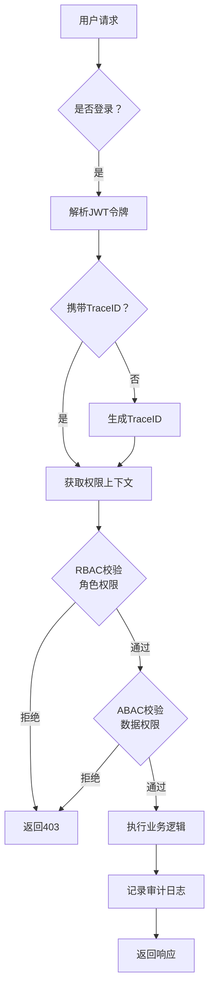

---

#### 3.1.5 关键业务时序图

- 带审计的登录流程

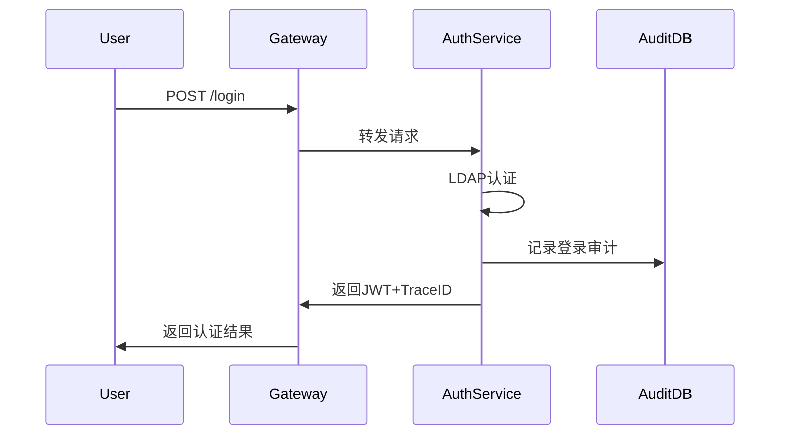

### 3.2. 微服务内分层架构

每个后端微服务遵循统一分层结构：
- **领域层（domain）**：业务核心（它包含业务的本质和规则、该层不依赖于任何其他层），领域模型、领域服务、领域资源库接口、领域事件
- **应用层（application）**：业务用例协调（应用层负责协调领域对象来完成一个特定的业务用例，它是对领域层操作的封装和组合）业务逻辑处理，命令对象 - CQS模式；查询对象 - CQS模式；事件处理器；应用服务
- **基础设施层（infrastructure）**：技术实现（基础设施层提供技术支撑，实现领域层和应用层定义的抽象接口）数据持久化、缓存、消息、领域模型转换、外部系统集成、通用工具类
- **接口层（interfaces）**：外部交互适配（负责与外部系统进行交互，包括 API、消息监听等）请求处理、参数校验、响应封装，例如、RESTful API、 Spring WebFlux 的非阻塞响应式编程模型、Kafka/MQ 消息消费者、将领域对象与DTO相互转换

### 3.3. 前端分成架构

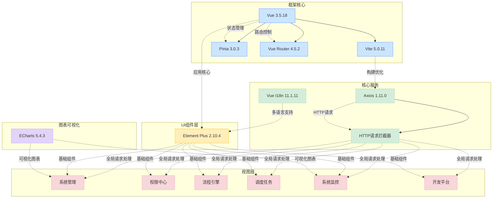

### 3.4. 前端核心框架调用关系

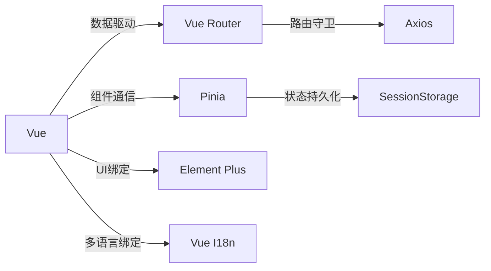

### 3.5 网络架构

- 外部请求 → API 网关 → 微服务集群 → 数据存储
- 服务间通信：同步（Feign Reactor）、异步（RabbitMQ）
- 多区域部署：支持跨区域容灾备份

### 3.6. 公共组件

单独创建一个公共组件的工程

- **组件名称**：apaas-core 用来封装系统的公共框架、组件、功能等

- **通用工具类**：提供常用的工具方法，如日期处理、字符串处理、文件操作、集合操作、线程操作、JSON 处理、加密解密、文件上传下载、邮件发送、短信发送、验证码生成等

- **数据加密**：采用 AES 加密算法对敏感数据进行加密存储

- **日志记录**：采用 SLF4J + Logback 日志框架，支持日志级别动态调整、日志滚动、日志分析等

- **异常处理**：全局异常处理，统一返回格式和状态码

- **动态多数据源**：支持动态切换数据源，实现读写分离、分库分表等

- **接口文档**：自动生成 API 文档，支持 Swagger UI 和 OpenAPI 3.0 规范

- **性能监控**：采用 Prometheus + Grafana 监控系统，实时监控系统性能指标

- **健康检查**：采用 Spring Boot Actuator 健康检查接口，支持自定义健康指标

### 3.7.技术栈选型

#### 3.7.1. 后端技术栈

- **JDK**：OpenJDK 25
- **核心框架**：Spring Boot 3.5.6
- **微服务框架**：Spring Cloud 2025.0.0、Spring Cloud Alibaba 2025.0.0.0-preview
- **服务注册发现**：Nacos 3.2
- **分布式事务**：Spring Cloud Starter Alibaba Seata 2025.0.0.0-preview
- **数据访问**：Spring Data JPA, MyBatis-Plus, Spring Data Redis、 Hibernate 6.x, R2DBC 42.7.2
- **数据库**：PostgreSQL 16.1 (主库)
- **缓存**：Redis 7.2.4
- **分布式锁**：Redisson 3.24.0
- **消息队列**：RabbitMQ 3.12.11
- **API 文档**：SpringDoc-OpenAPI 2.8.13 (Swagger UI)
- **安全框架**：spring-boot-starter-security 3.5.6 + OAuth2
- **链路追踪**：OpenTelemetry + Jaeger, SkyWalking 9.1.0
- **分布式事务**：Seata 2.0.0
- **任务调度**：XXL-Job 3.2.0
- **日志框架**：Logback + ELK Stack 8.11.3
- **监控**：Micrometer + Prometheus + Grafana 
- **对象存储**：MinIO 8.5.17
- **工具库**：Spring core, Lombok

#### 3.7.2. 前端技术栈

- **核心框架**：Vue 3.5.18 + TypeScript 5.x
- **构建工具**：Vite 7.x
- **UI 组件库**：Element Plus 2.11.4
- **状态管理**：Pinia 3.0.3
- **路由管理**：Vue Router 4.5.2
- **HTTP 客户端**：Axios 1.12.2
- **多语言**：Vue I18n 11.1.11
- **图表库**：ECharts 5.4.3
- **多主题**：Element Plus 深浅色主题

#### 3.7.3. 中间件技术

- PostgreSQL 主数据库：存储业务数据
- Redis：缓存、分布式锁、限流、计数器
- Elasticsearch：日志、全文检索
- MinIO：附件存储

#### 3.7.4. 基础设置（运维与部署）

- **代码质量**：SonarQube 9.1.0
- **容器化**：Docker 25.0.0（支持镜像漏洞自动扫描和供应链安全增强）
- **编排工具**：Docker Compose 2.24.5, Kubernetes 1.28+
- **CI/CD**：Jenkins 2.450.0（支持 Pipeline-as-Code 默认启用和 AI 辅助错误诊断）
- **监控系统**：Prometheus 2.45.0 + Grafana 10.2.3
- **反向代理**：Nginx 1.25.3

## 五、数据模型设计

### 5.1. 数据库设计

#### 5.1.1. 系统基础服务 (System Core Services)

##### 5.1.1.1. 数据字典管理 (Data Dictionary Management)

###### `sys_dict_type` (系统字典类型表 - System Dictionary Type Table)

| 字段名称       | 字段类型 | 长度 | 是否必填 | 是否主键 | 中文注释                |
| :------------- | :------- | :--- | :------- | :------- | :---------------------- |
| `id`           | BIGINT   |      | 是       | 是       | 主键 ID                 |
| `type_code`    | VARCHAR  | 64   | 是       | 是       | 字典类型编码 (唯一)     |
| `type_name`    | VARCHAR  | 128  | 是       | 否       | 字典类型名称            |
| `description`  | VARCHAR  | 255  | 否       | 否       | 描述                    |
| `status`       | TINYINT  | 1    | 是       | 否       | 状态 (1: 正常, 0: 停用) |
| `creator`      | VARCHAR  | 64   | 否       | 否       | 创建人                  |
| `created_time` | DATETIME |      | 否       | 否       | 创建时间                |
| `updater`      | VARCHAR  | 64   | 否       | 否       | 更新人                  |
| `updated_time` | DATETIME |      | 否       | 否       | 更新时间                |
| `deleted`      | TINYINT  | 1    | 是       | 否       | 是否删除 (1: 是, 0: 否) |

###### `sys_dict_item` (系统字典项表 - System Dictionary Item Table)

| 字段名称       | 字段类型 | 长度 | 是否必填 | 是否主键 | 中文注释                              |
| :------------- | :------- | :--- | :------- | :------- | :------------------------------------ |
| `id`           | BIGINT   |      | 是       | 是       | 主键 ID                               |
| `dict_type_id` | BIGINT   |      | 是       | 否       | 字典类型 ID (外键 `sys_dict_type.id`) |
| `item_code`    | VARCHAR  | 64   | 是       | 否       | 字典项编码 (在类型下唯一)             |
| `item_name`    | VARCHAR  | 128  | 是       | 否       | 字典项名称                            |
| `item_value`   | VARCHAR  | 255  | 是       | 否       | 字典项值                              |
| `description`  | VARCHAR  | 255  | 否       | 否       | 描述                                  |
| `status`       | TINYINT  | 1    | 是       | 否       | 状态 (1: 正常, 0: 停用)               |
| `sort_order`   | INT      |      | 否       | 否       | 排序                                  |
| `creator`      | VARCHAR  | 64   | 否       | 否       | 创建人                                |
| `created_time` | DATETIME |      | 否       | 否       | 创建时间                              |
| `updater`      | VARCHAR  | 64   | 否       | 否       | 更新人                                |
| `updated_time` | DATETIME |      | 否       | 否       | 更新时间                              |
| `deleted`      | TINYINT  | 1    | 是       | 否       | 是否删除 (1: 是, 0: 否)               |

---

##### 5.1.1.2. 系统配置管理 (System Configuration Management)

###### `sys_config` (系统配置表 - System Configuration Table)

| 字段名称        | 字段类型 | 长度 | 是否必填 | 是否主键 | 中文注释                               |
| :-------------- | :------- | :--- | :------- | :------- | :------------------------------------- |
| `id`            | BIGINT   |      | 是       | 是       | 主键 ID                                |
| `param_key`     | VARCHAR  | 64   | 是       | 否       | 参数键 (用于管理端设置)                |
| `param_code`    | VARCHAR  | 64   | 是       | 否       | 参数编码 (用于前端获取)                |
| `param_name`    | VARCHAR  | 128  | 是       | 否       | 参数名称                               |
| `param_value`   | TEXT     |      | 是       | 否       | 参数值                                 |
| `description`   | VARCHAR  | 255  | 否       | 否       | 描述                                   |
| `status`        | TINYINT  | 1    | 是       | 否       | 状态 (1: 正常, 0: 停用)                |
| `creator`       | VARCHAR  | 64   | 否       | 否       | 创建人                                 |
| `created_time`  | DATETIME |      | 否       | 否       | 创建时间                               |
| `updater`       | VARCHAR  | 64   | 否       | 否       | 更新人                                 |
| `updated_time`  | DATETIME |      | 否       | 否       | 更新时间                               |
| `deleted`       | TINYINT  | 1    | 是       | 否       | 是否删除 (1: 是, 0: 否)                |

---

##### 5.1.1.3. 国际化多语言 (Internationalization Multi-language)

###### `sys_language` (支持语言表 - Supported Languages Table)

| 字段名称       | 字段类型 | 长度 | 是否必填 | 是否主键 | 中文注释                       |
| :------------- | :------- | :--- | :------- | :------- | :----------------------------- |
| `id`           | BIGINT   |      | 是       | 是       | 主键 ID                        |
| `lang_code`    | VARCHAR  | 16   | 是       | 是       | 语言代码 (e.g., zh-CN, en-US)  |
| `lang_name`    | VARCHAR  | 64   | 是       | 否       | 语言名称 (e.g., 中文, English) |
| `is_default`   | TINYINT  | 1    | 是       | 否       | 是否默认语言 (1: 是, 0: 否)    |
| `status`       | TINYINT  | 1    | 是       | 否       | 状态 (1: 启用, 0: 禁用)        |
| `creator`      | VARCHAR  | 64   | 否       | 否       | 创建人                         |
| `created_time` | DATETIME |      | 否       | 否       | 创建时间                       |
| `updater`      | VARCHAR  | 64   | 否       | 否       | 更新人                         |
| `updated_time` | DATETIME |      | 否       | 否       | 更新时间                       |
| `deleted`      | TINYINT  | 1    | 是       | 否       | 是否删除 (1: 是, 0: 否)        |

###### `sys_translation` (系统翻译资源表 - System Translation Resource Table)

| 字段名称           | 字段类型 | 长度 | 是否必填 | 是否主键 | 中文注释                                 |
| :----------------- | :------- | :--- | :------- | :------- | :--------------------------------------- |
| `id`               | BIGINT   |      | 是       | 是       | 主键 ID                                  |
| `resource_key`     | VARCHAR  | 255  | 是       | 否       | 资源键 (唯一标识待翻译内容)              |
| `lang_code`        | VARCHAR  | 16   | 是       | 否       | 语言代码 (外键 `sys_language.lang_code`) |
| `translated_value` | TEXT     |      | 是       | 否       | 翻译后的值                               |
| `module`           | VARCHAR  | 64   | 否       | 否       | 所属模块 (e.g., system, workflow)        |
| `type`             | VARCHAR  | 32   | 否       | 否       | 翻译类型 (e.g., menu, button, message)   |
| `creator`          | VARCHAR  | 64   | 否       | 否       | 创建人                                   |
| `created_time`     | DATETIME |      | 否       | 否       | 创建时间                                 |
| `updater`          | VARCHAR  | 64   | 否       | 否       | 更新人                                   |
| `updated_time`     | DATETIME |      | 否       | 否       | 更新时间                                 |
| `deleted`          | TINYINT  | 1    | 是       | 否       | 是否删除 (1: 是, 0: 否)                  |

---

##### 5.1.1.4. 通知与提醒 (Notifications and Reminders)

###### `sys_notification_channel` (通知渠道表 - Notification Channel Table)

| 字段名称       | 字段类型 | 长度 | 是否必填 | 是否主键 | 中文注释                                 |
| :------------- | :------- | :--- | :------- | :------- | :--------------------------------------- |
| `id`           | BIGINT   |      | 是       | 是       | 主键 ID                                  |
| `channel_code` | VARCHAR  | 32   | 是       | 是       | 渠道编码 (e.g., EMAIL, SMS, WECHAT_WORK) |
| `channel_name` | VARCHAR  | 64   | 是       | 否       | 渠道名称                                 |
| `description`  | VARCHAR  | 255  | 否       | 否       | 描述                                     |
| `config_json`  | JSON     |      | 否       | 否       | 渠道配置 (e.g., SMTP settings, API keys) |
| `status`       | TINYINT  | 1    | 是       | 否       | 状态 (1: 启用, 0: 禁用)                  |
| `creator`      | VARCHAR  | 64   | 否       | 否       | 创建人                                   |
| `created_time` | DATETIME |      | 否       | 否       | 创建时间                                 |
| `updater`      | VARCHAR  | 64   | 否       | 否       | 更新人                                   |
| `updated_time` | DATETIME |      | 否       | 否       | 更新时间                                 |
| `deleted`      | TINYINT  | 1    | 是       | 否       | 是否删除 (1: 是, 0: 否)                  |

###### `sys_notification_template` (通知模板表 - Notification Template Table)

| 字段名称        | 字段类型 | 长度 | 是否必填 | 是否主键 | 中文注释                                           |
| :-------------- | :------- | :--- | :------- | :------- | :------------------------------------------------- |
| `id`            | BIGINT   |      | 是       | 是       | 主键 ID                                            |
| `template_code` | VARCHAR  | 64   | 是       | 是       | 模板编码 (唯一)                                    |
| `template_name` | VARCHAR  | 128  | 是       | 否       | 模板名称                                           |
| `channel_id`    | BIGINT   |      | 是       | 否       | 通知渠道 ID (外键 `sys_notification_channel.id`)   |
| `title`         | VARCHAR  | 255  | 是       | 否       | 标题                                               |
| `content`       | TEXT     |      | 是       | 否       | 模板内容 (支持变量)                                |
| `lang_code`     | VARCHAR  | 16   | 是       | 否       | 语言代码 (外键 `sys_language.lang_code`)           |
| `trigger_event` | VARCHAR  | 64   | 否       | 否       | 触发事件 (e.g., TASK_ASSIGNED, APPROVAL_COMPLETED) |
| `status`        | TINYINT  | 1    | 是       | 否       | 状态 (1: 启用, 0: 禁用)                            |
| `creator`       | VARCHAR  | 64   | 否       | 否       | 创建人                                             |
| `created_time`  | DATETIME |      | 否       | 否       | 创建时间                                           |
| `updater`       | VARCHAR  | 64   | 否       | 否       | 更新人                                             |
| `updated_time`  | DATETIME |      | 否       | 否       | 更新时间                                           |
| `deleted`       | TINYINT  | 1    | 是       | 否       | 是否删除 (1: 是, 0: 否)                            |

###### `sys_user_notification_subscription` (用户通知订阅表 - User Notification Subscription Table)

| 字段名称        | 字段类型 | 长度 | 是否必填 | 是否主键 | 中文注释                                          |
| :-------------- | :------- | :--- | :------- | :------- | :------------------------------------------------ |
| `id`            | BIGINT   |      | 是       | 是       | 主键 ID                                           |
| `user_id`       | BIGINT   |      | 是       | 否       | 用户 ID (外键 `sys_user.id`)                      |
| `channel_id`    | BIGINT   |      | 是       | 否       | 通知渠道 ID (外键 `sys_notification_channel.id`)  |
| `template_id`   | BIGINT   |      | 是       | 否       | 通知模板 ID (外键 `sys_notification_template.id`) |
| `is_subscribed` | TINYINT  | 1    | 是       | 否       | 是否订阅 (1: 是, 0: 否)                           |
| `creator`       | VARCHAR  | 64   | 否       | 否       | 创建人                                            |
| `created_time`  | DATETIME |      | 否       | 否       | 创建时间                                          |
| `updater`       | VARCHAR  | 64   | 否       | 否       | 更新人                                            |
| `updated_time`  | DATETIME |      | 否       | 否       | 更新时间                                          |
| `deleted`       | TINYINT  | 1    | 是       | 否       | 是否删除 (1: 是, 0: 否)                           |

###### `sys_notification_log` (通知发送日志表 - Notification Sending Log Table)

| 字段名称            | 字段类型 | 长度 | 是否必填 | 是否主键 | 中文注释                                          |
| :------------------ | :------- | :--- | :------- | :------- | :------------------------------------------------ |
| `id`                | BIGINT   |      | 是       | 是       | 主键 ID                                           |
| `template_id`       | BIGINT   |      | 是       | 否       | 通知模板 ID (外键 `sys_notification_template.id`) |
| `recipient_user_id` | BIGINT   |      | 否       | 否       | 接收用户 ID (若有)                                |
| `recipient_address` | VARCHAR  | 255  | 是       | 否       | 接收地址 (邮箱/手机号/企业微信 ID 等)             |
| `channel_id`        | BIGINT   |      | 是       | 否       | 渠道 ID (外键 `sys_notification_channel.id`)      |
| `send_status`       | TINYINT  | 1    | 是       | 否       | 发送状态 (1: 成功, 0: 失败, 2: 处理中)            |
| `send_time`         | DATETIME |      | 是       | 否       | 发送时间                                          |
| `error_message`     | TEXT     |      | 否       | 否       | 错误信息 (如果失败)                               |
| `content_sent`      | TEXT     |      | 否       | 否       | 实际发送内容                                      |
| `creator`           | VARCHAR  | 64   | 否       | 否       | 创建人                                            |
| `created_time`      | DATETIME |      | 否       | 否       | 创建时间                                          |

---

#### 5.1.2. 权限中心服务 (Auth Center Services)

##### 5.1.2.1. 多租户管理 (Multi-tenant Management)

###### `sys_tenant` (租户信息表 - Tenant Information Table)

| 字段名称         | 字段类型 | 长度 | 是否必填 | 是否主键 | 中文注释                             |
| :--------------- | :------- | :--- | :------- | :------- | :----------------------------------- |
| `id`             | BIGINT   |      | 是       | 是       | 主键 ID                              |
| `tenant_code`    | VARCHAR  | 64   | 是       | 是       | 租户编码 (唯一)                      |
| `tenant_name`    | VARCHAR  | 128  | 是       | 否       | 租户名称                             |
| `contact_person` | VARCHAR  | 64   | 否       | 否       | 联系人                               |
| `contact_phone`  | VARCHAR  | 32   | 否       | 否       | 联系电话                             |
| `email`          | VARCHAR  | 128  | 否       | 否       | 邮箱                                 |
| `start_date`     | DATE     |      | 否       | 否       | 租户启用日期                         |
| `end_date`       | DATE     |      | 否       | 否       | 租户过期日期                         |
| `status`         | TINYINT  | 1    | 是       | 否       | 状态 (1: 启用, 0: 禁用)              |
| `resource_quota` | JSON     |      | 否       | 否       | 资源配额 (CPU/内存/存储等 JSON 配置) |
| `creator`        | VARCHAR  | 64   | 否       | 否       | 创建人                               |
| `created_time`   | DATETIME |      | 否       | 否       | 创建时间                             |
| `updater`        | VARCHAR  | 64   | 否       | 否       | 更新人                               |
| `updated_time`   | DATETIME |      | 否       | 否       | 更新时间                             |
| `deleted`        | TINYINT  | 1    | 是       | 否       | 是否删除 (1: 是, 0: 否)              |

---

##### 5.1.2.2. 组织机构管理 (Organization Management)

###### `sys_organization` (组织机构表 - Organization Table)

| 字段名称         | 字段类型 | 长度 | 是否必填 | 是否主键 | 中文注释                             |
| :--------------- | :------- | :--- | :------- | :------- | :----------------------------------- |
| `id`             | BIGINT   |      | 是       | 是       | 主键 ID                              |
| `tenant_id`      | BIGINT   |      | 是       | 否       | 租户 ID (外键 `sys_tenant.id`)       |
| `org_code`       | VARCHAR  | 64   | 是       | 否       | 组织编码 (在租户下唯一)              |
| `org_name`       | VARCHAR  | 128  | 是       | 否       | 组织名称                             |
| `parent_id`      | BIGINT   |      | 否       | 否       | 父级组织 ID (自引用)                 |
| `org_type`       | VARCHAR  | 32   | 否       | 否       | 组织类型 (e.g., COMPANY, DEPARTMENT) |
| `leader_user_id` | BIGINT   |      | 否       | 否       | 负责人用户 ID (外键 `sys_user.id`)   |
| `description`    | VARCHAR  | 255  | 否       | 否       | 描述                                 |
| `status`         | TINYINT  | 1    | 是       | 否       | 状态 (1: 启用, 0: 禁用)              |
| `sort_order`     | INT      |      | 否       | 否       | 排序                                 |
| `creator`        | VARCHAR  | 64   | 否       | 否       | 创建人                               |
| `created_time`   | DATETIME |      | 否       | 否       | 创建时间                             |
| `updater`        | VARCHAR  | 64   | 否       | 否       | 更新人                               |
| `updated_time`   | DATETIME |      | 否       | 否       | 更新时间                             |
| `deleted`        | TINYINT  | 1    | 是       | 否       | 是否删除 (1: 是, 0: 否)              |

###### `sys_position` (岗位信息表 - Position Information Table)

| 字段名称        | 字段类型 | 长度 | 是否必填 | 是否主键 | 中文注释                       |
| :-------------- | :------- | :--- | :------- | :------- | :----------------------------- |
| `id`            | BIGINT   |      | 是       | 是       | 主键 ID                        |
| `tenant_id`     | BIGINT   |      | 是       | 否       | 租户 ID (外键 `sys_tenant.id`) |
| `position_code` | VARCHAR  | 64   | 是       | 否       | 岗位编码 (在租户下唯一)        |
| `position_name` | VARCHAR  | 128  | 是       | 否       | 岗位名称                       |
| `description`   | VARCHAR  | 255  | 否       | 否       | 描述                           |
| `status`        | TINYINT  | 1    | 是       | 否       | 状态 (1: 启用, 0: 禁用)        |
| `creator`       | VARCHAR  | 64   | 否       | 否       | 创建人                         |
| `created_time`  | DATETIME |      | 否       | 否       | 创建时间                       |
| `updater`       | VARCHAR  | 64   | 否       | 否       | 更新人                         |
| `updated_time`  | DATETIME |      | 否       | 否       | 更新时间                       |
| `deleted`       | TINYINT  | 1    | 是       | 否       | 是否删除 (1: 是, 0: 否)        |

---

##### 5.1.2.3. 用户管理 (User Management)

###### `sys_user` (用户信息表 - User Information Table)

| 字段名称          | 字段类型 | 长度 | 是否必填 | 是否主键 | 中文注释                                   |
| :---------------- | :------- | :--- | :------- | :------- | :----------------------------------------- |
| `id`              | BIGINT   |      | 是       | 是       | 主键 ID                                    |
| `tenant_id`       | BIGINT   |      | 是       | 否       | 租户 ID (外键 `sys_tenant.id`)             |
| `username`        | VARCHAR  | 64   | 是       | 是       | 用户名 (唯一)                              |
| `password`        | VARCHAR  | 255  | 否       | 否       | 密码 (加密存储)                            |
| `nickname`        | VARCHAR  | 128  | 否       | 否       | 昵称                                       |
| `email`           | VARCHAR  | 128  | 否       | 否       | 邮箱                                       |
| `phone_number`    | VARCHAR  | 32   | 否       | 否       | 手机号                                     |
| `user_type`       | TINYINT  | 1    | 是       | 否       | 用户类型 (1: 普通用户, 2: 系统管理员, ...) |
| `avatar_url`      | VARCHAR  | 255  | 否       | 否       | 头像 URL                                   |
| `last_login_time` | DATETIME |      | 否       | 否       | 最后登录时间                               |
| `status`          | TINYINT  | 1    | 是       | 否       | 状态 (1: 正常, 0: 锁定, 2: 禁用)           |
| `auth_method`     | VARCHAR  | 32   | 否       | 否       | 认证方式 (e.g., LOCAL, LDAP, OAUTH2)       |
| `creator`         | VARCHAR  | 64   | 否       | 否       | 创建人                                     |
| `created_time`    | DATETIME |      | 否       | 否       | 创建时间                                   |
| `updater`         | VARCHAR  | 64   | 否       | 否       | 更新人                                     |
| `updated_time`    | DATETIME |      | 否       | 否       | 更新时间                                   |
| `deleted`         | TINYINT  | 1    | 是       | 否       | 是否删除 (1: 是, 0: 否)                    |

---

##### 5.1.2.4. 系统资源管理 (System Resource Management)

###### `sys_resource` (系统资源表 - System Resource Table)

| 字段名称                | 字段类型 | 长度 | 是否必填 | 是否主键 | 中文注释                                                       |
| :---------------------- | :------- | :--- | :------- | :------- | :------------------------------------------------------------- |
| `id`                    | BIGINT   |      | 是       | 是       | 主键 ID                                                        |
| `tenant_id`             | BIGINT   |      | 是       | 否       | 租户 ID (外键 `sys_tenant.id`)                                 |
| `resource_name`         | VARCHAR  | 128  | 是       | 否       | 资源名称                                                       |
| `resource_code`         | VARCHAR  | 128  | 是       | 否       | 资源编码 (唯一)                                                |
| `resource_type`         | TINYINT  | 1    | 是       | 否       | 资源类型 (1: 目录, 2: 菜单, 3: 按钮, 4: API 接口, 5: 数据字段) |
| `parent_id`             | BIGINT   |      | 否       | 否       | 父级资源 ID (自引用)                                           |
| `resource_path`         | VARCHAR  | 255  | 否       | 否       | 资源路径 (URL 风格标识, e.g., /system/user)                    |
| `icon`                  | VARCHAR  | 64   | 否       | 否       | 资源图标                                                       |
| `sort_order`            | INT      |      | 否       | 否       | 排序                                                           |
| `status`                | TINYINT  | 1    | 是       | 否       | 状态 (1: 启用, 0: 禁用)                                        |
| `permission_expression` | VARCHAR  | 255  | 否       | 否       | 权限表达式 (用于 API 权限校验, e.g., user:add)                 |
| `creator`               | VARCHAR  | 64   | 否       | 否       | 创建人                                                         |
| `created_time`          | DATETIME |      | 否       | 否       | 创建时间                                                       |
| `updater`               | VARCHAR  | 64   | 否       | 否       | 更新人                                                         |
| `updated_time`          | DATETIME |      | 否       | 否       | 更新时间                                                       |
| `deleted`               | TINYINT  | 1    | 是       | 否       | 是否删除 (1: 是, 0: 否)                                        |

---

##### 5.1.2.5. 角色与权限管理 (Role and Permission Management)

###### `sys_role` (角色信息表 - Role Information Table)

| 字段名称       | 字段类型 | 长度 | 是否必填 | 是否主键 | 中文注释                        |
| :------------- | :------- | :--- | :------- | :------- | :------------------------------ |
| `id`           | BIGINT   |      | 是       | 是       | 主键 ID                         |
| `tenant_id`    | BIGINT   |      | 是       | 否       | 租户 ID (外键 `sys_tenant.id`)  |
| `role_code`    | VARCHAR  | 64   | 是       | 是       | 角色编码 (唯一)                 |
| `role_name`    | VARCHAR  | 128  | 是       | 否       | 角色名称                        |
| `description`  | VARCHAR  | 255  | 否       | 否       | 描述                            |
| `is_system`    | TINYINT  | 1    | 是       | 否       | 是否系统内置角色 (1: 是, 0: 否) |
| `status`       | TINYINT  | 1    | 是       | 否       | 状态 (1: 启用, 0: 禁用)         |
| `creator`      | VARCHAR  | 64   | 否       | 否       | 创建人                          |
| `created_time` | DATETIME |      | 否       | 否       | 创建时间                        |
| `updater`      | VARCHAR  | 64   | 否       | 否       | 更新人                          |
| `updated_time` | DATETIME |      | 否       | 否       | 更新时间                        |
| `deleted`      | TINYINT  | 1    | 是       | 否       | 是否删除 (1: 是, 0: 否)         |

###### `sys_user_role` (用户角色关联表 - User Role Association Table)

| 字段名称       | 字段类型 | 长度 | 是否必填 | 是否主键 | 中文注释                               |
| :------------- | :------- | :--- | :------- | :------- | :------------------------------------- |
| `user_id`      | BIGINT   |      | 是       | 是       | 用户 ID (复合主键, 外键 `sys_user.id`) |
| `role_id`      | BIGINT   |      | 是       | 是       | 角色 ID (复合主键, 外键 `sys_role.id`) |
| `creator`      | VARCHAR  | 64   | 否       | 否       | 创建人                                 |
| `created_time` | DATETIME |      | 否       | 否       | 创建时间                               |

###### `sys_role_resource` (角色资源关联表 - Role Resource Association Table)

| 字段名称       | 字段类型 | 长度 | 是否必填 | 是否主键 | 中文注释                                        |
| :------------- | :------- | :--- | :------- | :------- | :---------------------------------------------- |
| `role_id`      | BIGINT   |      | 是       | 是       | 角色 ID (复合主键, 外键 `sys_role.id`)          |
| `resource_id`  | BIGINT   |      | 是       | 是       | 资源 ID (复合主键, 外键 `sys_resource.id`)      |
| `permissions`  | VARCHAR  | 128  | 否       | 否       | 权限操作 (逗号分隔, e.g., view,add,edit,delete) |
| `creator`      | VARCHAR  | 64   | 否       | 否       | 创建人                                          |
| `created_time` | DATETIME |      | 否       | 否       | 创建时间                                        |

###### `sys_data_scope` (数据范围定义表 - Data Scope Definition Table)

| 字段名称       | 字段类型 | 长度 | 是否必填 | 是否主键 | 中文注释                                                   |
| :------------- | :------- | :--- | :------- | :------- | :--------------------------------------------------------- |
| `id`           | BIGINT   |      | 是       | 是       | 主键 ID                                                    |
| `tenant_id`    | BIGINT   |      | 是       | 否       | 租户 ID (外键 `sys_tenant.id`)                             |
| `scope_code`   | VARCHAR  | 64   | 是       | 是       | 数据范围编码 (唯一)                                        |
| `scope_name`   | VARCHAR  | 128  | 是       | 否       | 数据范围名称                                               |
| `scope_type`   | VARCHAR  | 32   | 是       | 否       | 范围类型 (e.g., all_tenants, current_tenant, custom_depts) |
| `scope_value`  | TEXT     |      | 否       | 否       | 范围值 (JSON 格式, 存储部门 ID 列表等)                     |
| `description`  | VARCHAR  | 255  | 否       | 否       | 描述                                                       |
| `status`       | TINYINT  | 1    | 是       | 否       | 状态 (1: 启用, 0: 禁用)                                    |
| `creator`      | VARCHAR  | 64   | 否       | 否       | 创建人                                                     |
| `created_time` | DATETIME |      | 否       | 否       | 创建时间                                                   |
| `updater`      | VARCHAR  | 64   | 否       | 否       | 更新人                                                     |
| `updated_time` | DATETIME |      | 否       | 否       | 更新时间                                                   |
| `deleted`      | TINYINT  | 1    | 是       | 否       | 是否删除 (1: 是, 0: 否)                                    |

###### `sys_role_data_scope` (角色数据范围关联表 - Role Data Scope Association Table)

| 字段名称       | 字段类型 | 长度 | 是否必填 | 是否主键 | 中文注释                                         |
| :------------- | :------- | :--- | :------- | :------- | :----------------------------------------------- |
| `role_id`      | BIGINT   |      | 是       | 是       | 角色 ID (复合主键, 外键 `sys_role.id`)           |
| `scope_id`     | BIGINT   |      | 是       | 是       | 数据范围 ID (复合主键, 外键 `sys_data_scope.id`) |
| `creator`      | VARCHAR  | 64   | 否       | 否       | 创建人                                           |
| `created_time` | DATETIME |      | 否       | 否       | 创建时间                                         |

###### `sys_user_organization` (用户组织机构关联表 - User Organization Association Table)

| 字段名称       | 字段类型 | 长度 | 是否必填 | 是否主键 | 中文注释                                           |
| :------------- | :------- | :--- | :------- | :------- | :------------------------------------------------- |
| `user_id`      | BIGINT   |      | 是       | 是       | 用户 ID (复合主键, 外键 `sys_user.id`)             |
| `org_id`       | BIGINT   |      | 是       | 是       | 组织机构 ID (复合主键, 外键 `sys_organization.id`) |
| `is_main_org`  | TINYINT  | 1    | 是       | 否       | 是否主组织 (1: 是, 0: 否)                          |
| `creator`      | VARCHAR  | 64   | 否       | 否       | 创建人                                             |
| `created_time` | DATETIME |      | 否       | 否       | 创建时间                                           |

###### `sys_user_position` (用户岗位关联表 - User Position Association Table)

| 字段名称       | 字段类型 | 长度 | 是否必填 | 是否主键 | 中文注释                                   |
| :------------- | :------- | :--- | :------- | :------- | :----------------------------------------- |
| `user_id`      | BIGINT   |      | 是       | 是       | 用户 ID (复合主键, 外键 `sys_user.id`)     |
| `position_id`  | BIGINT   |      | 是       | 是       | 岗位 ID (复合主键, 外键 `sys_position.id`) |
| `creator`      | VARCHAR  | 64   | 否       | 否       | 创建人                                     |
| `created_time` | DATETIME |      | 否       | 否       | 创建时间                                   |

---

#### 5.1.3. 系统监控服务 (System Monitoring Services)

##### 5.1.3.1. 操作审计 (Operation Audit)

###### `sys_audit_log` (操作审计日志表 - Operation Audit Log Table)

| 字段名称         | 字段类型 | 长度 | 是否必填 | 是否主键 | 中文注释                                    |
| :--------------- | :------- | :--- | :------- | :------- | :------------------------------------------ |
| `id`             | BIGINT   |      | 是       | 是       | 主键 ID                                     |
| `trace_id`       | VARCHAR  | 64   | 否       | 否       | 全链路追踪 ID                               |
| `span_id`        | VARCHAR  | 64   | 否       | 否       | 追踪段 ID                                   |
| `tenant_id`      | BIGINT   |      | 否       | 否       | 租户 ID                                     |
| `user_id`        | BIGINT   |      | 否       | 否       | 操作用户 ID                                 |
| `username`       | VARCHAR  | 64   | 否       | 否       | 操作用户名                                  |
| `client_ip`      | VARCHAR  | 64   | 否       | 否       | 客户端 IP                                   |
| `request_url`    | VARCHAR  | 255  | 否       | 否       | 请求 URL                                    |
| `request_method` | VARCHAR  | 10   | 否       | 否       | 请求方法                                    |
| `operation_type` | VARCHAR  | 64   | 否       | 否       | 操作类型 (e.g., ADD, UPDATE, DELETE, LOGIN) |
| `module_name`    | VARCHAR  | 128  | 否       | 否       | 模块名称                                    |
| `operation_desc` | VARCHAR  | 255  | 否       | 否       | 操作描述                                    |
| `request_params` | TEXT     |      | 否       | 否       | 请求参数 (JSON 格式)                        |
| `response_data`  | TEXT     |      | 否       | 否       | 响应数据 (JSON 格式)                        |
| `old_value`      | TEXT     |      | 否       | 否       | 数据旧值 (JSON 格式)                        |
| `new_value`      | TEXT     |      | 否       | 否       | 数据新值 (JSON 格式)                        |
| `is_sensitive`   | TINYINT  | 1    | 是       | 否       | 是否敏感操作 (1: 是, 0: 否)                 |
| `risk_level`     | TINYINT  | 1    | 否       | 否       | 风险等级 (1: 低, 2: 中, 3: 高)              |
| `status`         | TINYINT  | 1    | 是       | 否       | 操作状态 (1: 成功, 0: 失败)                 |
| `error_message`  | TEXT     |      | 否       | 否       | 错误信息                                    |
| `operation_time` | DATETIME |      | 是       | 否       | 操作时间                                    |
| `cost_time_ms`   | INT      |      | 否       | 否       | 耗时 (毫秒)                                 |
| `creator`        | VARCHAR  | 64   | 否       | 否       | 创建人                                      |
| `created_time`   | DATETIME |      | 否       | 否       | 创建时间                                    |

---

##### 5.1.3.2. 链路追踪 (Link Tracing)

###### `sys_link_trace` (链路追踪表 -Link Trace Table)

| 字段名称       | 字段类型 | 长度 | 是否必填 | 是否主键 | 中文注释                           |
| :------------- | :------- | :--- | :------- | :------- | :--------------------------------- |
| `id`           | BIGINT   |      | 是       | 是       | 主键 ID                            |
| `trace_id`     | VARCHAR  | 64   | 是       | 是       | 全链路追踪 ID (唯一)               |
| `tenant_id`    | BIGINT   |      | 否       | 否       | 租户 ID                            |
| `process_type` | VARCHAR  | 64   | 否       | 否       | 流程类型 (e.g., WF, JOB, API_CALL) |
| `process_name` | VARCHAR  | 128  | 否       | 否       | 流程名称                           |
| `start_time`   | DATETIME |      | 是       | 否       | 开始时间                           |
| `end_time`     | DATETIME |      | 否       | 否       | 结束时间                           |
| `duration_ms`  | BIGINT   |      | 否       | 否       | 持续时间 (毫秒)                    |
| `status`       | TINYINT  | 1    | 是       | 否       | 状态 (1: 成功, 0: 失败, 2: 运行中) |
| `root_span_id` | VARCHAR  | 64   | 否       | 否       | 根 Span ID                         |
| `creator`      | VARCHAR  | 64   | 否       | 否       | 创建人                             |
| `created_time` | DATETIME |      | 否       | 否       | 创建时间                           |

###### `sys_span_trace` (追踪段表 - Span Trace Table)

| 字段名称         | 字段类型 | 长度 | 是否必填 | 是否主键 | 中文注释                                       |
| :--------------- | :------- | :--- | :------- | :------- | :--------------------------------------------- |
| `id`             | BIGINT   |      | 是       | 是       | 主键 ID                                        |
| `trace_id`       | VARCHAR  | 64   | 是       | 否       | 全链路追踪 ID (外键 `sys_link_trace.trace_id`) |
| `span_id`        | VARCHAR  | 64   | 是       | 是       | 追踪段 ID (唯一)                               |
| `parent_span_id` | VARCHAR  | 64   | 否       | 否       | 父级 Span ID                                   |
| `service_name`   | VARCHAR  | 128  | 是       | 否       | 服务名称                                       |
| `operation_name` | VARCHAR  | 128  | 是       | 否       | 操作名称                                       |
| `start_time`     | DATETIME |      | 是       | 否       | 开始时间                                       |
| `end_time`       | DATETIME |      | 否       | 否       | 结束时间                                       |
| `duration_ms`    | BIGINT   |      | 否       | 否       | 持续时间 (毫秒)                                |
| `status`         | TINYINT  | 1    | 是       | 否       | 状态 (1: 成功, 0: 失败)                        |
| `tags`           | JSON     |      | 否       | 否       | 标签 (JSON 格式, 键值对)                       |
| `logs`           | JSON     |      | 否       | 否       | 日志 (JSON 格式, 事件列表)                     |
| `created_time`   | DATETIME |      | 否       | 否       | 创建时间                                       |

---

##### 5.1.3.3. 异常监控 (Exception Monitoring)

###### `sys_exception_log` (异常日志表 - Exception Log Table)

| 字段名称          | 字段类型 | 长度 | 是否必填 | 是否主键 | 中文注释                                   |
| :---------------- | :------- | :--- | :------- | :------- | :----------------------------------------- |
| `id`              | BIGINT   |      | 是       | 是       | 主键 ID                                    |
| `tenant_id`       | BIGINT   |      | 否       | 否       | 租户 ID                                    |
| `trace_id`        | VARCHAR  | 64   | 否       | 否       | 全链路追踪 ID                              |
| `service_name`    | VARCHAR  | 128  | 是       | 否       | 服务名称                                   |
| `exception_type`  | VARCHAR  | 128  | 是       | 否       | 异常类型 (e.g., NullPointerException)      |
| `error_message`   | TEXT     |      | 是       | 否       | 错误信息                                   |
| `stack_trace`     | TEXT     |      | 否       | 否       | 堆栈信息                                   |
| `request_url`     | VARCHAR  | 255  | 否       | 否       | 请求 URL (若有)                            |
| `request_params`  | TEXT     |      | 否       | 否       | 请求参数 (JSON 格式)                       |
| `user_id`         | BIGINT   |      | 否       | 否       | 触发用户 ID                                |
| `client_ip`       | VARCHAR  | 64   | 否       | 否       | 客户端 IP                                  |
| `occurrence_time` | DATETIME | 是   | 否       | 发生时间 |
| `status`          | TINYINT  | 1    | 是       | 否       | 处理状态 (1: 未处理, 2: 处理中, 3: 已解决) |
| `alert_level`     | TINYINT  | 1    | 否       | 否       | 告警级别 (1: 提醒, 2: 警告, 3: 严重)       |
| `assigned_to`     | BIGINT   |      | 否       | 否       | 负责人用户 ID                              |
| `created_time`    | DATETIME |      | 否       | 否       | 创建时间                                   |

###### `sys_system_metrics` (系统指标表 - System Metrics Table)

| 字段名称       | 字段类型 | 长度 | 是否必填 | 是否主键 | 中文注释                                 |
| :------------- | :------- | :--- | :------- | :------- | :--------------------------------------- |
| `id`           | BIGINT   |      | 是       | 是       | 主键 ID                                  |
| `tenant_id`    | BIGINT   |      | 否       | 否       | 租户 ID                                  |
| `host_name`    | VARCHAR  | 128  | 是       | 否       | 主机名                                   |
| `service_name` | VARCHAR  | 128  | 否       | 否       | 服务名称                                 |
| `metric_name`  | VARCHAR  | 128  | 是       | 否       | 指标名称 (e.g., cpu_usage, memory_usage) |
| `metric_value` | DECIMAL  | 10,2 | 是       | 否       | 指标值                                   |
| `timestamp`    | DATETIME |      | 是       | 否       | 采集时间                                 |
| `unit`         | VARCHAR  | 32   | 否       | 否       | 单位 (e.g., %, MB, ms)                   |
| `created_time` | DATETIME |      | 否       | 否       | 创建时间                                 |

###### `sys_alert_rule` (告警规则表 - Alert Rule Table)

| 字段名称           | 字段类型 | 长度 | 是否必填 | 是否主键 | 中文注释                             |
| :----------------- | :------- | :--- | :------- | :------- | :----------------------------------- |
| `id`               | BIGINT   |      | 是       | 是       | 主键 ID                              |
| `tenant_id`        | BIGINT   |      | 否       | 否       | 租户 ID                              |
| `rule_name`        | VARCHAR  | 128  | 是       | 是       | 规则名称 (唯一)                      |
| `metric_name`      | VARCHAR  | 128  | 是       | 否       | 监控指标名称                         |
| `threshold`        | DECIMAL  | 10,2 | 是       | 否       | 阈值                                 |
| `operator`         | VARCHAR  | 10   | 是       | 否       | 运算符 (e.g., >, <, >=, <=)          |
| `duration_minutes` | INT      |      | 否       | 否       | 持续时间 (分钟)                      |
| `alert_level`      | TINYINT  | 1    | 是       | 否       | 告警级别 (1: 提醒, 2: 警告, 3: 严重) |
| `channel_ids`      | VARCHAR  | 255  | 否       | 否       | 通知渠道 ID 列表 (逗号分隔)          |
| `recipient_users`  | TEXT     |      | 否       | 否       | 告警接收人用户 ID 列表 (JSON 数组)   |
| `status`           | TINYINT  | 1    | 是       | 否       | 状态 (1: 启用, 0: 禁用)              |
| `creator`          | VARCHAR  | 64   | 否       | 否       | 创建人                               |
| `created_time`     | DATETIME |      | 否       | 否       | 创建时间                             |
| `updater`          | VARCHAR  | 64   | 否       | 否       | 更新人                               |
| `updated_time`     | DATETIME |      | 否       | 否       | 更新时间                             |
| `deleted`          | TINYINT  | 1    | 是       | 否       | 是否删除 (1: 是, 0: 否)              |

###### `sys_alert_history` (告警历史表 - Alert History Table)

| 字段名称          | 字段类型 | 长度 | 是否必填 | 是否主键 | 中文注释                                      |
| :---------------- | :------- | :--- | :------- | :------- | :-------------------------------------------- |
| `id`              | BIGINT   |      | 是       | 是       | 主键 ID                                       |
| `rule_id`         | BIGINT   |      | 是       | 否       | 告警规则 ID (外键 `sys_alert_rule.id`)        |
| `tenant_id`       | BIGINT   |      | 否       | 否       | 租户 ID                                       |
| `alert_level`     | TINYINT  | 1    | 是       | 否       | 告警级别                                      |
| `alert_message`   | TEXT     |      | 是       | 否       | 告警消息                                      |
| `trigger_data`    | JSON     |      | 否       | 否       | 触发数据 (JSON 格式)                          |
| `alert_time`      | DATETIME |      | 是       | 否       | 告警时间                                      |
| `resolve_time`    | DATETIME |      | 否       | 否       | 解决时间                                      |
| `status`          | TINYINT  | 1    | 是       | 否       | 状态 (1: 触发, 2: 恢复, 3: 已确认, 4: 已关闭) |
| `handler_user_id` | BIGINT   |      | 否       | 否       | 处理人用户 ID                                 |
| `created_time`    | DATETIME |      | 否       | 否       | 创建时间                                      |

---

##### 5.1.3.4. 日志分析 (Log Analysis)

###### `sys_log_entry` (原始日志条目表 - Raw Log Entry Table)

_Note: For high-volume log analysis, often a dedicated log management system (like ELK stack) is used rather than directly storing all raw logs in a relational database._
_This table would be for more structured/filtered logs if not using a dedicated system._

| 字段名称          | 字段类型 | 长度 | 是否必填 | 是否主键 | 中文注释                           |
| :---------------- | :------- | :--- | :------- | :------- | :--------------------------------- |
| `id`              | BIGINT   |      | 是       | 是       | 主键 ID                            |
| `tenant_id`       | BIGINT   |      | 否       | 否       | 租户 ID                            |
| `trace_id`        | VARCHAR  | 64   | 否       | 否       | 全链路追踪 ID                      |
| `service_name`    | VARCHAR  | 128  | 是       | 否       | 服务名称                           |
| `log_level`       | VARCHAR  | 16   | 是       | 否       | 日志级别 (e.g., INFO, WARN, ERROR) |
| `log_message`     | TEXT     |      | 是       | 否       | 日志消息                           |
| `log_timestamp`   | DATETIME |      | 是       | 否       | 日志时间戳                         |
| `thread_name`     | VARCHAR  | 128  | 否       | 否       | 线程名称                           |
| `logger_name`     | VARCHAR  | 255  | 否       | 否       | 日志记录器名称                     |
| `exception_stack` | TEXT     |      | 否       | 否       | 异常堆栈 (若有)                    |
| `tags`            | JSON     |      | 否       | 否       | 结构化标签 (JSON 格式)             |
| `created_time`    | DATETIME |      | 否       | 否       | 创建时间                           |

---

#### 5.1.4. 流程引擎服务 (Flow Engine Services)

##### 5.1.4.1. 流程设计与管理 (Workflow Design & Management)

###### `flow_definition` (流程定义表 - Flow Definition Table)

| 字段名称             | 字段类型 | 长度 | 是否必填 | 是否主键 | 中文注释                                  |
| :------------------- | :------- | :--- | :------- | :------- | :---------------------------------------- |
| `id`                 | BIGINT   |      | 是       | 是       | 主键 ID                                   |
| `tenant_id`          | BIGINT   |      | 否       | 否       | 租户 ID                                   |
| `process_key`        | VARCHAR  | 64   | 是       | 是       | 流程定义唯一标识键                        |
| `process_name`       | VARCHAR  | 128  | 是       | 否       | 流程名称                                  |
| `version`            | INT      |      | 是       | 否       | 版本号                                    |
| `description`        | VARCHAR  | 255  | 否       | 否       | 描述                                      |
| `process_model_xml`  | LONGTEXT |      | 是       | 否       | 流程模型 XML 定义 (BPMN/DAG)              |
| `process_model_json` | LONGTEXT |      | 否       | 否       | 流程模型 JSON 定义 (用于前端渲染)         |
| `status`             | TINYINT  | 1    | 是       | 否       | 状态 (1: 启用, 0: 禁用, 2: 草稿, 3: 灰度) |
| `category`           | VARCHAR  | 64   | 否       | 否       | 流程分类                                  |
| `is_latest_version`  | TINYINT  | 1    | 是       | 否       | 是否最新版本 (1: 是, 0: 否)               |
| `creator`            | VARCHAR  | 64   | 否       | 否       | 创建人                                    |
| `created_time`       | DATETIME |      | 否       | 否       | 创建时间                                  |
| `updater`            | VARCHAR  | 64   | 否       | 否       | 更新人                                    |
| `updated_time`       | DATETIME |      | 否       | 否       | 更新时间                                  |
| `deleted`            | TINYINT  | 1    | 是       | 否       | 是否删除 (1: 是, 0: 否)                   |

###### `flow_node_definition` (流程节点定义表 - Flow Node Definition Table)

| 字段名称           | 字段类型 | 长度 | 是否必填 | 是否主键 | 中文注释                                             |
| :----------------- | :------- | :--- | :------- | :------- | :--------------------------------------------------- |
| `id`               | BIGINT   |      | 是       | 是       | 主键 ID                                              |
| `process_def_id`   | BIGINT   |      | 是       | 否       | 流程定义 ID (外键 `flow_definition.id`)              |
| `node_id_in_model` | VARCHAR  | 64   | 是       | 否       | 模型中节点 ID                                        |
| `node_name`        | VARCHAR  | 128  | 是       | 否       | 节点名称                                             |
| `node_type`        | VARCHAR  | 32   | 是       | 否       | 节点类型 (e.g., START, END, APPROVAL, TASK, SERVICE) |
| `assignee_rule`    | TEXT     |      | 否       | 否       | 审批人规则 (JSON, 角色/用户/表达式)                  |
| `form_id`          | BIGINT   |      | 否       | 否       | 关联表单 ID (外键 `flow_form_definition.id`)         |
| `service_config`   | JSON     |      | 否       | 否       | 服务调用配置 (JSON, for SERVICE_TASK)                |
| `deleted`          | TINYINT  | 1    | 是       | 否       | 是否删除 (1: 是, 0: 否)                              |

---

##### 5.1.4.2. 表单引擎 (Form Engine)

###### `flow_form_definition` (表单定义表 - Form Definition Table)

| 字段名称       | 字段类型 | 长度 | 是否必填 | 是否主键 | 中文注释                           |
| :------------- | :------- | :--- | :------- | :------- | :--------------------------------- |
| `id`           | BIGINT   |      | 是       | 是       | 主键 ID                            |
| `tenant_id`    | BIGINT   |      | 否       | 否       | 租户 ID                            |
| `form_code`    | VARCHAR  | 64   | 是       | 是       | 表单编码 (唯一)                    |
| `form_name`    | VARCHAR  | 128  | 是       | 否       | 表单名称                           |
| `description`  | VARCHAR  | 255  | 否       | 否       | 描述                               |
| `layout_json`  | LONGTEXT |      | 是       | 否       | 表单布局 JSON (包含字段和布局信息) |
| `status`       | TINYINT  | 1    | 是       | 否       | 状态 (1: 启用, 0: 禁用, 2: 草稿)   |
| `creator`      | VARCHAR  | 64   | 否       | 否       | 创建人                             |
| `created_time` | DATETIME |      | 否       | 否       | 创建时间                           |
| `updater`      | VARCHAR  | 64   | 否       | 否       | 更新人                             |
| `updated_time` | DATETIME |      | 否       | 否       | 更新时间                           |
| `deleted`      | TINYINT  | 1    | 是       | 否       | 是否删除 (1: 是, 0: 否)            |

###### `flow_form_field_definition` (表单字段定义表 - Form Field Definition Table)

| 字段名称           | 字段类型 | 长度 | 是否必填 | 是否主键 | 中文注释                                          |
| :----------------- | :------- | :--- | :------- | :------- | :------------------------------------------------ |
| `id`               | BIGINT   |      | 是       | 是       | 主键 ID                                           |
| `form_id`          | BIGINT   |      | 是       | 否       | 表单定义 ID (外键 `flow_form_definition.id`)      |
| `field_key`        | VARCHAR  | 64   | 是       | 否       | 字段键 (在表单下唯一)                             |
| `field_name`       | VARCHAR  | 128  | 是       | 否       | 字段名称                                          |
| `field_type`       | VARCHAR  | 32   | 是       | 否       | 字段类型 (e.g., TEXT, NUMBER, DATE, SELECT)       |
| `default_value`    | VARCHAR  | 255  | 否       | 否       | 默认值                                            |
| `validation_rules` | JSON     |      | 否       | 否       | 校验规则 (JSON, e.g., required, minLength, regex) |
| `options_json`     | JSON     |      | 否       | 否       | 选项数据 (JSON, for select/radio/checkbox)        |
| `is_required`      | TINYINT  | 1    | 是       | 否       | 是否必填 (1: 是, 0: 否)                           |
| `is_editable`      | TINYINT  | 1    | 是       | 否       | 是否可编辑 (1: 是, 0: 否)                         |
| `is_visible`       | TINYINT  | 1    | 是       | 否       | 是否可见 (1: 是, 0: 否)                           |
| `sort_order`       | INT      |      | 否       | 否       | 排序                                              |
| `creator`          | VARCHAR  | 64   | 否       | 否       | 创建人                                            |
| `created_time`     | DATETIME |      | 否       | 否       | 创建时间                                          |
| `deleted`          | TINYINT  | 1    | 是       | 否       | 是否删除 (1: 是, 0: 否)                           |

---

#### 5.1.5. 流程执行服务 (Flow Execution Services)

##### 5.1.5.1. 流程运行与控制 (Flow Running & Control)

###### `flow_instance` (流程实例表 - Flow Instance Table)

| 字段名称          | 字段类型 | 长度 | 是否必填 | 是否主键 | 中文注释                                    |
| :---------------- | :------- | :--- | :------- | :------- | :------------------------------------------ |
| `id`              | BIGINT   |      | 是       | 是       | 主键 ID                                     |
| `tenant_id`       | BIGINT   |      | 是       | 否       | 租户 ID                                     |
| `process_def_id`  | BIGINT   |      | 是       | 否       | 流程定义 ID (外键 `flow_definition.id`)     |
| `business_key`    | VARCHAR  | 128  | 否       | 否       | 业务关联键 (关联到具体业务数据)             |
| `start_user_id`   | BIGINT   |      | 是       | 否       | 流程发起人 ID (外键 `sys_user.id`)          |
| `start_time`      | DATETIME |      | 是       | 否       | 流程启动时间                                |
| `end_time`        | DATETIME |      | 否       | 否       | 流程结束时间                                |
| `status`          | TINYINT  | 1    | 是       | 否       | 状态 (1: 运行中, 2: 完成, 0: 终止, 3: 暂停) |
| `current_node_id` | VARCHAR  | 64   | 否       | 否       | 当前所在节点 ID                             |
| `variables_json`  | JSON     |      | 否       | 否       | 流程变量 (JSON 格式)                        |
| `creator`         | VARCHAR  | 64   | 否       | 否       | 创建人                                      |
| `created_time`    | DATETIME |      | 否       | 否       | 创建时间                                    |
| `updater`         | VARCHAR  | 64   | 否       | 否       | 更新人                                      |
| `updated_time`    | DATETIME |      | 否       | 否       | 更新时间                                    |
| `deleted`         | TINYINT  | 1    | 是       | 否       | 是否删除 (1: 是, 0: 否)                     |

###### `flow_task_instance` (任务实例表 - Task Instance Table)

| 字段名称              | 字段类型 | 长度 | 是否必填 | 是否主键 | 中文注释                                                     |
| :-------------------- | :------- | :--- | :------- | :------- | :----------------------------------------------------------- |
| `id`                  | BIGINT   |      | 是       | 是       | 主键 ID                                                      |
| `tenant_id`           | BIGINT   |      | 是       | 否       | 租户 ID                                                      |
| `process_instance_id` | BIGINT   |      | 是       | 否       | 流程实例 ID (外键 `flow_instance.id`)                        |
| `node_id_in_model`    | VARCHAR  | 64   | 是       | 否       | 模型中节点 ID                                                |
| `task_name`           | VARCHAR  | 128  | 是       | 否       | 任务名称                                                     |
| `task_type`           | VARCHAR  | 32   | 是       | 否       | 任务类型 (e.g., USER_TASK, SERVICE_TASK)                     |
| `assignee_user_id`    | BIGINT   |      | 否       | 否       | 任务处理人用户 ID (外键 `sys_user.id`)                       |
| `candidate_users`     | TEXT     |      | 否       | 否       | 候选用户列表 (JSON 数组)                                     |
| `candidate_roles`     | TEXT     |      | 否       | 否       | 候选角色列表 (JSON 数组)                                     |
| `start_time`          | DATETIME |      | 是       | 否       | 任务开始时间                                                 |
| `end_time`            | DATETIME |      | 否       | 否       | 任务结束时间                                                 |
| `due_time`            | DATETIME |      | 否       | 否       | 任务截止时间                                                 |
| `status`              | TINYINT  | 1    | 是       | 否       | 状态 (1: 待处理, 2: 处理中, 3: 已完成, 0: 已取消, 4: 已转办) |
| `form_data_json`      | JSON     |      | 否       | 否       | 表单数据 (JSON 格式)                                         |
| `parent_task_id`      | BIGINT   |      | 否       | 否       | 父任务 ID (for sub-processes/会签)                           |
| `creator`             | VARCHAR  | 64   | 否       | 否       | 创建人                                                       |
| `created_time`        | DATETIME |      | 否       | 否       | 创建时间                                                     |
| `updater`             | VARCHAR  | 64   | 否       | 否       | 更新人                                                       |
| `updated_time`        | DATETIME |      | 否       | 否       | 更新时间                                                     |
| `deleted`             | TINYINT  | 1    | 是       | 否       | 是否删除 (1: 是, 0: 否)                                      |

---

##### 5.1.5.2. 审批与会签 (Approval & Co-signing)

###### `flow_approval_record` (审批记录表 - Approval Record Table)

| 字段名称               | 字段类型 | 长度 | 是否必填 | 是否主键 | 中文注释                                                                                             |
| :--------------------- | :------- | :--- | :------- | :------- | :--------------------------------------------------------------------------------------------------- |
| `id`                   | BIGINT   |      | 是       | 是       | 主键 ID                                                                                              |
| `task_instance_id`     | BIGINT   |      | 是       | 否       | 任务实例 ID (外键 `flow_task_instance.id`)                                                           |
| `approver_user_id`     | BIGINT   |      | 是       | 否       | 审批人用户 ID (外键 `sys_user.id`)                                                                   |
| `approval_time`        | DATETIME |      | 是       | 否       | 审批时间                                                                                             |
| `approval_result`      | TINYINT  | 1    | 是       | 否       | 审批结果 (1: 通过, 0: 驳回, 2: 转办, 3: 委派, 4: 退回, 5: 加签, 6: 减签, 7: 会签通过, 8: 会签不通过) |
| `approval_comment`     | TEXT     |      | 否       | 否       | 审批意见                                                                                             |
| `attachment_urls`      | JSON     |      | 否       | 否       | 附件 URL 列表 (JSON 数组)                                                                            |
| `electronic_signature` | VARCHAR  | 255  | 否       | 否       | 电子签名数据                                                                                         |
| `creator`              | VARCHAR  | 64   | 否       | 否       | 创建人                                                                                               |
| `created_time`         | DATETIME |      | 否       | 否       | 创建时间                                                                                             |

---

##### 5.1.5.1. 流程运行与控制 (Flow Running & Control)

###### `flow_form_instance_data` (流程表单数据表 - Workflow Form Data Table)

| 字段名称              | 字段类型 | 长度 | 是否必填 | 是否主键 | 中文注释                                                     |
| :-------------------- | :------- | :--- | :------- | :------- | :----------------------------------------------------------- |
| `id`                  | BIGINT   |      | 是       | 是       | 主键 ID                                                      |
| `tenant_id`           | BIGINT   |      | 是       | 否       | 租户 ID                                                      |
| `form_def_id`         | BIGINT   |      | 是       | 否       | 表单定义 ID (外键 `flow_form_definition.id`)                 |
| `process_instance_id` | BIGINT   |      | 是       | 否       | 流程实例 ID (外键 `flow_instance.id`)                        |
| `task_instance_id`    | BIGINT   |      | 否       | 否       | 任务实例 ID (外键 `flow_task_instance.id`, 若与特定任务相关) |
| `submit_user_id`      | BIGINT   |      | 是       | 否       | 表单提交用户 ID                                              |
| `submit_time`         | DATETIME |      | 是       | 否       | 表单提交时间                                                 |
| `form_data_json`      | JSON     |      | 是       | 否       | 表单实际数据 (JSON 格式，键值对)                             |
| `created_by`          | VARCHAR  | 64   | 否       | 否       | 创建人                                                       |
| `created_time`        | DATETIME |      | 否       | 否       | 创建时间                                                     |
| `updated_by`          | VARCHAR  | 64   | 否       | 否       | 更新人                                                       |
| `updated_time`        | DATETIME |      | 否       | 否       | 更新时间                                                     |
| `is_deleted`          | TINYINT  | 1    | 是       | 否       | 是否删除 (1: 是, 0: 否)                                      |

---

#### 5.1.6. 数据引擎服务 (Data Engine Services)


#### 5.1.6. 调度任务服务 (Scheduling Task Services)

##### 5.1.6.1. 任务调度管理 (Task Scheduling Management)

###### `job_definition` (任务定义表 - Job Definition Table)

| 字段名称           | 字段类型 | 长度 | 是否必填 | 是否主键 | 中文注释                                               |
| :----------------- | :------- | :--- | :------- | :------- | :----------------------------------------------------- |
| `id`               | BIGINT   |      | 是       | 是       | 主键 ID                                                |
| `tenant_id`        | BIGINT   |      | 否       | 否       | 租户 ID                                                |
| `job_code`         | VARCHAR  | 128  | 是       | 是       | 任务编码 (唯一)                                        |
| `job_name`         | VARCHAR  | 128  | 是       | 否       | 任务名称                                               |
| `job_type`         | VARCHAR  | 32   | 是       | 否       | 任务类型 (e.g., CRON, DELAYED, DEPENDENT, DISTRIBUTED) |
| `executor_type`    | VARCHAR  | 32   | 是       | 否       | 执行器类型 (e.g., JAVA_METHOD, HTTP, SCRIPT, MQ)       |
| `executor_handler` | TEXT     |      | 是       | 否       | 执行器配置 (方法名/URL/脚本内容等)                     |
| `cron_expression`  | VARCHAR  | 128  | 否       | 否       | Cron 表达式                                            |
| `initial_delay_ms` | BIGINT   |      | 否       | 否       | 初始延迟毫秒数                                         |
| `fixed_rate_ms`    | BIGINT   |      | 否       | 否       | 固定间隔毫秒数                                         |
| `description`      | VARCHAR  | 255  | 否       | 否       | 描述                                                   |
| `status`           | TINYINT  | 1    | 是       | 否       | 状态 (1: 启用, 0: 禁用)                                |
| `creator`          | VARCHAR  | 64   | 否       | 否       | 创建人                                                 |
| `created_time`     | DATETIME |      | 否       | 否       | 创建时间                                               |
| `updater`          | VARCHAR  | 64   | 否       | 否       | 更新人                                                 |
| `updated_time`     | DATETIME |      | 否       | 否       | 更新时间                                               |
| `deleted`          | TINYINT  | 1    | 是       | 否       | 是否删除 (1: 是, 0: 否)                                |

###### `job_dependency` (任务依赖表 - Job Dependency Table)

| 字段名称           | 字段类型 | 长度 | 是否必填 | 是否主键 | 中文注释                                      |
| :----------------- | :------- | :--- | :------- | :------- | :-------------------------------------------- |
| `id`               | BIGINT   |      | 是       | 是       | 主键 ID                                       |
| `job_id`           | BIGINT   |      | 是       | 否       | 任务 ID (外键 `job_definition.id`)            |
| `dependent_job_id` | BIGINT   |      | 是       | 否       | 依赖的任务 ID (外键 `job_definition.id`)      |
| `dependency_type`  | VARCHAR  | 32   | 否       | 否       | 依赖类型 (e.g., SUCCESS, FAILURE, COMPLETION) |
| `created_time`     | DATETIME |      | 否       | 否       | 创建时间                                      |

###### `job_config` (任务配置表 - Job Configuration Table)

| 字段名称       | 字段类型 | 长度 | 是否必填 | 是否主键 | 中文注释                                     |
| :------------- | :------- | :--- | :------- | :------- | :------------------------------------------- |
| `id`           | BIGINT   |      | 是       | 是       | 主键 ID                                      |
| `job_id`       | BIGINT   |      | 是       | 是       | 任务 ID (外键 `job_definition.id`, 复合主键) |
| `config_key`   | VARCHAR  | 128  | 是       | 是       | 配置键 (复合主键)                            |
| `config_value` | TEXT     |      | 否       | 否       | 配置值                                       |
| `creator`      | VARCHAR  | 64   | 否       | 否       | 创建人                                       |
| `created_time` | DATETIME |      | 否       | 否       | 创建时间                                     |
| `updater`      | VARCHAR  | 64   | 否       | 否       | 更新人                                       |
| `updated_time` | DATETIME |      | 否       | 否       | 更新时间                                     |

---

##### 5.1.6.2. 调度引擎 &任务执行 &错误处理与重试

###### `job_execution_log` (任务执行日志表 - Job Execution Log Table)

| 字段名称           | 字段类型 | 长度 | 是否必填 | 是否主键 | 中文注释                                                 |
| :----------------- | :------- | :--- | :------- | :------- | :------------------------------------------------------- |
| `id`               | BIGINT   |      | 是       | 是       | 主键 ID                                                  |
| `job_id`           | BIGINT   |      | 是       | 否       | 任务定义 ID (外键 `job_definition.id`)                   |
| `tenant_id`        | BIGINT   |      | 否       | 否       | 租户 ID                                                  |
| `trigger_time`     | DATETIME |      | 是       | 否       | 触发时间                                                 |
| `start_time`       | DATETIME |      | 是       | 否       | 执行开始时间                                             |
| `end_time`         | DATETIME |      | 否       | 否       | 执行结束时间                                             |
| `duration_ms`      | BIGINT   |      | 否       | 否       | 持续时间 (毫秒)                                          |
| `executor_address` | VARCHAR  | 255  | 否       | 否       | 执行器地址 (IP:Port)                                     |
| `shard_index`      | INT      |      | 否       | 否       | 分片索引 (for 分布式任务)                                |
| `shard_total`      | INT      |      | 否       | 否       | 总分片数 (for 分布式任务)                                |
| `status`           | TINYINT  | 1    | 是       | 否       | 执行状态 (1: 成功, 0: 失败, 2: 运行中, 3: 超时, 4: 取消) |
| `error_message`    | TEXT     |      | 否       | 否       | 错误信息                                                 |
| `retry_count`      | INT      |      | 是       | 否       | 重试次数                                                 |
| `trigger_type`     | VARCHAR  | 32   | 否       | 否       | 触发类型 (IMMEDIATE, CRON, EVENT, MANUAL)                |
| `job_params`       | JSON     |      | 否       | 否       | 任务参数 (JSON 格式)                                     |
| `execution_result` | TEXT     |      | 否       | 否       | 执行结果 (JSON 或文本)                                   |
| `created_time`     | DATETIME |      | 否       | 否       | 创建时间                                                 |

---

#### 5.1.7. 集成服务 (Integration Services)

##### 5.1.7.1. API 集成 (API Integration)

###### `sys_api_integration_config` (API 集成配置表 - API Integration Configuration Table)

| 字段名称       | 字段类型 | 长度 | 是否必填 | 是否主键 | 中文注释                                      |
| :------------- | :------- | :--- | :------- | :------- | :-------------------------------------------- |
| `id`           | BIGINT   |      | 是       | 是       | 主键 ID                                       |
| `tenant_id`    | BIGINT   |      | 否       | 否       | 租户 ID                                       |
| `api_name`     | VARCHAR  | 128  | 是       | 是       | API 名称 (唯一)                               |
| `base_url`     | VARCHAR  | 255  | 是       | 否       | 基础 URL                                      |
| `auth_type`    | VARCHAR  | 32   | 否       | 否       | 认证类型 (e.g., NONE, BASIC, OAUTH2, API_KEY) |
| `auth_config`  | JSON     |      | 否       | 否       | 认证配置 (JSON 格式)                          |
| `headers_json` | JSON     |      | 否       | 否       | 默认请求头 (JSON 格式)                        |
| `description`  | VARCHAR  | 255  | 否       | 否       | 描述                                          |
| `status`       | TINYINT  | 1    | 是       | 否       | 状态 (1: 启用, 0: 禁用)                       |
| `creator`      | VARCHAR  | 64   | 否       | 否       | 创建人                                        |
| `created_time` | DATETIME |      | 否       | 否       | 创建时间                                      |
| `updater`      | VARCHAR  | 64   | 否       | 否       | 更新人                                        |
| `updated_time` | DATETIME |      | 否       | 否       | 更新时间                                      |
| `deleted`      | TINYINT  | 1    | 是       | 否       | 是否删除 (1: 是, 0: 否)                       |

###### `sys_webhook_config` (WebHook 配置表 - WebHook Configuration Table)

| 字段名称           | 字段类型 | 长度 | 是否必填 | 是否主键 | 中文注释                                         |
| :----------------- | :------- | :--- | :------- | :------- | :----------------------------------------------- |
| `id`               | BIGINT   |      | 是       | 是       | 主键 ID                                          |
| `tenant_id`        | BIGINT   |      | 否       | 否       | 租户 ID                                          |
| `event_type`       | VARCHAR  | 64   | 是       | 否       | 触发事件类型 (e.g., ORDER_CREATED, USER_UPDATED) |
| `webhook_url`      | VARCHAR  | 255  | 是       | 否       | WebHook 回调 URL                                 |
| `secret_key`       | VARCHAR  | 255  | 否       | 否       | 签名密钥                                         |
| `payload_template` | TEXT     |      | 否       | 否       | 请求体模板 (JSON 格式)                           |
| `status`           | TINYINT  | 1    | 是       | 否       | 状态 (1: 启用, 0: 禁用)                          |
| `creator`          | VARCHAR  | 64   | 否       | 否       | 创建人                                           |
| `created_time`     | DATETIME |      | 否       | 否       | 创建时间                                         |
| `updater`          | VARCHAR  | 64   | 否       | 否       | 更新人                                           |
| `updated_time`     | DATETIME |      | 否       | 否       | 更新时间                                         |
| `deleted`          | TINYINT  | 1    | 是       | 否       | 是否删除 (1: 是, 0: 否)                          |

###### `sys_external_system_config` (外部系统集成配置表 - External System Integration Config Table)

| 字段名称             | 字段类型 | 长度 | 是否必填 | 是否主键 | 中文注释                                         |
| :------------------- | :------- | :--- | :------- | :------- | :----------------------------------------------- |
| `id`                 | BIGINT   |      | 是       | 是       | 主键 ID                                          |
| `tenant_id`          | BIGINT   |      | 否       | 否       | 租户 ID                                          |
| `system_name`        | VARCHAR  | 128  | 是       | 是       | 外部系统名称 (e.g., OA, ERP, HR)                 |
| `system_type`        | VARCHAR  | 64   | 否       | 否       | 系统类型                                         |
| `auth_config`        | JSON     |      | 否       | 否       | 认证配置 (JSON 格式)                             |
| `connection_details` | JSON     |      | 否       | 否       | 连接详情 (e.g., API endpoints, database configs) |
| `sync_strategy`      | VARCHAR  | 64   | 否       | 否       | 同步策略 (e.g., REALTIME, BATCH)                 |
| `description`        | VARCHAR  | 255  | 否       | 否       | 描述                                             |
| `status`             | TINYINT  | 1    | 是       | 否       | 状态 (1: 启用, 0: 禁用)                          |
| `creator`            | VARCHAR  | 64   | 否       | 否       | 创建人                                           |
| `created_time`       | DATETIME |      | 否       | 否       | 创建时间                                         |
| `updater`            | VARCHAR  | 64   | 否       | 否       | 更新人                                           |
| `updated_time`       | DATETIME |      | 否       | 否       | 更新时间                                         |
| `deleted`            | TINYINT  | 1    | 是       | 否       | 是否删除 (1: 是, 0: 否)                          |

---

#### 5.1.8. 报表服务 (Reporting Services)

###### `rpt_report_definition` (报表定义表 - Report Definition Table)

| 字段名称             | 字段类型 | 长度 | 是否必填 | 是否主键 | 中文注释                                       |
| :------------------- | :------- | :--- | :------- | :------- | :--------------------------------------------- |
| `id`                 | BIGINT   |      | 是       | 是       | 主键 ID                                        |
| `tenant_id`          | BIGINT   |      | 否       | 否       | 租户 ID                                        |
| `report_code`        | VARCHAR  | 128  | 是       | 是       | 报表编码 (唯一)                                |
| `report_name`        | VARCHAR  | 128  | 是       | 否       | 报表名称                                       |
| `report_type`        | VARCHAR  | 32   | 是       | 否       | 报表类型 (e.g., LIST, CHART, DASHBOARD)        |
| `description`        | VARCHAR  | 255  | 否       | 否       | 描述                                           |
| `data_source_id`     | BIGINT   |      | 否       | 否       | 数据源 ID (外键 `design_datasource_config.id`) |
| `query_sql`          | LONGTEXT |      | 否       | 否       | 查询 SQL 或数据集定义                          |
| `chart_config_json`  | JSON     |      | 否       | 否       | 图表配置 (JSON 格式, 柱状图/折线图等)          |
| `layout_config_json` | JSON     |      | 否       | 否       | 布局配置 (JSON 格式, 拖拽式布局)               |
| `status`             | TINYINT  | 1    | 是       | 否       | 状态 (1: 启用, 0: 禁用)                        |
| `creator`            | VARCHAR  | 64   | 否       | 否       | 创建人                                         |
| `created_time`       | DATETIME |      | 否       | 否       | 创建时间                                       |
| `updater`            | VARCHAR  | 64   | 否       | 否       | 更新人                                         |
| `updated_time`       | DATETIME |      | 否       | 否       | 更新时间                                       |
| `deleted`            | TINYINT  | 1    | 是       | 否       | 是否删除 (1: 是, 0: 否)                        |

---

#### 5.1.9. 开发平台服务 (Design Platform Services)

###### `design_metadata` (元数据表 - Metadata Table)

| 字段名称            | 字段类型 | 长度 | 是否必填 | 是否主键 | 中文注释                                |
| :------------------ | :------- | :--- | :------- | :------- | :-------------------------------------- |
| `id`                | BIGINT   |      | 是       | 是       | 主键 ID                                 |
| `tenant_id`         | BIGINT   |      | 否       | 否       | 租户 ID                                 |
| `meta_code`         | VARCHAR  | 128  | 是       | 是       | 元数据编码 (唯一)                       |
| `meta_name`         | VARCHAR  | 128  | 是       | 否       | 元数据名称                              |
| `meta_type`         | VARCHAR  | 64   | 是       | 否       | 元数据类型 (e.g., ENTITY, FIELD, ENUM)  |
| `description`       | VARCHAR  | 255  | 否       | 否       | 描述                                    |
| `schema_json`       | LONGTEXT |      | 是       | 否       | 元数据结构定义 (JSON, 如字段列表，属性) |
| `java_type_mapping` | VARCHAR  | 255  | 否       | 否       | 映射的 Java 类型                        |
| `status`            | TINYINT  | 1    | 是       | 否       | 状态 (1: 启用, 0: 禁用)                 |
| `creator`           | VARCHAR  | 64   | 否       | 否       | 创建人                                  |
| `created_time`      | DATETIME |      | 否       | 否       | 创建时间                                |
| `updater`           | VARCHAR  | 64   | 否       | 否       | 更新人                                  |
| `updated_time`      | DATETIME |      | 否       | 否       | 更新时间                                |
| `deleted`           | TINYINT  | 1    | 是       | 否       | 是否删除 (1: 是, 0: 否)                 |

###### `design_model_definition` (模型定义表 - Model Definition Table)

| 字段名称         | 字段类型 | 长度 | 是否必填 | 是否主键 | 中文注释                                         |
| :--------------- | :------- | :--- | :------- | :------- | :----------------------------------------------- |
| `id`             | BIGINT   |      | 是       | 是       | 主键 ID                                          |
| `tenant_id`      | BIGINT   |      | 否       | 否       | 租户 ID                                          |
| `model_code`     | VARCHAR  | 128  | 是       | 是       | 模型编码 (唯一)                                  |
| `model_name`     | VARCHAR  | 128  | 是       | 否       | 模型名称                                         |
| `model_type`     | VARCHAR  | 32   | 是       | 否       | 模型类型 (e.g., ENTITY, VIEW)                    |
| `description`    | VARCHAR  | 255  | 否       | 否       | 描述                                             |
| `table_name`     | VARCHAR  | 128  | 否       | 否       | 对应数据库表名                                   |
| `fields_json`    | LONGTEXT |      | 是       | 否       | 字段定义 (JSON 格式, 包含字段名称、类型、约束等) |
| `relations_json` | JSON     |      | 否       | 否       | 关联关系定义 (JSON 格式)                         |
| `index_json`     | JSON     |      | 否       | 否       | 索引定义 (JSON 格式)                             |
| `status`         | TINYINT  | 1    | 是       | 否       | 状态 (1: 启用, 0: 禁用)                          |
| `creator`        | VARCHAR  | 64   | 否       | 否       | 创建人                                           |
| `created_time`   | DATETIME |      | 否       | 否       | 创建时间                                         |
| `updater`        | VARCHAR  | 64   | 否       | 否       | 更新人                                           |
| `updated_time`   | DATETIME |      | 否       | 否       | 更新时间                                         |
| `deleted`        | TINYINT  | 1    | 是       | 否       | 是否删除 (1: 是, 0: 否)                          |

###### `design_code_template` (代码模板表 - Code Template Table)

| 字段名称           | 字段类型 | 长度 | 是否必填 | 是否主键 | 中文注释                                         |
| :----------------- | :------- | :--- | :------- | :------- | :----------------------------------------------- |
| `id`               | BIGINT   |      | 是       | 是       | 主键 ID                                          |
| `tenant_id`        | BIGINT   |      | 否       | 否       | 租户 ID                                          |
| `template_code`    | VARCHAR  | 128  | 是       | 是       | 模板编码 (唯一)                                  |
| `template_name`    | VARCHAR  | 128  | 是       | 否       | 模板名称                                         |
| `template_type`    | VARCHAR  | 64   | 是       | 否       | 模板类型 (e.g., JAVA_ENTITY, FRONTEND_PAGE, DAO) |
| `template_content` | LONGTEXT |      | 是       | 否       | 模板内容                                         |
| `description`      | VARCHAR  | 255  | 否       | 否       | 描述                                             |
| `status`           | TINYINT  | 1    | 是       | 否       | 状态 (1: 启用, 0: 禁用)                          |
| `creator`          | VARCHAR  | 64   | 否       | 否       | 创建人                                           |
| `created_time`     | DATETIME |      | 否       | 否       | 创建时间                                         |
| `updater`          | VARCHAR  | 64   | 否       | 否       | 更新人                                           |
| `updated_time`     | DATETIME |      | 否       | 否       | 更新时间                                         |
| `deleted`          | TINYINT  | 1    | 是       | 否       | 是否删除 (1: 是, 0: 否)                          |

###### `design_datasource_config` (数据源配置表 - Data Source Configuration Table)

| 字段名称         | 字段类型 | 长度 | 是否必填 | 是否主键 | 中文注释                                             |
| :--------------- | :------- | :--- | :------- | :------- | :--------------------------------------------------- |
| `id`             | BIGINT   |      | 是       | 是       | 主键 ID                                              |
| `tenant_id`      | BIGINT   |      | 否       | 否       | 租户 ID                                              |
| `ds_code`        | VARCHAR  | 128  | 是       | 是       | 数据源编码 (唯一)                                    |
| `ds_name`        | VARCHAR  | 128  | 是       | 否       | 数据源名称                                           |
| `ds_type`        | VARCHAR  | 32   | 是       | 否       | 数据源类型 (e.g., PostgreSQL, PostgreSQL, Redis, ES) |
| `connection_url` | VARCHAR  | 512  | 是       | 否       | 连接 URL                                             |
| `username`       | VARCHAR  | 128  | 否       | 否       | 用户名                                               |
| `password`       | VARCHAR  | 255  | 否       | 否       | 密码 (加密存储)                                      |
| `config_json`    | JSON     |      | 否       | 否       | 其他配置 (JSON 格式)                                 |
| `description`    | VARCHAR  | 255  | 否       | 否       | 描述                                                 |
| `status`         | TINYINT  | 1    | 是       | 否       | 状态 (1: 启用, 0: 禁用)                              |
| `creator`        | VARCHAR  | 64   | 否       | 否       | 创建人                                               |
| `created_time`   | DATETIME |      | 否       | 否       | 创建时间                                             |
| `updater`        | VARCHAR  | 64   | 否       | 否       | 更新人                                               |
| `updated_time`   | DATETIME |      | 否       | 否       | 更新时间                                             |
| `deleted`        | TINYINT  | 1    | 是       | 否       | 是否删除 (1: 是, 0: 否)                              |

###### `design_api_definition` (API 接口定义表 - API Interface Definition Table)

| 字段名称                | 字段类型 | 长度 | 是否必填 | 是否主键 | 中文注释                                       |
| :---------------------- | :------- | :--- | :------- | :------- | :--------------------------------------------- |
| `id`                    | BIGINT   |      | 是       | 是       | 主键 ID                                        |
| `tenant_id`             | BIGINT   |      | 否       | 否       | 租户 ID                                        |
| `api_code`              | VARCHAR  | 128  | 是       | 是       | API 编码 (唯一)                                |
| `api_name`              | VARCHAR  | 128  | 是       | 否       | API 名称                                       |
| `api_path`              | VARCHAR  | 255  | 是       | 否       | API 路径 (e.g., /data/userlist)                |
| `http_method`           | VARCHAR  | 10   | 是       | 否       | HTTP 方法 (GET, POST, PUT, DELETE)             |
| `version`               | VARCHAR  | 32   | 否       | 否       | 版本号                                         |
| `data_source_id`        | BIGINT   |      | 是       | 否       | 数据源 ID (外键 `design_datasource_config.id`) |
| `sql_script`            | LONGTEXT |      | 是       | 否       | SQL 查询脚本                                   |
| `request_params_schema` | JSON     |      | 否       | 否       | 请求参数 Schema (JSON)                         |
| `response_schema`       | JSON     |      | 否       | 否       | 响应 Schema (JSON)                             |
| `description`           | VARCHAR  | 255  | 否       | 否       | 描述                                           |
| `status`                | TINYINT  | 1    | 是       | 否       | 状态 (1: 启用, 0: 禁用)                        |
| `creator`               | VARCHAR  | 64   | 否       | 否       | 创建人                                         |
| `created_time`          | DATETIME |      | 否       | 否       | 创建时间                                       |
| `updater`               | VARCHAR  | 64   | 否       | 否       | 更新人                                         |
| `updated_time`          | DATETIME |      | 否       | 否       | 更新时间                                       |
| `deleted`               | TINYINT  | 1    | 是       | 否       | 是否删除 (1: 是, 0: 否)                        |

###### `design_data_sync_task` (数据同步任务表 - Data Synchronization Task Table)

| 字段名称             | 字段类型 | 长度 | 是否必填 | 是否主键 | 中文注释                                           |
| :------------------- | :------- | :--- | :------- | :------- | :------------------------------------------------- |
| `id`                 | BIGINT   |      | 是       | 是       | 主键 ID                                            |
| `tenant_id`          | BIGINT   |      | 否       | 否       | 租户 ID                                            |
| `task_code`          | VARCHAR  | 128  | 是       | 是       | 任务编码 (唯一)                                    |
| `task_name`          | VARCHAR  | 128  | 是       | 否       | 任务名称                                           |
| `source_ds_id`       | BIGINT   |      | 是       | 否       | 源数据源 ID (外键 `design_datasource_config.id`)   |
| `target_ds_id`       | BIGINT   |      | 是       | 否       | 目标数据源 ID (外键 `design_datasource_config.id`) |
| `sync_type`          | VARCHAR  | 32   | 是       | 否       | 同步类型 (e.g., FULL, INCREMENTAL)                 |
| `sync_strategy`      | VARCHAR  | 32   | 是       | 否       | 同步策略 (e.g., SCHEDULED, REALTIME_CDC)           |
| `table_mapping_json` | JSON     |      | 是       | 否       | 表/字段映射 (JSON)                                 |
| `cron_expression`    | VARCHAR  | 128  | 否       | 否       | Cron 表达式 (定时同步)                             |
| `description`        | VARCHAR  | 255  | 否       | 否       | 描述                                               |
| `status`             | TINYINT  | 1    | 是       | 否       | 状态 (1: 启用, 0: 禁用)                            |
| `last_sync_time`     | DATETIME |      | 否       | 否       | 最后同步时间                                       |
| `creator`            | VARCHAR  | 64   | 否       | 否       | 创建人                                             |
| `created_time`       | DATETIME |      | 否       | 否       | 创建时间                                           |
| `updater`            | VARCHAR  | 64   | 否       | 否       | 更新人                                             |
| `updated_time`       | DATETIME |      | 否       | 否       | 更新时间                                           |
| `deleted`            | TINYINT  | 1    | 是       | 否       | 是否删除 (1: 是, 0: 否)                            |

---

### 5.2. 数据库表之间的 ER 图 (Entity-Relationship Diagram)

由于生成完整的 ER 图在文本环境中存在困难，我将提供核心 ER 关系的 Mermaid 语法描述，您可以在支持 Mermaid 的工具（如 GitHub、Typora、Mermaid Live Editor）中渲染可视化图形：

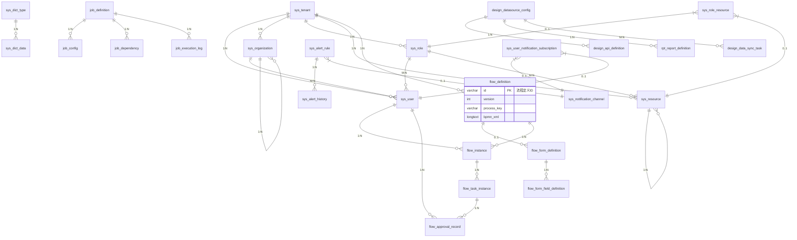

### 5.3. 数据实体

- **数据字典（DataDictionary）**：id, tenant_id, name, code, type, config, created_at
- **数据字典项（DataDictionaryItem）**：id, tenant_id, name, code, value, sort, status, created_at
- **系统配置（SystemConfig）**：id, tenant_id, name, code, config, created_at
- **多语言（Locale）**：id, tenant_id, language, name, code, created_at
- **租户（Tenant）**：id, name, code, status, schema, config, created_at, updated_at
- **用户（User）**：id, tenant_id, username, password, name, email, status, dept_id, created_at
- **组织（Organization）**：id, tenant_id, name, code, type, parent_id, path, sort, status, created_at
- **岗位（Post）**：id, tenant_id, name, code, organization_id, sort, status, created_at
- **角色（Role）**：id, tenant_id, name, code, data_scope, created_at
- **资源（Resource）**：id, tenant_id, name, code, type, parent_id, path, component, icon, sort, status, created_at
- **角色资源（RoleResource）**：id, role_id, resource_id, permission, created_at
- **数据权限（DataPermission）**：id, role_id, data_scope(枚举: all_tenants-所有租户, current_tenant-当前租户, current_dept-当前部门, current_user-当前用户, custom_depts-自定义部门), dept_ids, created_at
- **流程定义（FlowDefinition）**：id, tenant_id, name, key, version, status, category, form_id, creator
- **流程实例（FlowInstance）**：id, tenant_id, process_id, business_key, status, start_time, end_time, starter
- **任务（Task）**：id, instance_id, node_id, assignee, status, priority, create_time, due_time
- **表单模板（FormTemplate）**：id, tenant_id, name, content, config, version
- **表单数据（FormData）**：id, instance_id, form_id, data, created_at
- **流程节点（FlowNode）**：id, process_id, name, type, config, sort
- **流程连线（FlowLine）**：id, process_id, source_node_id, target_node_id, condition
- **节点处理（NodeHandler）**：id, node_id, type, config, created_at

### 5.4. 实体关系图

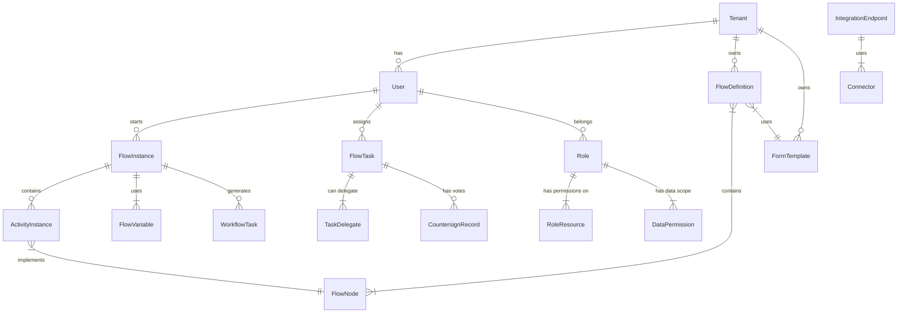

1. **多租户核心**：

   - `sys_tenant` 是所有业务数据的入口点
   - 每个租户拥有独立的用户/组织/角色/流程定义

2. **组织结构树**：

   ```mermaid
   erDiagram
       sys_organization ||--o{ sys_organization : "自关联"
       sys_organization }|--|{ sys_user : "多对多"
   ```

3. **RBAC 权限模型**：

   ```mermaid
   erDiagram
       sys_user }|--|{ sys_role : "多对多"
       sys_role }|--|{ sys_resource : "多对多"
       sys_resource ||--o{ sys_resource : "树形结构"
   ```

4. **流程引擎**：

   ```mermaid
   erDiagram
       flow_process_definition }|--|| flow_form_definition : "1对1"
       flow_process_definition ||--o{ flow_process_instance : "1对多"
       flow_process_instance ||--o{ flow_task_instance : "1对多"
   ```

5. **数据权限**：

   ```mermaid
   erDiagram
       sys_role }|--|{ sys_data_scope : "多对多"
       sys_data_scope ||--o{ sys_role_data_scope : "1对多"
   ```

6. **通知系统**：
   ```mermaid
   erDiagram
       sys_notification_channel ||--o{ sys_user_notification_subscription : "1对多"
       sys_user_notification_subscription }|--|| sys_user : "归属"
   ```

## 六、安全设计

### 1. 身份认证

- 基于 OAuth2.0+JWT 实现认证
- 支持多因素认证
- 密码策略：复杂度要求、定期更换、历史密码限制
- 会话管理：超时控制、并发登录限制

### 2. 权限控制

- RBAC+ABAC 混合权限模型
- 数据级权限：行级数据隔离
- 功能级权限：菜单、按钮、接口权限
- 字段级权限：表单字段访问控制

### 3. 数据安全

- 敏感数据加密存储（如密码、身份证号）
- Docker 镜像漏洞自动扫描（集成 Trivy 实现供应链安全增强）
- 传输加密（TLS 1.3）
- 数据脱敏（日志、查询结果）
- 数据备份与恢复策略

### 4. 操作审计

- 全量操作日志记录
- 敏感操作双人授权
- 操作轨迹追踪
- 审计日志防篡改

## 七、高可用设计

### 1. 集群部署

- 无状态服务水平扩展
- 数据库主从复制
- Redis 集群
- 消息队列集群

### 2. 限流熔断

- API 网关限流
- 服务级限流（Redis+Lua）
- 熔断降级（Resilience4j）
- 队列削峰填谷

### 3. 缓存策略

- 多级缓存：本地缓存+分布式缓存
- 热点数据缓存
- 缓存预热与更新
- 缓存穿透/击穿/雪崩防护

### 4. 故障恢复

- 服务自愈（健康检查+自动重启）
- 数据恢复机制
- 灾难备份
- 故障演练

## 八、性能优化

### 1. 数据库优化

- 合理索引设计
- SQL 优化
- 分库分表（ShardingSphere）
- 读写分离

### 2. 应用优化

- 异步处理
- 批量操作
- 延迟加载
- 资源池化（线程池、连接池）

### 3. 前端优化

- 启用 Vue 3.6 Vapor Mode 提升渲染性能，复杂列表场景性能提升 300%
- 资源压缩与合并
- 懒加载
- 缓存策略
- 预渲染

## 九、多语言与国际化

### 1. 多语言支持

- 系统界面多语言（zh-CN, en-US, ja-JP, ko-KR）
- 动态语言切换
- 语言包管理与更新
- 第三方组件国际化适配

### 2. 多时区支持

- 用户时区设置
- 时间自动转换
- 日志时间标准化

## 十、集成与扩展

### 1. 插件机制

- 流程插件：自定义节点、自定义连线
- 表单插件：自定义字段类型
- 通知插件：自定义通知渠道

### 2. API 设计

- RESTful API 设计规范
- 版本控制
- 接口文档（OpenAPI）
- 接口测试工具

### 3. 事件驱动

- 领域事件发布订阅
- 事件总线
- 事件溯源

## 十一、系统工程架构设计

系统采用前后端工程分离：

- 后端：Spring Boot + Spring Cloud + MyBatis Plus + PostgreSQL + Redis + RabbitMQ
- 前端：Vue 3 + Element Plus + Axios + ECharts
  前端工程名称：apaas-ui
  后端工程名：apaas
  基础包名：org.apaas

### 11.1. 后端工程结构

```
apaas (父工程)
├── apaas-core (核心模块)
├── apaas-gateway (网关服务)
├── apaas-micro (微服务模块)
│   ├── apaas-system (系统服务)
│   ├── apaas-auth (权限中心服务)
│   ├── apaas-monitor (监控服务)
│   ├── apaas-flow-engine (流程引擎服务)
│   ├── apaas-flow-execution (流程执行服务)
│   ├── apaas-data (数据引擎服务)
│   ├── apaas-job (调度任务服务)
│   ├── apaas-integration (集成服务)
│   ├── apaas-report (报表服务)
│   └── apaas-design-platform (开发平台服务)
├── apaas-api (API模块)
│   ├── apaas-core (API需要公共的实体、DTO、对象等)
│   ├── apaas-inner-api (对内提供远程调用服务API)
│   └── apaas-open-api (对外开放API)
└── apaas-standalone (单体服务)
```

#### 11.1.1 详细模块结构

---

##### 1. 父工程 (`apaas/pom.xml`)

```xml
<?xml version="1.0" encoding="UTF-8"?>
<project xmlns="http://maven.apache.org/POM/4.0.0"
         xmlns:xsi="http://www.w3.org/2001/XMLSchema-instance"
         xsi:schemaLocation="http://maven.apache.org/POM/4.0.0
         http://maven.apache.org/xsd/maven-4.0.0.xsd">
    <modelVersion>4.0.0</modelVersion>
    <groupId>org.apaas</groupId>
    <artifactId>apaas</artifactId>
    <version>1.0.0</version>
    <packaging>pom</packaging>

    <modules>
        <module>apaas-core</module>
        <module>apaas-gateway</module>
        <module>apaas-micro</module>
        <module>apaas-api</module>
        <module>apaas-standalone</module>
    </modules>

    <properties>
        <java.version>21</java.version>
        <spring-boot.version>3.5.4</spring-boot.version>
        <spring-cloud.version>2025.0.0</spring-cloud.version>
        <spring-cloud-alibaba.version>2023.0.3.3</spring-cloud-alibaba.version>
    </properties>

    <dependencyManagement>
        <dependencies>
            <!-- Spring Boot Starter -->
            <dependency>
                <groupId>org.springframework.boot</groupId>
                <artifactId>spring-boot-starter-parent</artifactId>
                <version>${spring-boot.version}</version>
                <type>pom</type>
                <scope>import</scope>
            </dependency>

            <!-- Spring Cloud -->
            <dependency>
                <groupId>org.springframework.cloud</groupId>
                <artifactId>spring-cloud-dependencies</artifactId>
                <version>${spring-cloud.version}</version>
                <type>pom</type>
                <scope>import</scope>
            </dependency>

            <!-- Spring Cloud Alibaba -->
            <dependency>
                <groupId>com.alibaba.cloud</groupId>
                <artifactId>spring-cloud-alibaba-dependencies</artifactId>
                <version>${spring-cloud-alibaba.version}</version>
                <type>pom</type>
                <scope>import</scope>
            </dependency>
        </dependencies>
    </dependencyManagement>

    <build>
        <plugins>
            <plugin>
                <groupId>org.apache.maven.plugins</groupId>
                <artifactId>maven-compiler-plugin</artifactId>
                <version>3.13.0</version>
                <configuration>
                    <release>${java.version}</release>
                    <encoding>UTF-8</encoding>
                </configuration>
            </plugin>
        </plugins>
    </build>
</project>
```

---

##### 2. 核心模块 (`apaas-core/`)

```markdown
src/
├── main/
│ ├── java/org/apaas/core/
│ │ ├── annotation/
│ │ │ ├── DataPermission.java
│ │ │ └── OperationLog.java
│ │ ├── config/
│ │ │ ├── MybatisPlusConfig.java
│ │ │ ├── RedisConfig.java
│ │ │ └── WebConfig.java
│ │ ├── domain/
│ │ │ ├── BaseEntity.java
│ │ │ └── TenantContext.java
│ │ ├── exception/
│ │ │ ├── GlobalExceptionHandler.java
│ │ │ └── ServiceException.java
│ │ ├── security/
│ │ │ ├── JwtTokenProvider.java
│ │ │ └── SecurityUtils.java
│ │ ├── util/
│ │ │ ├── ExcelUtil.java
│ │ │ ├── JsonUtil.java
│ │ │ └── SnowflakeIdWorker.java
│ │ └── web/
│ │ ├── domain/
│ │ │ ├── AjaxResult.java
│ │ │ └── PageResult.java
│ │ └── filter/
│ │ ├── RepeatSubmitFilter.java
│ │ └── TenantContextFilter.java
│ └── resources/
│ └── i18n/
│ ├── messages.properties
│ ├── messages_en.properties
│ └── messages_ja.properties
└── test/
└── java/org/apaas/core/
└── util/JsonUtilTest.java
```

---

##### 3. 网关服务 (`apaas-gateway/`)

```markdown
src/
├── main/
│ ├── java/org/apaas/gateway/
│ │ ├── config/
│ │ │ ├── GatewayConfig.java
│ │ │ └── SecurityConfig.java
│ │ ├── filter/
│ │ │ ├── AuthFilter.java
│ │ │ ├── LogFilter.java
│ │ │ └── RateLimitFilter.java
│ │ └── Application.java
│ └── resources/
│ ├── application.yml
│ └── bootstrap.yml
└── test/
```

---

##### 4. 微服务父模块 (`apaas-micro/pom.xml`)

```xml
<?xml version="1.0" encoding="UTF-8"?>
<project>
    <parent>
        <artifactId>apaas</artifactId>
        <groupId>org.apaas</groupId>
        <version>1.0.0</version>
    </parent>
    <modelVersion>4.0.0</modelVersion>
    <artifactId>apaas-micro</artifactId>
    <packaging>pom</packaging>

    <modules>
        <module>apaas-system</module>
        <module>apaas-auth</module>
        <module>apaas-monitor</module>
        <module>apaas-flow-engine</module>
        <module>apaas-flow-execution</module>
        <module>apaas-job</module>
        <module>apaas-integration</module>
        <module>apaas-report</module>
        <module>apaas-design-platform</module>
    </modules>
</project>
```

---

##### 5. 系统服务 (`apaas-micro/apaas-system/`)

```markdown
src/
├── main/
│ ├── java/org/apaas/system/
│ │ ├── resource/
│ │ │ ├── DictResource.java
│ │ │ ├── ConfigResource.java
│ │ │ └── NoticeResource.java
│ │ ├── service/
│ │ │ ├── DictService.java
│ │ │ ├── ConfigService.java
│ │ │ └── impl/
│ │ ├── repository/
│ │ │ ├── mapper/
│ │ │ └── impl/
│ │ ├── domain/
│ │ │ ├── entity/
│ │ │ │ ├── SysConfig.java
│ │ │ │ └── SysDict.java
│ │ │ └── vo/
│ │ └── Application.java
│ └── resources/
│ ├── application.yml
│ ├── mapper/
│ │ ├── SysConfigMapper.xml
│ │ └── SysDictMapper.xml
│ └── i18n/
└── test/
```

---

##### 6. 权限中心服务 (`apaas-micro/apaas-auth/`)

```markdown
src/
├── main/
│ ├── java/org/apaas/auth/
│ │ ├── resource/
│ │ │ ├── RoleResource.java
│ │ │ ├── UserResource.java
│ │ │ └── TenantResource.java
│ │ ├── service/
│ │ │ ├── PermissionService.java
│ │ │ ├── DataScopeService.java
│ │ │ └── impl/
│ │ ├── repository/
│ │ │ ├── mapper/
│ │ │ └── impl/
│ │ ├── domain/
│ │ │ ├── entity/
│ │ │ │ ├── Role.java
│ │ │ │ ├── User.java
│ │ │ │ └── Tenant.java
│ │ │ └── vo/
│ │ └── Application.java
│ └── resources/
│ ├── application.yml
│ └── mapper/
```

---

##### 7. 监控服务 (`apaas-micro/apaas-monitor/`)

```markdown
src/
├── main/
│ ├── java/org/apaas/log/
│ │ ├── resource/
│ │ │ ├── AuditResource.java
│ │ │ └── LogQueryResource.java
│ │ ├── service/
│ │ │ ├── AuditService.java
│ │ │ └── impl/
│ │ ├── repository/
│ │ │ ├── es/ (Elasticsearch)
│ │ │ └── mapper/
│ │ ├── domain/
│ │ │ ├── entity/
│ │ │ │ ├── OperationLog.java
│ │ │ │ └── LinkTrace.java
│ │ │ └── vo/
│ │ └── Application.java
│ └── resources/
│ ├── application.yml
│ └── logback-spring.xml
└── test/
```

---

##### 8. 流程引擎服务 (`apaas-micro/apaas-flow-engine/`)

```markdown
src/
├── main/
│ ├── java/org/apaas/flow/engine/
│ │ ├── resource/
│ │ │ ├── FlowDesignResource.java
│ │ │ └── FormDesignResource.java
│ │ ├── service/
│ │ │ ├── FlowDefinitionService.java
│ │ │ ├── BpmnModelService.java
│ │ │ └── impl/
│ │ ├── repository/
│ │ │ ├── mapper/
│ │ │ └── impl/
│ │ ├── domain/
│ │ │ ├── entity/
│ │ │ │ ├── FlowDefinition.java
│ │ │ │ ├── FlowNode.java
│ │ │ │ └── FormTemplate.java
│ │ │ └── model/
│ │ │ └── bpmn/
│ │ ├── engine/
│ │ │ ├── parser/
│ │ │ ├── handler/
│ │ │ └── constants/
│ │ └── Application.java
│ └── resources/
│ ├── application.yml
│ └── bpmn-templates/
│ ├── approval-flow.json
│ └── purchase-flow.json
└── test/
```

---

##### 9. 流程执行服务 (`apaas-micro/apaas-flow-execution/`)

```markdown
src/
├── main/
│ ├── java/org/apaas/flow/execution/
│ │ ├── resource/
│ │ │ ├── FlowInstanceResource.java
│ │ │ └── TaskResource.java
│ │ ├── service/
│ │ │ ├── FlowRuntimeService.java
│ │ │ ├── TaskManagementService.java
│ │ │ └── impl/
│ │ ├── domain/
│ │ │ ├── entity/
│ │ │ │ ├── FlowInstance.java
│ │ │ │ ├── ActivityInstance.java
│ │ │ │ └── WorkflowTask.java
│ │ │ └── event/
│ │ ├── listener/
│ │ │ ├── TaskAssignmentListener.java
│ │ │ └── FlowCompleteListener.java
│ │ └── Application.java
│ └── resources/
│ ├── application.yml
│ └── workflow-rules/
│ ├── task-assignment-rules.drl
│ └── escalation-rules.drl
└── test/
```

##### 10. 调度任务服务 (`apaas-micro/apaas-job/`)

```markdown
src/
├── main/
│ ├── java/org/apaas/job/
│ │ ├── resource/
│ │ │ ├── SchedulerResource.java
│ │ │ ├── TaskResource.java
│ │ │ └── JobLogResource.java
│ │ ├── service/
│ │ │ ├── SchedulerService.java
│ │ │ ├── TaskExecutorService.java
│ │ │ └── impl/
│ │ ├── domain/
│ │ │ ├── entity/
│ │ │ │ ├── SchedulerTask.java
│ │ │ │ ├── SchedulerTrigger.java
│ │ │ │ ├── TaskExecution.java
│ │ │ │ └── TaskLog.java
│ │ │ └── enums/
│ │ │ ├── TriggerType.java
│ │ │ └── TaskStatus.java
│ │ ├── executor/
│ │ │ ├── JobExecutor.java
│ │ │ ├── FlowTaskExecutor.java
│ │ │ └── ApiTaskExecutor.java
│ │ ├── handler/
│ │ │ ├── RetryHandler.java
│ │ │ └── FailoverHandler.java
│ │ └── Application.java
│ └── resources/
│ ├── application.yml
│ ├── quartz.properties
│ └── job-templates/
│ ├── process-job.xml
│ └── api-job.xml
└── test/
```

##### 11. 集成服务 (`apaas-micro/apaas-integration/`)

```markdown
src/
├── main/
│ ├── java/org/apaas/integration/
│ │ ├── resource/
│ │ │ ├── ApiIntegrationResource.java
│ │ │ ├── FormIntegrationResource.java
│ │ │ └── ConnectorResource.java
│ │ ├── service/
│ │ │ ├── ApiIntegrationService.java
│ │ │ ├── ConnectorService.java
│ │ │ └── impl/
│ │ ├── domain/
│ │ │ ├── entity/
│ │ │ │ ├── IntegrationEndpoint.java
│ │ │ │ ├── Connector.java
│ │ │ │ ├── IntegrationMapping.java
│ │ │ │ └── ApiAccessLog.java
│ │ │ └── model/
│ │ │ ├── ApiRequest.java
│ │ │ └── ApiResponse.java
│ │ ├── adapter/
│ │ │ ├── OAuth2Adapter.java
│ │ │ ├── SAMLAdapter.java
│ │ │ └── LDAPAdapter.java
│ │ ├── gateway/
│ │ │ ├── ApiGateway.java
│ │ │ └── RequestRouter.java
│ │ └── Application.java
│ └── resources/
│ ├── application.yml
│ ├── connectors/
│ │ ├── oauth2-config.json
│ │ └── ldap-config.json
│ └── api-specs/
│ ├── erp-api.yaml
│ └── hr-api.yaml
└── test/
```

##### 12. 报表服务 (`apaas-micro/apaas-report/`)

```markdown
src/
├── main/
│ ├── java/org/apaas/report/
│ │ ├── resource/
│ │ │ ├── FlowAnalysisResource.java
│ │ │ ├── UserAnalysisResource.java
│ │ │ └── CustomReportResource.java
│ │ ├── service/
│ │ │ ├── AnalysisService.java
│ │ │ ├── ReportGenerator.java
│ │ │ └── impl/
│ │ ├── domain/
│ │ │ ├── entity/
│ │ │ │ ├── AnalysisTask.java
│ │ │ │ ├── ReportDefinition.java
│ │ │ │ ├── AnalysisResult.java
│ │ │ │ └── DashboardConfig.java
│ │ │ └── vo/
│ │ │ ├── FlowMetricVO.java
│ │ │ └── UserActivityVO.java
│ │ ├── analyzer/
│ │ │ ├── FlowAnalyzer.java
│ │ │ ├── UserBehaviorAnalyzer.java
│ │ │ └── BottleneckDetector.java
│ │ ├── visualization/
│ │ │ ├── ChartRenderer.java
│ │ │ └── DashboardBuilder.java
│ │ └── Application.java
│ └── resources/
│ ├── application.yml
│ ├── report-templates/
│ │ ├── process-analysis.jrxml
│ │ └── user-activity.jrxml
│ └── dashboards/
│ ├── process-monitor.json
│ └── user-performance.json
└── test/
```

##### 13. 开发平台服务 (`apaas-micro/apaas-design-platform/`)

```markdown
src/
├── main/
│ ├── java/org/apaas/design/
│ │ ├── resource/
│ │ │ ├── MetadataResource.java # 元数据管理
│ │ │ ├── ModelDesignResource.java # 模型设计
│ │ │ ├── CodeTemplateResource.java # 代码模板管理
│ │ │ ├── CodeGeneratorResource.java # 代码生成
│ │ │ ├── DataSourceResource.java # 数据源管理
│ │ │ ├── ApiGeneratorResource.java # API 接口生成
│ │ │ ├── DataSyncResource.java # 数据同步
│ │ │ └── VisualizationResource.java # 数据可视化
│ │ ├── service/
│ │ │ ├── MetadataService.java # 元数据服务
│ │ │ ├── ModelDesignService.java # 模型设计服务
│ │ │ ├── CodeTemplateService.java # 代码模板服务
│ │ │ ├── CodeGeneratorService.java # 代码生成服务
│ │ │ ├── DataSourceService.java # 数据源服务
│ │ │ ├── ApiGeneratorService.java # API 生成服务
│ │ │ ├── DataSyncService.java # 数据同步服务
│ │ │ ├── VisualizationService.java # 可视化服务
│ │ │ └── impl/ # 服务实现
│ │ ├── repository/
│ │ │ ├── mapper/ # MyBatis Mapper 接口
│ │ │ │ ├── MetadataMapper.java
│ │ │ │ ├── ModelMapper.java
│ │ │ │ └── ...
│ │ │ └── impl/ # 自定义 Repository 实现
│ │ ├── domain/
│ │ │ ├── entity/ # 实体类
│ │ │ │ ├── Metadata.java # 元数据实体
│ │ │ │ ├── DataModel.java # 数据模型实体
│ │ │ │ ├── CodeTemplate.java # 代码模板实体
│ │ │ │ ├── DataSource.java # 数据源实体
│ │ │ │ ├── ApiDefinition.java # API 定义实体
│ │ │ │ ├── DataSyncTask.java # 数据同步任务实体
│ │ │ │ └── ...
│ │ │ ├── enums/ # 枚举类
│ │ │ │ ├── DataSourceType.java # 数据源类型枚举
│ │ │ │ ├── CodeLangType.java # 代码语言类型枚举
│ │ │ │ └── ...
│ │ │ └── vo/ # 视图对象
│ │ │ ├── MetadataVO.java
│ │ │ ├── ModelVO.java
│ │ │ └── ...
│ │ ├── generator/ # 代码生成器核心
│ │ │ ├── engine/ # 模板引擎封装
│ │ │ │ └── TemplateEngine.java # 抽象模板引擎
│ │ │ ├── factory/ # 生成器工厂
│ │ │ │ └── GeneratorFactory.java
│ │ │ ├── impl/ # 具体生成器实现
│ │ │ │ ├── JavaEntityGenerator.java # Java 实体生成器
│ │ │ │ ├── MybatisMapperGenerator.java # Mapper 生成器
│ │ │ │ ├── VuePageGenerator.java # Vue 页面生成器
│ │ │ │ └── ...
│ │ │ └── model/ # 生成模型
│ │ │ └── TableInfo.java # 表信息模型
│ │ ├── datasource/ # 数据源管理
│ │ │ ├── manager/ # 数据源管理器
│ │ │ │ └── DataSourceManager.java
│ │ │ ├── factory/ # 数据源工厂
│ │ │ │ └── DataSourceFactory.java
│ │ │ └── impl/ # 具体数据源实现
│ │ │ ├── JdbcDataSource.java # JDBC 数据源
│ │ │ ├── RedisDataSource.java # Redis 数据源
│ │ │ └── ...
│ │ ├── sync/ # 数据同步
│ │ │ ├── task/ # 同步任务
│ │ │ │ └── DataSyncTaskExecutor.java
│ │ │ ├── strategy/ # 同步策略
│ │ │ │ ├── FullSyncStrategy.java # 全量同步
│ │ │ │ └── IncrementalSyncStrategy.java # 增量同步
│ │ │ └── handler/ # 同步处理器
│ │ │ ├── PostgreSQLHandler.java
│ │ │ └── ...
│ │ ├── api/ # API 接口生成
│ │ │ ├── builder/ # API 构建器
│ │ │ │ └── ApiBuilder.java
│ │ │ ├── parser/ # SQL 解析器
│ │ │ │ └── SqlParser.java
│ │ │ └── model/ # API 模型
│ │ │ └── ApiDefinition.java
│ │ ├── visualization/ # 数据可视化
│ │ │ ├── renderer/ # 渲染器
│ │ │ │ ├── ChartRenderer.java
│ │ │ │ └── DashboardRenderer.java
│ │ │ └── builder/ # 构建器
│ │ │ └── DashboardBuilder.java
│ │ └── Application.java # 启动类
│ └── resources/
│ ├── application.yml # 应用配置
│ ├── generator-templates/ # 代码生成模板
│ │ ├── java/
│ │ │ ├── entity.java.ftl # 实体类模板
│ │ │ ├── mapper.java.ftl # Mapper 接口模板
│ │ │ ├── service.java.ftl # Service 接口模板
│ │ │ ├── serviceImpl.java.ftl # Service 实现模板
│ │ │ ├── resource.java.ftl # Controller 模板
│ │ │ └── ...
│ │ └── vue/
│ │ ├── list.vue.ftl # Vue 列表页面模板
│ │ ├── form.vue.ftl # Vue 表单页面模板
│ │ └── ...
│ ├── sql-parser-rules/ # SQL 解析规则
│ │ └── api-rules.xml
│ ├── data-sync/ # 数据同步配置
│ │ └── sync-rules.xml
│ └── visualization/ # 可视化模板
│ ├── chart-templates/
│ └── dashboard-templates/
└── test/
└── java/org/apaas/devplatform/
├── service/
│ └── CodeGeneratorServiceTest.java
└── generator/
└── JavaEntityGeneratorTest.java
```

---

##### 14. API 模块 (`apaas-api`)

```xml
<?xml version="1.0" encoding="UTF-8"?>
<project>
    <parent>
        <artifactId>apaas</artifactId>
        <groupId>org.apaas</groupId>
        <version>1.0.0</version>
    </parent>
    <modelVersion>4.0.0</modelVersion>
    <artifactId>apaas-api</artifactId>
    <packaging>pom</packaging>

    <modules>
        <module>apaas-core</module>
        <module>apaas-inner-api</module>
        <module>apaas-open-api</module>
    </modules>
</project>
```

##### 15. API 公共模块 (`apaas-api/apaas-core/`)

```markdown
src/
├── main/
│ ├── java/org/apaas/common/
│ │ ├── dto/
│ │ ├── entity/
│ └── resources/
│ ├── application.yml
│ └── openapi/
│ └── openapi-v3.yaml
└── test/
```

##### 16. 对内远程调用模块 (`apaas-api/apaas-inner-api/`)

```markdown
src/
├── main/
│ ├── java/org/apaas/inner/
│ │ ├── service/
│ └── resources/
│ ├── application.yml
│ └── openapi/
│ └── openapi-v3.yaml
└── test/
```

##### 17. 对外开放 API 模块 (`apaas-api/apaas-open-api/`)

```markdown
src/
├── main/
│ ├── java/org/apaas/open/
│ │ ├── service/
│ └── resources/
│ ├── application.yml
│ └── openapi/
│ └── openapi-v3.yaml
└── test/
```

#### 11.1.2Maven 构建说明

1. **多环境打包**：

```bash
# 开发环境
mvn clean package -P dev

# 测试环境
mvn clean package -P test

# 生产环境
mvn clean package -P prod
```

2. **单独构建服务**：

```bash
cd apaas-micro/apaas-system
mvn clean package
```

3. **Docker 镜像构建**：

```bash
mvn spring-boot:build-image -Dspring-boot.build-image.imageName=apaas/apaas-system:1.0.0
```

### 11.2. 前端工程结构

```markdown
src/
├── assets/ # 静态资源
│ ├── svgs/ # SVG 图标
│ ├── styles/ # 全局样式
│ │ ├── variables.scss # SCSS 变量
│ │ ├── mixins.scss # SCSS 混入
│ │ └── global.scss # 全局样式
│ └── images/ # 图片资源
├── components/ # 通用组件
│ ├── layout/ # 布局组件
│ │ ├── AppLayout.vue # 主布局
│ │ ├── AppHeader.vue # 顶部导航
│ │ └── AppSidebar.vue # 侧边菜单
│ ├── common/ # 通用组件
│ │ ├── PageHeader.vue # 页面标题
│ │ ├── SearchBar.vue # 搜索栏
│ │ └── SvgIcon.vue # SVG 图标组件
│ └── business/ # 业务组件
│ ├── flow/
│ │ ├── FlowDesigner.vue # 流程设计器
│ │ └── ApprovalPanel.vue # 审批面板
│ └── system/
│ ├── TenantSelector.vue # 租户选择器
│ └── RoleAssignment.vue # 角色分配
├── composables/ # 组合式函数
│ ├── useAxios.ts # Axios 封装
│ ├── useForm.ts # 表单处理
│ ├── useI18n.ts # 多语言扩展
│ └── usePermission.ts # 权限验证
├── router/ # 路由管理
│ ├── index.ts # 路由入口
│ ├── routes.ts # 路由配置
│ └── guard/ # 路由守卫
│ ├── auth.ts # 认证守卫
│ └── permission.ts # 权限守卫
├── stores/ # Pinia 状态管理
│ ├── auth.ts # 认证状态
│ ├── permission.ts # 权限状态
│ ├── workflow.ts # 流程引擎状态
│ └── system.ts # 系统管理状态
├── utils/ # 工具函数
│ ├── request.ts # Axios 封装
│ ├── auth.ts # 认证工具
│ ├── validate.ts # 验证工具
│ └── formatter.ts # 数据格式化
├── views/ # 页面视图
│ ├── login/ # 登录模块
│ │ └── LoginPage.vue
│ ├── dashboard/ # 仪表盘
│ │ ├── index.vue
│ │ └── components/
│ ├── flow/ # 流程引擎
│ │ ├── design/ # 流程设计
│ │ ├── execution/ # 流程执行
│ │ └── monitoring/ # 流程监控
│ ├── system/ # 系统管理
│ │ ├── tenant/ # 租户管理
│ │ ├── user/ # 用户管理
│ │ ├── role/ # 角色权限
│ │ └── dict/ # 数据字典
│ └── monitor/ # 系统监控
│ ├── audit/ # 操作审计
│ ├── log/ # 日志分析
│ └── dashboard/ # 监控大屏
├── api/ # API 接口管理
│ ├── auth.ts # 认证相关 API
│ ├── workflow.ts # 流程引擎 API
│ ├── system.ts # 系统管理 API
│ └── monitor.ts # 监控 API
├── i18n/ # 国际化语言包
│ ├── zh-CN.ts
│ ├── en-US.ts
│ └── ja-JP.ts
├── App.vue # 根组件
└── main.ts # 应用入口
```

## 十二、 服务间依赖关系分析

### 12.1 服务依赖矩阵

| 依赖方 \ 被依赖方 | 系统服务 | 权限中心 | 日志服务 | 流程引擎 | 流程执行 | 调度任务 | 集成服务 | 报表服务 | 开发平台 |
| ----------------- | -------- | -------- | -------- | -------- | -------- | -------- | -------- | -------- | -------- |
| **系统服务**      | -        | ✅       | ✅       |          |          |          |          |          |          |
| **权限中心**      | ✅       | -        | ✅       |          |          |          |          |          |          |
| **日志服务**      |          |          | -        |          |          |          |          |          |          |
| **流程引擎**      | ✅       | ✅       | ✅       | -        |          |          |          |          |          |
| **流程执行**      |          | ✅       | ✅       | ✅       | -        | ✅       | ✅       |          |          |
| **调度任务**      |          |          | ✅       |          | ✅       | -        | ✅       |          |          |
| **集成服务**      | ✅       | ✅       | ✅       |          |          |          | -        |          |          |
| **报表服务**      |          |          | ✅       |          | ✅       | ✅       |          | -        |          |
| **开发平台**      | ✅       | ✅       | ✅       |          |          |          | ✅       |          | -        |

### 12.2 详细依赖关系说明

#### 1. 系统服务依赖

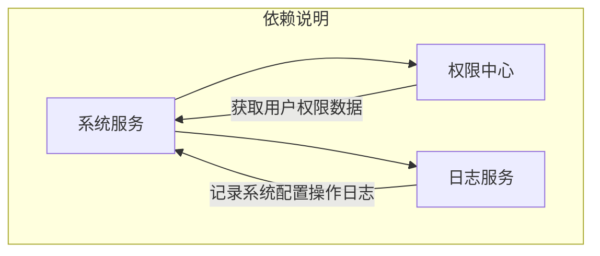

#### 2. 权限中心依赖

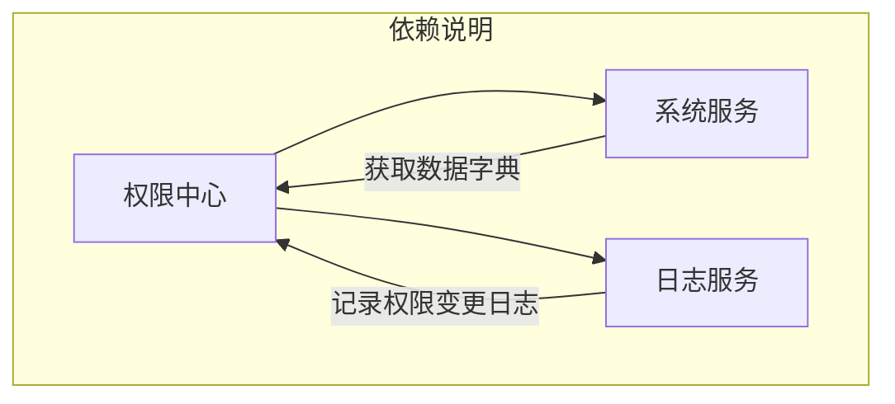

#### 3. 流程引擎依赖

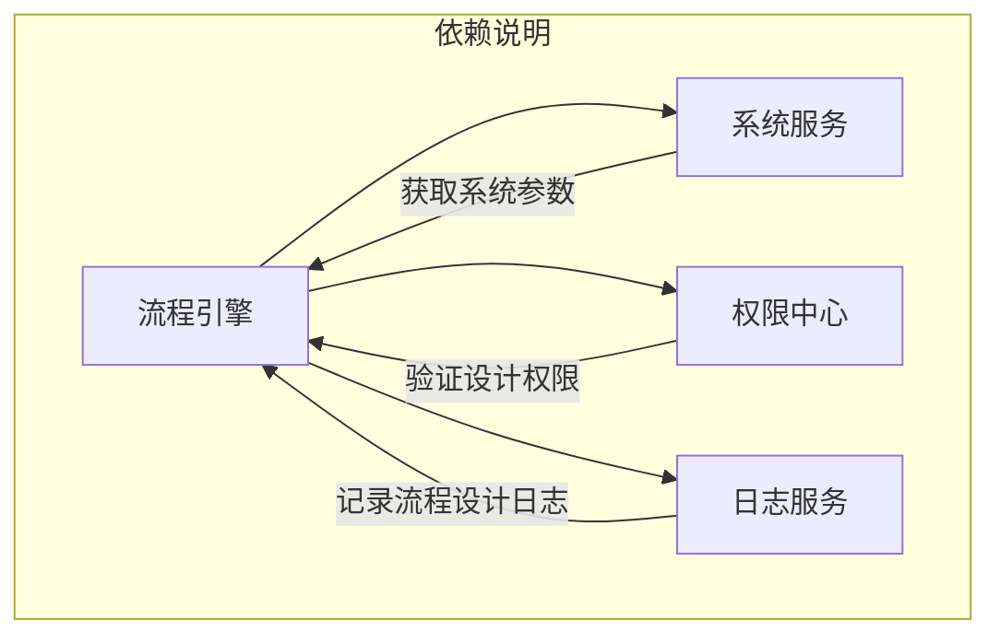

#### 4. 流程执行依赖

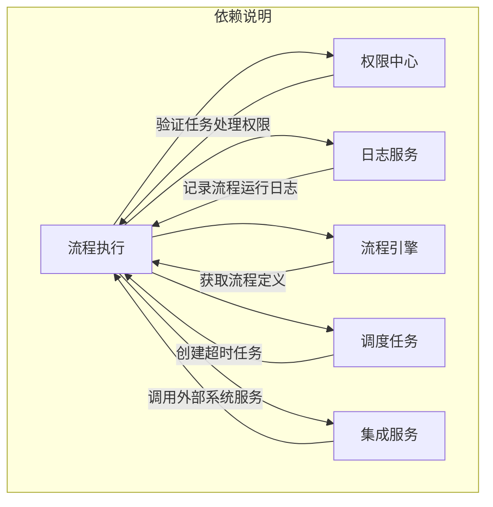

#### 5. 调度任务依赖

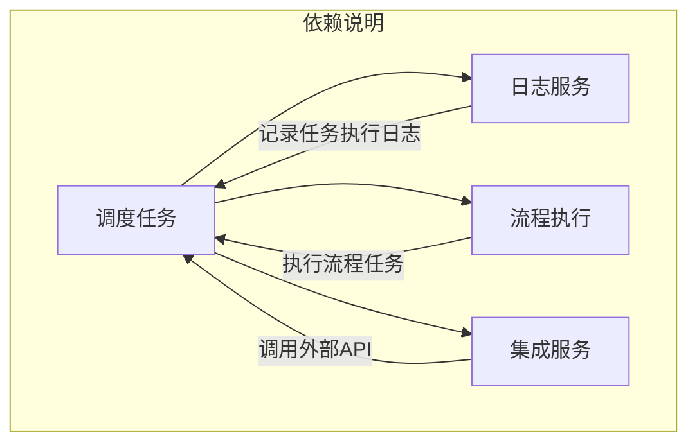

#### 6. 集成服务依赖

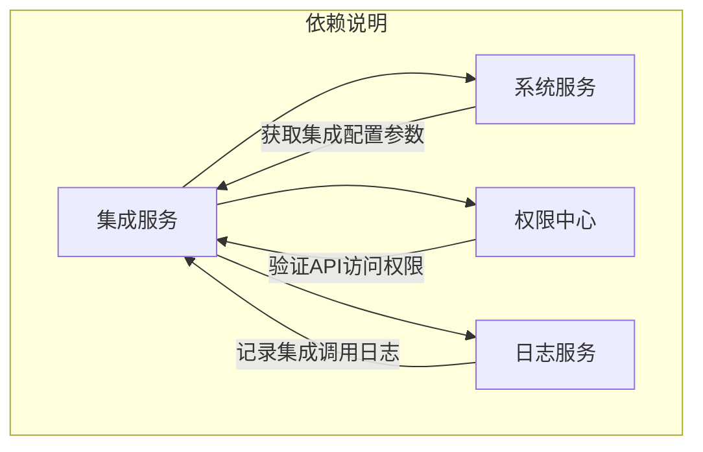

#### 7. 报表服务依赖

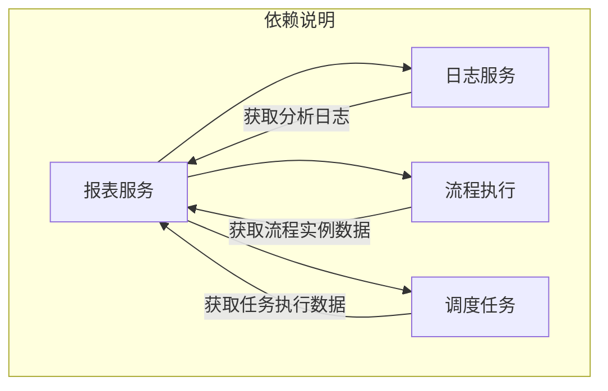

#### 8. 开发平台依赖

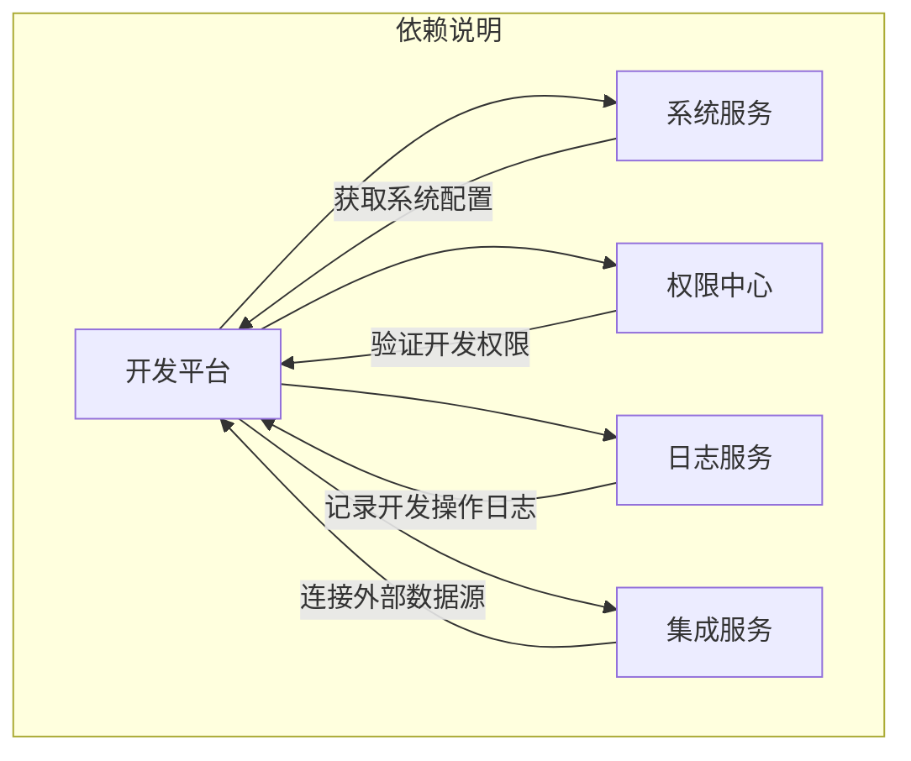

### 12.3 关键依赖路径分析

#### 流程启动依赖链

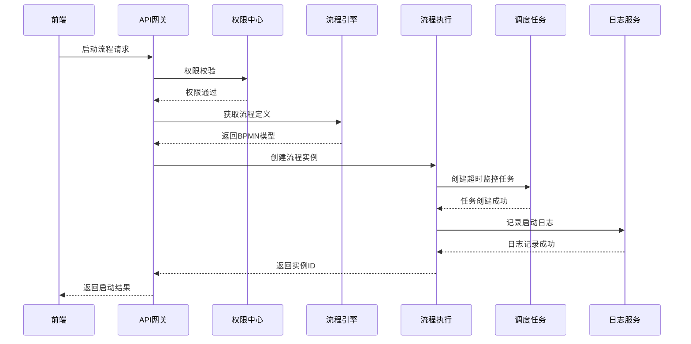

#### 任务处理依赖链

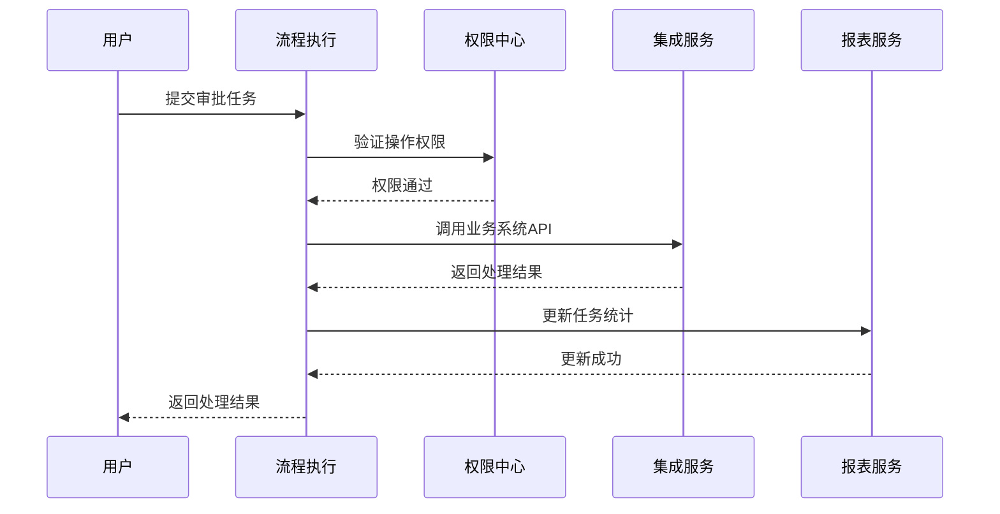

### 12.4 依赖管理策略

#### 1. 服务降级策略

| **服务** | **降级方案**                     | **影响范围**                    |
| -------- | -------------------------------- | ------------------------------- |
| 权限中心 | 使用本地缓存权限数据             | 新用户/角色权限变更无法及时生效 |
| 日志服务 | 降级到本地文件日志               | 日志查询功能受限                |
| 集成服务 | 跳过外部系统调用，记录待重试任务 | 部分业务流程中断                |
| 调度任务 | 使用内存队列暂存任务             | 重启可能导致任务丢失            |

#### 2. 依赖超时配置

```yaml
# 应用配置示例
feign:
  client:
    config:
      default:
        connectTimeout: 2000
        readTimeout: 5000

resilience4j:
  circuitbreaker:
    instances:
      permissionService:
        failureRateThreshold: 50
        waitDurationInOpenState: 5000
  timelimiter:
    instances:
      default:
        timeoutDuration: 3000
```

#### 3. 消息补偿机制

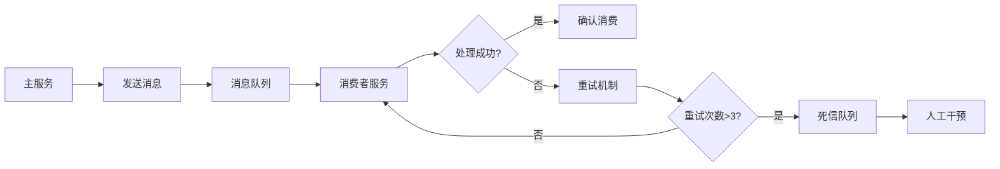

#### 服务治理建议

1. **依赖可视化**：

   - 使用 SkyWalking 绘制服务依赖拓扑图
   - 在 Grafana 展示关键依赖的健康状态

2. **强弱依赖分离**：

   - 核心流程：流程引擎 → 流程执行 → 权限中心
   - 辅助流程：日志服务 → 报表服务

3. **依赖解耦策略**：

   ```mermaid
   graph TD
       A[服务A] -->|同步调用| B[服务B]
       A -->|事件发布| C[消息队列]
       C -->|异步消费| D[服务C]

       style A fill:#f9f,stroke:#333
       style B fill:#f96,stroke:#333
       style C fill:#6f9,stroke:#333
       style D fill:#69f,stroke:#333
   ```

4. **依赖测试方案**：
   - 单元测试：Mock 依赖服务
   - 集成测试：Testcontainers 模拟依赖
   - 混沌测试：Chaos Mesh 注入依赖故障

## 十三、部署与运维

### **1. 部署架构**

```yaml
# 部署架构图（概念）
Internet
    |
    v
[Load Balancer (Nginx)]
    |
    v
[API Gateway (udap-gateway)]
    |
    +---> [Microservices Cluster]
    |       ├── udap-iam-service
    |       ├── udap-project-service
    |       ├── udap-integration-service
    |       ├── udap-workflow-service
    |       └── ...
    |
    +---> [Data Layer]
    |       ├── PostgreSQL (HA)
    |       ├── Redis Cluster
    |       └── MongoDB ReplicaSet
    |
    +---> [Message Queue]
    |       └── Kafka Cluster
    |       └── RabbitMQ Cluster
    |
    +---> [Monitoring]
        ├── Prometheus
        ├── Grafana
        └── Jaeger
```


### 2. 环境规划

- 开发环境（dev）
- 测试环境（test）
- 预发布环境（staging）
- 生产环境（prod）

### 3. 部署流程

- 代码管理：GitLab
- 持续集成：自动化构建、测试
- 持续部署：蓝绿部署、灰度发布，基于 Jenkins Pipeline-as-Code 实现，核心流程包括：
  ```groovy
  pipeline {
    agent any
    stages {
      stage('Build') { steps { sh 'mvn clean package' } }
      stage('Test') { steps { sh 'mvn test' } }
      stage('Scan') { steps { sh 'trivy image $APP_IMAGE' } }
      stage('Deploy') { steps { sh 'kubectl apply -f deployment.yaml' } }
    }
  }
  ```
- 配置管理：Nacos 配置中心

### 4. 监控告警

- 系统监控：CPU、内存、磁盘、网络
- 应用监控：响应时间、错误率、吞吐量
- 业务监控：流程数量、任务数量、活跃用户
- 告警策略：多级别、多渠道、告警升级
