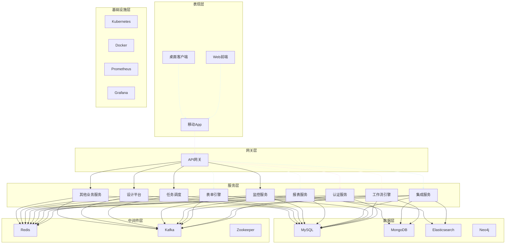

# 统一智能数据应用平台(UDAP) - 技术选型设计

## 1. 整体技术架构

统一智能数据应用平台(UDAP)采用现代化的云原生技术架构，基于微服务设计理念，将系统拆分为多个独立的服务模块，每个模块可独立开发、部署和扩展。整体技术架构分为以下几个层次：

1. **表现层**: 用户界面和交互
2. **网关层**: API网关和安全控制
3. **服务层**: 业务微服务
4. **中间件层**: 公共基础服务
5. **数据层**: 数据存储和管理
6. **基础设施层**: 容器化和云平台

## 2. 前端技术选型

### 2.1 Web前端技术栈

#### 2.1.1 核心框架
- **Vue.js 3.x**: 选择Vue.js作为主要前端框架，理由如下：
  - 渐进式框架，学习曲线平缓
  - 优秀的生态系统和社区支持
  - 良好的性能和可维护性
  - 支持TypeScript，提高代码质量
  - 丰富的组件库和工具链

#### 2.1.2 UI组件库
- **Element Plus**: 基于Vue 3的桌面端组件库
  - 丰富的组件集合，满足大部分UI需求
  - 良好的主题定制能力
  - 完善的中文文档和支持
  - 与Vue 3完美集成

#### 2.1.3 状态管理
- **Pinia**: Vue 3官方推荐的状态管理库
  - 更简洁的API设计
  - TypeScript支持更好
  - 模块化组织状态
  - 开发体验更佳

#### 2.1.4 路由管理
- **Vue Router 4**: Vue.js官方路由管理器
  - 与Vue 3深度集成
  - 支持动态路由和嵌套路由
  - 提供路由守卫功能
  - 支持路由懒加载

#### 2.1.5 构建工具
- **Vite**: 下一代前端构建工具
  - 极快的冷启动速度
  - 热模块替换(HMR)速度快
  - 原生支持TypeScript和JSX
  - 丰富的插件生态系统

#### 2.1.6 图表库
- **ECharts**: 百度开源的可视化图表库
  - 丰富的图表类型
  - 良好的交互体验
  - 强大的自定义能力
  - 良好的性能表现

### 2.2 移动端技术选型

#### 2.2.1 跨平台框架
- **uni-app**: 基于Vue.js的跨平台开发框架
  - 一套代码多端运行（iOS、Android、H5、小程序）
  - 与Vue生态系统无缝集成
  - 丰富的组件和API
  - 良好的性能表现

#### 2.2.2 原生开发
- **React Native**: Facebook开源的跨平台移动开发框架
  - 接近原生的性能体验
  - 强大的社区支持
  - 丰富的第三方组件
  - 热更新能力

### 2.3 桌面端技术选型

#### 2.3.1 Electron
- **Electron**: 使用Web技术构建跨平台桌面应用
  - 基于Chromium和Node.js
  - 一套代码多平台运行
  - 丰富的原生API
  - 活跃的社区生态

## 3. 后端技术选型

### 3.1 微服务框架

#### 3.1.1 Spring Boot/Spring Cloud
- **Spring Boot**: 快速构建Spring应用的框架
  - 约定优于配置，简化开发
  - 内嵌Web服务器，独立运行
  - 丰富的starter组件
  - 完善的生态系统

- **Spring Cloud**: 构建分布式系统的工具集
  - 服务注册与发现(Eureka/Nacos)
  - 配置管理(Config)
  - 断路器(Hystrix/Resilience4j)
  - 网关(Zuul/Gateway)

#### 3.1.2 微服务通信
- **RESTful API**: 基于HTTP的轻量级通信协议
  - 简单易用，广泛支持
  - 无状态，可扩展
  - 易于调试和测试

- **gRPC**: Google开源的高性能RPC框架
  - 基于HTTP/2协议
  - 支持多种编程语言
  - 高性能，低延迟
  - 支持流式传输

### 3.2 编程语言

#### 3.2.1 Java
- **Java 17 LTS**: 选择Java作为主要后端开发语言
  - 成熟稳定的生态系统
  - 丰富的第三方库和框架
  - 强大的企业级支持
  - 良好的性能和可靠性
  - 长期支持版本

#### 3.2.2 Kotlin
- **Kotlin**: 作为Java的补充语言
  - 与Java完全兼容
  - 更简洁的语法
  - 空安全特性
  - 函数式编程支持

### 3.3 API文档

#### 3.3.1 Swagger/OpenAPI
- **Swagger**: API文档生成和测试工具
  - 自动生成API文档
  - 提供交互式API测试界面
  - 支持多种编程语言
  - 与Spring Boot集成良好

## 4. 数据库技术选型

### 4.1 关系型数据库

#### 4.1.1 MySQL 8.0
- **MySQL**: 选择MySQL作为主要关系型数据库
  - 广泛使用，社区支持强大
  - 性能优秀，稳定性高
  - 丰富的存储引擎
  - 良好的可扩展性

#### 4.1.2 PostgreSQL
- **PostgreSQL**: 作为特定场景下的关系型数据库选择
  - 更强大的SQL标准支持
  - 丰富的数据类型
  - 良好的扩展性
  - 支持复杂查询和分析

### 4.2 NoSQL数据库

#### 4.2.1 MongoDB
- **MongoDB**: 文档型数据库
  - 灵活的文档结构
  - 水平扩展能力强
  - 丰富的查询语言
  - 良好的性能表现

#### 4.2.2 Redis
- **Redis**: 高性能内存数据库
  - 极高的读写性能
  - 丰富的数据结构支持
  - 持久化机制
  - 发布订阅功能

#### 4.2.3 Elasticsearch
- **Elasticsearch**: 分布式搜索引擎
  - 全文检索能力强
  - 实时分析能力
  - 分布式架构
  - RESTful API

#### 4.2.4 Neo4j
- **Neo4j**: 图数据库
  - 优秀的图数据建模能力
  - 高效的图遍历算法
  - Cypher查询语言
  - 支持ACID事务

## 5. 中间件技术选型

### 5.1 消息队列

#### 5.1.1 Apache Kafka
- **Kafka**: 分布式流处理平台
  - 高吞吐量，低延迟
  - 持久化存储
  - 水平扩展能力强
  - 生态系统完善

#### 5.1.2 RabbitMQ
- **RabbitMQ**: 传统消息队列
  - 支持多种消息协议
  - 灵活的路由机制
  - 可靠的消息传递
  - 管理界面友好

### 5.2 缓存系统

#### 5.2.1 Redis Cluster
- **Redis**: 高性能内存数据库
  - 集群模式支持水平扩展
  - 多种数据结构支持
  - 持久化机制
  - 丰富的客户端支持

### 5.3 配置中心

#### 5.3.1 Nacos
- **Nacos**: 动态服务发现、配置管理和服务管理平台
  - 服务注册与发现
  - 配置管理
  - 服务元数据管理
  - 动态DNS服务

#### 5.3.2 Apollo
- **Apollo**: 携程开源的配置中心
  - 配置管理UI
  - 权限管理
  - 流程治理
  - 客户端支持

## 6. 容器化与云原生技术选型

### 6.1 容器化平台

#### 6.1.1 Docker
- **Docker**: 容器化平台
  - 轻量级虚拟化技术
  - 标准化的镜像格式
  - 丰富的镜像仓库
  - 良好的生态系统

### 6.2 容器编排

#### 6.2.1 Kubernetes
- **Kubernetes**: 容器编排平台
  - 自动化部署和扩展
  - 服务发现和负载均衡
  - 存储编排
  - 自我修复能力

#### 6.2.2 Helm
- **Helm**: Kubernetes包管理器
  - 应用打包和分发
  - 版本管理
  - 依赖管理
  - 参数化配置

### 6.3 服务网格

#### 6.3.1 Istio
- **Istio**: 服务网格
  - 流量管理
  - 安全控制
  - 可观察性
  - 策略执行

## 7. 监控与运维技术选型

### 7.1 监控系统

#### 7.1.1 Prometheus
- **Prometheus**: 监控和告警工具包
  - 多维数据模型
  - 强大的查询语言PromQL
  - 不依赖分布式存储
  - 服务发现机制

#### 7.1.2 Grafana
- **Grafana**: 数据可视化平台
  - 丰富的图表类型
  - 支持多种数据源
  - 灵活的仪表板
  - 告警功能

### 7.2 日志管理

#### 7.2.1 ELK Stack
- **Elasticsearch**: 分布式搜索引擎
- **Logstash**: 数据收集处理引擎
- **Kibana**: 数据可视化平台

#### 7.2.2 Fluentd
- **Fluentd**: 开源数据收集器
  - 统一的日志层
  - 插件化架构
  - 最小资源占用
  - 可靠性高

### 7.3 调用链追踪

#### 7.3.1 Jaeger
- **Jaeger**: 分布式追踪系统
  - 分布式上下文传播
  - 分布式事务监控
  - 根本原因分析
  - 服务依赖分析

#### 7.3.2 SkyWalking
- **SkyWalking**: 应用性能监控系统
  - 分布式追踪
  - 服务网格遥测分析
  - 应用性能指标分析
  - 多语言自动探针

## 8. 安全技术选型

### 8.1 身份认证

#### 8.1.1 OAuth 2.0/OpenID Connect
- **OAuth 2.0**: 授权框架
- **OpenID Connect**: 身份认证层

#### 8.1.2 JWT
- **JWT**: JSON Web Token
  - 无状态认证
  - 跨域支持
  - 移动端友好
  - 自包含信息

### 8.2 API网关

#### 8.2.1 Spring Cloud Gateway
- **Spring Cloud Gateway**: API网关
  - 基于Spring Framework 5
  - 集成Spring Cloud
  - 高性能
  - 易于扩展

#### 8.2.2 Kong
- **Kong**: 云原生API网关
  - 高性能和可扩展性
  - 插件化架构
  - 安全控制
  - 监控和分析

## 9. 开发工具与流程

### 9.1 集成开发环境(IDE)

#### 9.1.1 IntelliJ IDEA
- **IntelliJ IDEA**: Java开发IDE
  - 强大的代码分析
  - 框架集成支持
  - 版本控制集成
  - 插件生态系统

#### 9.1.2 Visual Studio Code
- **VS Code**: 轻量级代码编辑器
  - 丰富的插件生态
  - Git集成
  - 调试支持
  - 多语言支持

### 9.2 版本控制

#### 9.2.1 Git
- **Git**: 分布式版本控制系统
  - 分布式架构
  - 强大的分支管理
  - 完整的历史记录
  - 高效的合并机制

#### 9.2.2 GitLab
- **GitLab**: DevOps平台
  - 代码托管
  - CI/CD流水线
  - 项目管理
  - 安全扫描

### 9.3 持续集成/持续部署(CI/CD)

#### 9.3.1 Jenkins
- **Jenkins**: 开源自动化服务器
  - 插件生态系统丰富
  - 灵活的流水线配置
  - 分布式构建支持
  - 社区支持强大

#### 9.3.2 GitLab CI/CD
- **GitLab CI/CD**: 内置CI/CD工具
  - 与GitLab无缝集成
  - YAML配置文件
  - 自动化部署
  - 安全扫描

### 9.4 代码质量管理

#### 9.4.1 SonarQube
- **SonarQube**: 代码质量管理平台
  - 多语言支持
  - 代码规范检查
  - 代码覆盖率分析
  - 技术债务管理

#### 9.4.2 Checkmarx
- **Checkmarx**: 静态应用安全测试工具
  - 安全漏洞检测
  - 代码质量分析
  - 合规性检查
  - 集成开发流程

## 10. 第三方服务与组件

### 10.1 云服务提供商

#### 10.1.1 阿里云
- **计算服务**: ECS、容器服务Kubernetes版
- **存储服务**: 对象存储OSS、文件存储NAS
- **网络服务**: 负载均衡SLB、CDN
- **安全服务**: Web应用防火墙、DDoS防护
- **数据库服务**: RDS、MongoDB、Redis

#### 10.1.2 AWS
- **计算服务**: EC2、EKS
- **存储服务**: S3、EFS
- **网络服务**: ELB、CloudFront
- **安全服务**: WAF、Shield
- **数据库服务**: RDS、DynamoDB、ElastiCache

### 10.2 短信服务

#### 10.2.1 阿里云短信服务
- **短信通知**: 验证码、通知类短信
- **国际短信**: 全球短信发送能力
- **模板管理**: 短信模板管理
- **发送统计**: 发送记录和统计

### 10.3 邮件服务

#### 10.3.1 阿里云邮件推送
- **批量发送**: 支持大批量邮件发送
- **模板邮件**: 邮件模板管理
- **发送统计**: 邮件发送统计和分析
- **反垃圾**: 反垃圾邮件机制

### 10.4 对象存储

#### 10.4.1 阿里云OSS
- **高可靠**: 99.999999999%的数据可靠性
- **高可用**: 99.995%的服务可用性
- **安全性**: 多重安全防护
- **低成本**: 按量付费，成本可控

## 11. 技术选型总结

通过以上技术选型，统一智能数据应用平台(UDAP)具备了以下优势：

1. **现代化架构**: 采用微服务、容器化、云原生等现代化技术架构
2. **高性能**: 选用高性能的框架和组件，确保系统响应速度
3. **可扩展性**: 支持水平扩展，满足业务增长需求
4. **高可用性**: 通过集群、负载均衡等技术确保系统高可用
5. **安全性**: 集成多种安全机制，保障系统和数据安全
6. **可维护性**: 采用成熟的框架和工具，降低维护成本
7. **生态丰富**: 选择有活跃社区和丰富生态的技术栈
8. **团队友好**: 选用团队熟悉或易于学习的技术栈

这些技术选型将为平台的稳定运行、快速迭代和持续发展提供坚实的技术基础。