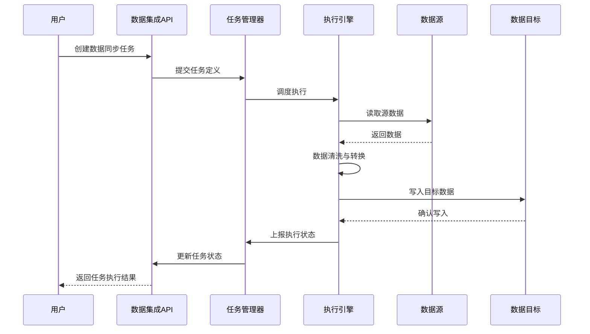
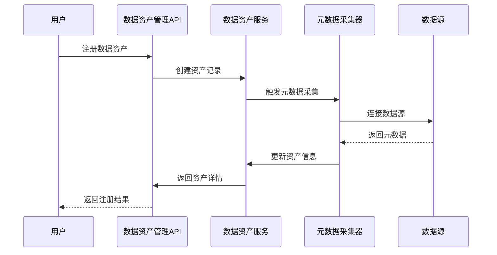
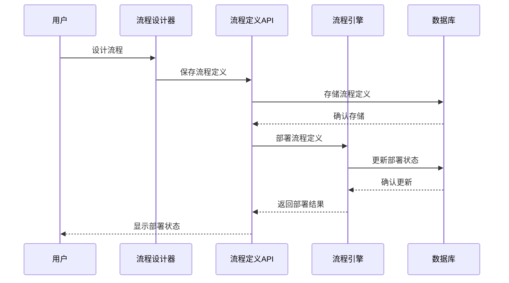
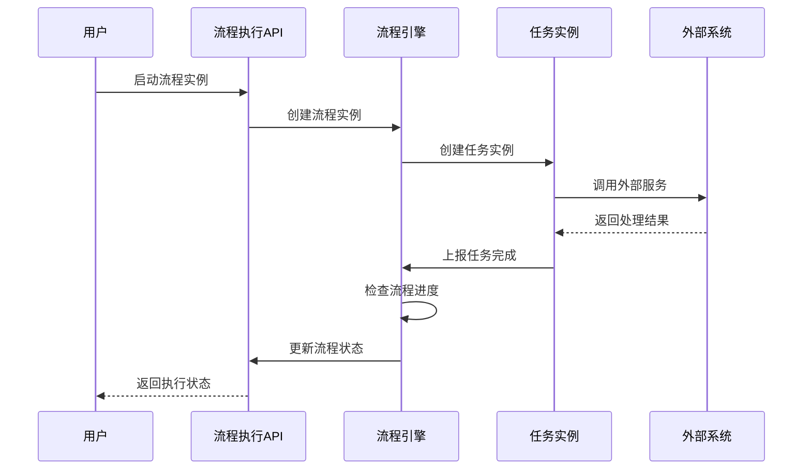
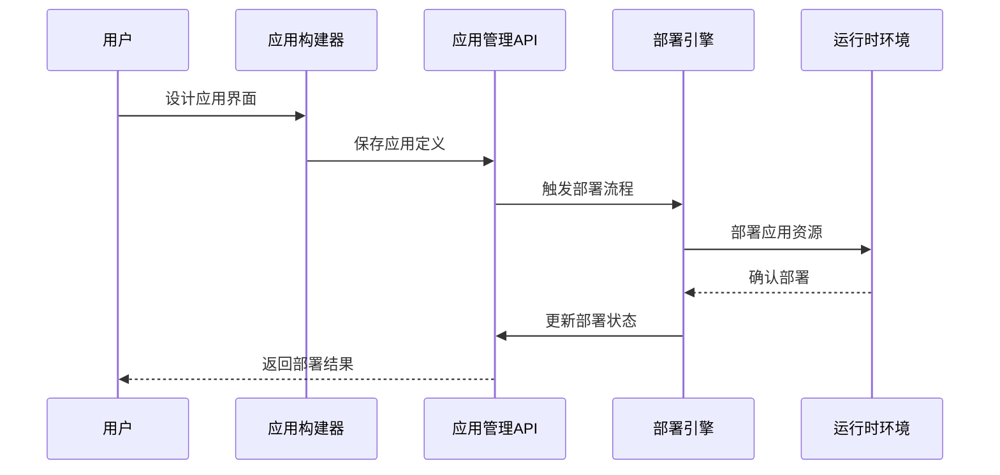
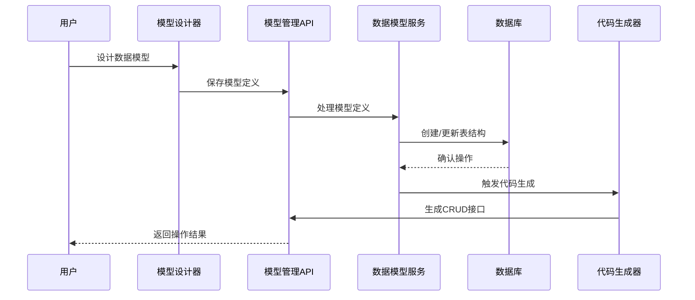

# 统一智能数据应用平台(UDAP) - 核心业务流程设计

## 1. 大数据平台核心业务流程

### 1.1 数据集成流程

#### 1.1.1 流程描述
数据集成流程负责从各种数据源采集数据，经过清洗、转换后加载到目标数据存储中。

#### 1.1.2 时序图

#### 1.1.3 关键设计要点
1. 支持多种数据源连接（PostgreSQL, PostgreSQL, Redis, ES等）
2. 提供数据清洗和转换功能
3. 支持增量同步和全量同步
4. 具备任务调度和监控能力

### 1.2 数据资产管理流程

#### 1.2.1 流程描述
数据资产管理流程负责对平台中的数据资产进行注册、分类、标记和管理。

#### 1.2.2 时序图

#### 1.2.3 关键设计要点
1. 自动化元数据采集
2. 数据资产分类和标签管理
3. 数据血缘关系追踪
4. 数据质量评估

## 2. 工作流引擎平台核心业务流程

### 2.1 流程定义与部署流程

#### 2.1.1 流程描述
流程定义与部署流程允许用户通过可视化界面设计业务流程，并将其部署到执行引擎中。

#### 2.1.2 时序图

#### 2.1.3 关键设计要点
1. 可视化流程设计界面
2. BPMN 2.0标准支持
3. 流程版本管理
4. 流程部署和生命周期管理

### 2.2 流程执行与监控流程

#### 2.2.1 流程描述
流程执行与监控流程负责启动已部署的流程实例，并实时监控其执行状态。

#### 2.2.2 时序图

#### 2.2.3 关键设计要点
1. 流程实例生命周期管理
2. 任务分配和执行跟踪
3. 实时监控和告警
4. 流程执行历史记录

## 3. 零代码应用平台核心业务流程

### 3.1 应用构建与部署流程

#### 3.1.1 流程描述
应用构建与部署流程允许用户通过拖拽组件的方式构建应用，并将其部署到生产环境。

#### 3.1.2 时序图

#### 3.1.3 关键设计要点
1. 可视化应用构建界面
2. 组件库和模板支持
3. 应用版本管理
4. 一键部署能力

### 3.2 数据模型管理流程

#### 3.2.1 流程描述
数据模型管理流程允许用户定义和管理应用的数据结构，并自动生成相应的数据库表和API接口。

#### 3.2.2 时序图

#### 3.2.3 关键设计要点
1. 可视化数据模型设计
2. 自动生成数据库表结构
3. 自动生成CRUD API接口
4. 模型版本和迁移管理