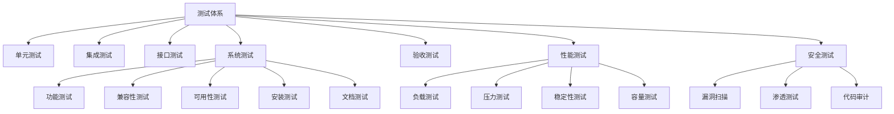

# 统一智能数据应用平台(UDAP) - 测试策略

## 1. 测试策略概述

统一智能数据应用平台(UDAP)采用全面的测试策略，确保软件质量和系统稳定性。测试策略涵盖从单元测试到生产环境监控的全生命周期，通过自动化和手动测试相结合的方式，保证平台的功能正确性、性能达标、安全可靠。

### 1.1 测试目标
- 确保软件功能符合需求规格
- 验证系统性能满足设计要求
- 保障系统安全性和数据完整性
- 提高软件质量和用户满意度
- 降低生产环境故障率

### 1.2 测试原则
- **全面性**: 覆盖所有功能模块和业务流程
- **自动化**: 尽可能实现测试自动化
- **可重复性**: 测试过程可重复执行
- **可追溯性**: 测试结果可追溯到需求
- **持续性**: 集成到持续集成/持续部署流程

## 2. 测试体系架构

### 2.1 测试层次结构



### 2.2 测试类型分类

#### 2.2.1 按测试阶段分类
- **开发阶段测试**: 单元测试、组件测试
- **集成阶段测试**: 集成测试、接口测试
- **系统阶段测试**: 系统测试、性能测试、安全测试
- **验收阶段测试**: 用户验收测试、生产验收测试

#### 2.2.2 按测试方法分类
- **静态测试**: 代码审查、文档审查
- **动态测试**: 执行程序进行测试
- **黑盒测试**: 不关注内部实现
- **白盒测试**: 关注内部逻辑结构
- **灰盒测试**: 结合黑盒和白盒测试

#### 2.2.3 按自动化程度分类
- **手工测试**: 人工执行测试用例
- **自动化测试**: 使用工具自动执行测试
- **半自动化测试**: 部分自动化，部分手工

## 3. 测试方法与技术

### 3.1 单元测试

#### 3.1.1 测试范围
- **业务逻辑**: 核心业务逻辑方法
- **工具类**: 公共工具方法
- **数据访问**: DAO层方法
- **异常处理**: 异常处理逻辑

#### 3.1.2 测试框架
- **Java**: JUnit 5 + Mockito
- **JavaScript**: Jest + Sinon.js
- **Vue.js**: Vue Test Utils

#### 3.1.3 测试覆盖率目标
- **行覆盖率**: ≥ 80%
- **分支覆盖率**: ≥ 70%
- **方法覆盖率**: ≥ 90%
- **核心业务逻辑**: 100%

#### 3.1.4 测试代码规范
```java
@ExtendWith(MockitoExtension.class)
class UserServiceTest {
    
    @Mock
    private UserRepository userRepository;
    
    @InjectMocks
    private UserService userService;
    
    @Test
    void should_ReturnUser_When_ValidId() {
        // Given
        Long userId = 1L;
        User expectedUser = new User();
        when(userRepository.findById(userId)).thenReturn(Optional.of(expectedUser));
        
        // When
        User actualUser = userService.getUserById(userId);
        
        // Then
        assertThat(actualUser).isEqualTo(expectedUser);
    }
}
```

### 3.2 集成测试

#### 3.2.1 测试范围
- **服务间调用**: 微服务间接口调用
- **数据库集成**: 数据库连接和操作
- **缓存集成**: 缓存读写操作
- **消息队列**: 消息发送和接收

#### 3.2.2 测试环境
- **测试数据库**: 独立的测试数据库实例
- **模拟服务**: 使用Mock服务模拟外部依赖
- **容器化测试**: 使用Docker容器进行集成测试

#### 3.2.3 测试框架
- **Spring Boot**: @SpringBootTest
- **Testcontainers**: 数据库容器化测试
- **WireMock**: 外部服务模拟

### 3.3 接口测试

#### 3.3.1 测试范围
- **RESTful API**: 所有对外提供的API接口
- **GraphQL**: GraphQL查询和变更
- **WebSocket**: 实时通信接口
- **文件上传下载**: 文件相关接口

#### 3.3.2 测试工具
- **Postman**: 手工接口测试
- **Newman**: Postman自动化测试
- **REST Assured**: Java接口测试框架
- **PyRestTest**: Python接口测试工具

#### 3.3.3 测试内容
- **功能验证**: 接口功能正确性
- **参数验证**: 请求参数合法性
- **状态码验证**: HTTP状态码正确性
- **响应格式**: 响应数据格式验证
- **性能测试**: 接口响应时间

### 3.4 系统测试

#### 3.4.1 功能测试

##### 3.4.1.1 测试范围
- **业务流程**: 完整业务流程验证
- **用户界面**: 前端界面功能
- **数据一致性**: 数据一致性检查
- **异常处理**: 异常场景处理

##### 3.4.1.2 测试工具
- **Selenium**: Web界面自动化测试
- **Cypress**: 现代化前端测试工具
- **Appium**: 移动端自动化测试

#### 3.4.2 兼容性测试

##### 3.4.2.1 浏览器兼容性
- **支持浏览器**: Chrome、Firefox、Safari、Edge
- **版本要求**: 最新两个版本
- **测试工具**: BrowserStack、Sauce Labs

##### 3.4.2.2 操作系统兼容性
- **服务器端**: CentOS、Ubuntu、Windows Server
- **客户端**: Windows、macOS、Linux
- **移动端**: iOS、Android

#### 3.4.3 可用性测试

##### 3.4.3.1 测试内容
- **用户体验**: 界面友好性、操作便捷性
- **可访问性**: 符合WCAG标准
- **国际化**: 多语言支持

##### 3.4.3.2 测试方法
- **用户调研**: 真实用户反馈
- **专家评审**: 专家可用性评审
- **A/B测试**: 不同设计方案对比

### 3.5 验收测试

#### 3.5.1 用户验收测试(UAT)

##### 3.5.1.1 测试参与者
- **业务用户**: 实际业务操作人员
- **产品经理**: 产品需求负责人
- **项目经理**: 项目管理负责人

##### 3.5.1.2 测试内容
- **业务流程**: 完整业务流程验证
- **数据准确性**: 业务数据准确性
- **操作便捷性**: 用户操作体验

#### 3.5.2 生产验收测试(PAT)

##### 3.5.2.1 测试环境
- **预生产环境**: 与生产环境一致的环境
- **真实数据**: 使用生产环境备份数据

##### 3.5.2.2 测试内容
- **部署验证**: 部署过程正确性
- **配置验证**: 环境配置正确性
- **性能验证**: 生产环境性能指标

## 4. 性能测试策略

### 4.1 性能测试类型

#### 4.1.1 负载测试
- **目标**: 验证系统在预期负载下的表现
- **指标**: 响应时间、吞吐量、资源利用率
- **场景**: 模拟正常业务负载

#### 4.1.2 压力测试
- **目标**: 验证系统在极限负载下的表现
- **指标**: 系统崩溃点、错误率、恢复能力
- **场景**: 超出正常负载的极端情况

#### 4.1.3 稳定性测试
- **目标**: 验证系统长时间运行的稳定性
- **指标**: 内存泄漏、资源耗尽、性能衰减
- **场景**: 长时间持续运行

#### 4.1.4 容量测试
- **目标**: 确定系统处理能力的上限
- **指标**: 最大并发用户数、最大数据量
- **场景**: 逐步增加负载直到系统瓶颈

### 4.2 性能测试指标

#### 4.2.1 响应时间
- **API响应时间**: ≤ 200ms (一般接口)
- **页面加载时间**: ≤ 1500ms (首屏)
- **复杂操作时间**: ≤ 5000ms (批量操作)

#### 4.2.2 吞吐量
- **API吞吐量**: ≥ 5000 QPS
- **并发用户数**: ≥ 10000
- **数据处理能力**: ≥ 2000 TPS

#### 4.2.3 资源利用率
- **CPU使用率**: 平均 < 70%
- **内存使用率**: 平均 < 75%
- **磁盘I/O**: 平均 < 80%
- **网络带宽**: 平均 < 70%

### 4.3 性能测试工具

#### 4.3.1 JMeter
- **功能**: 负载测试、性能测试
- **特点**: 开源、功能强大、插件丰富
- **使用场景**: API性能测试、Web应用测试

#### 4.3.2 LoadRunner
- **功能**: 企业级性能测试
- **特点**: 商业软件、支持多种协议
- **使用场景**: 复杂业务场景性能测试

#### 4.3.3 Gatling
- **功能**: 高性能负载测试
- **特点**: 基于Scala、高并发、实时报告
- **使用场景**: 高并发API测试

### 4.4 性能测试流程

#### 4.4.1 测试准备
1. **需求分析**: 确定性能测试目标和指标
2. **测试环境**: 搭建与生产环境相似的测试环境
3. **测试数据**: 准备充足的测试数据
4. **测试脚本**: 开发性能测试脚本

#### 4.4.2 测试执行
1. **基线测试**: 建立性能基线
2. **负载测试**: 执行负载测试场景
3. **压力测试**: 执行压力测试场景
4. **稳定性测试**: 执行长时间稳定性测试

#### 4.4.3 结果分析
1. **数据收集**: 收集性能测试数据
2. **瓶颈分析**: 分析系统性能瓶颈
3. **优化建议**: 提出性能优化建议
4. **报告编写**: 编写性能测试报告

## 5. 安全测试策略

### 5.1 安全测试类型

#### 5.1.1 漏洞扫描
- **静态扫描**: 代码静态安全分析
- **动态扫描**: 运行时安全漏洞检测
- **依赖扫描**: 第三方组件安全漏洞检测

#### 5.1.2 渗透测试
- **黑盒测试**: 模拟外部攻击者行为
- **白盒测试**: 基于源代码的安全测试
- **灰盒测试**: 结合黑盒和白盒的测试方法

#### 5.1.3 代码审计
- **安全规范检查**: 检查代码是否符合安全规范
- **常见漏洞检查**: 检查是否存在常见安全漏洞
- **权限控制检查**: 检查权限控制是否合理

### 5.2 安全测试工具

#### 5.2.1 静态安全分析工具
- **SonarQube**: 代码质量和安全分析
- **Checkmarx**: 静态应用安全测试
- **Fortify**: 应用安全测试工具

#### 5.2.2 动态安全测试工具
- **OWASP ZAP**: Web应用安全扫描
- **Burp Suite**: Web安全测试平台
- **Acunetix**: Web漏洞扫描工具

#### 5.2.3 依赖安全检查工具
- **OWASP Dependency-Check**: 依赖组件漏洞检查
- **Snyk**: 开源组件安全监控
- **Nexus IQ**: 软件供应链安全管控

### 5.3 安全测试内容

#### 5.3.1 身份认证安全
- **密码安全**: 密码复杂度、加密存储
- **会话管理**: Session安全、Token安全
- **多因素认证**: MFA实现安全性

#### 5.3.2 授权控制安全
- **RBAC模型**: 基于角色的访问控制
- **数据权限**: 行级和列级数据权限
- **API权限**: 接口级权限控制

#### 5.3.3 数据传输安全
- **HTTPS加密**: 数据传输加密
- **敏感数据**: 敏感数据传输保护
- **证书管理**: SSL证书安全管理

#### 5.3.4 数据存储安全
- **数据加密**: 敏感数据加密存储
- **密钥管理**: 加密密钥安全管理
- **备份安全**: 数据备份安全保护

### 5.4 安全测试流程

#### 5.4.1 测试准备
1. **安全需求分析**: 确定安全测试需求
2. **测试环境搭建**: 搭建安全测试环境
3. **测试工具配置**: 配置安全测试工具
4. **测试计划制定**: 制定详细测试计划

#### 5.4.2 测试执行
1. **自动化扫描**: 执行自动化安全扫描
2. **手工测试**: 执行手工安全测试
3. **渗透测试**: 执行渗透测试
4. **代码审计**: 执行代码安全审计

#### 5.4.3 结果处理
1. **漏洞分类**: 对发现的漏洞进行分类
2. **风险评估**: 评估漏洞风险等级
3. **修复验证**: 验证漏洞修复效果
4. **报告编写**: 编写安全测试报告

## 6. 测试环境管理

### 6.1 环境分类

#### 6.1.1 开发环境(DEV)
- **用途**: 开发人员日常开发和调试
- **特点**: 配置相对较低，数据可随意修改
- **管理**: 开发人员自助管理

#### 6.1.2 测试环境(TEST)
- **用途**: 功能测试、集成测试
- **特点**: 配置接近生产环境，数据定期刷新
- **管理**: 测试团队管理

#### 6.1.3 预生产环境(STAGING)
- **用途**: 生产环境部署前的最终验证
- **特点**: 配置与生产环境完全一致
- **管理**: 运维团队管理

#### 6.1.4 生产环境(PROD)
- **用途**: 对外提供正式服务
- **特点**: 高可用、高可靠、严格的安全控制
- **管理**: 运维团队管理

### 6.2 环境配置管理

#### 6.2.1 配置文件管理
- **外部化配置**: 配置文件外部化管理
- **环境隔离**: 不同环境使用不同的配置文件
- **版本控制**: 配置文件纳入版本控制

#### 6.2.2 数据管理
- **数据初始化**: 环境初始化数据脚本
- **数据刷新**: 定期刷新测试数据
- **数据脱敏**: 生产数据脱敏后用于测试

### 6.3 环境自动化

#### 6.3.1 基础设施即代码(IaC)
- **Terraform**: 基础设施自动化管理
- **Ansible**: 配置管理和应用部署
- **Docker**: 容器化环境部署

#### 6.3.2 环境自助服务
- **环境申请**: 自助申请测试环境
- **环境销毁**: 自动销毁过期环境
- **环境监控**: 实时监控环境状态

## 7. 测试数据管理

### 7.1 数据生成策略

#### 7.1.1 真实数据
- **生产数据脱敏**: 对生产数据进行脱敏处理
- **数据子集**: 提取生产数据的子集
- **数据同步**: 定期同步生产数据

#### 7.1.2 模拟数据
- **数据生成工具**: 使用工具生成测试数据
- **数据模板**: 基于模板生成测试数据
- **数据工厂**: 建立测试数据工厂

### 7.2 数据管理工具

#### 7.2.1 数据生成工具
- **Mockaroo**: 在线数据生成工具
- **GenerateData**: 开源数据生成工具
- **自研工具**: 根据业务需求自研数据生成工具

#### 7.2.2 数据管理平台
- **数据目录**: 建立测试数据目录
- **数据版本**: 管理测试数据版本
- **数据权限**: 控制测试数据访问权限

### 7.3 数据质量管理

#### 7.3.1 数据完整性
- **数据校验**: 验证测试数据完整性
- **数据一致性**: 保证数据间的一致性
- **数据有效性**: 确保数据符合业务规则

#### 7.3.2 数据安全
- **敏感数据**: 识别和保护敏感数据
- **数据访问**: 控制数据访问权限
- **数据审计**: 记录数据使用日志

## 8. 测试自动化策略

### 8.1 自动化测试范围

#### 8.1.1 高优先级自动化
- **核心业务流程**: 平台核心业务流程
- **高频执行用例**: 需要频繁执行的测试用例
- **回归测试用例**: 回归测试相关用例

#### 8.1.2 中优先级自动化
- **功能测试用例**: 一般功能测试用例
- **接口测试用例**: API接口测试用例
- **性能测试用例**: 性能基准测试用例

#### 8.1.3 低优先级自动化
- **探索性测试**: 需要人工判断的测试
- **用户体验测试**: 用户体验相关测试
- **兼容性测试**: 多环境兼容性测试

### 8.2 自动化测试框架

#### 8.2.1 后端自动化框架
- **JUnit 5**: Java单元测试框架
- **TestNG**: Java测试框架
- **PyTest**: Python测试框架

#### 8.2.2 前端自动化框架
- **Selenium**: Web自动化测试框架
- **Cypress**: 现代化前端测试工具
- **Playwright**: 微软开源测试工具

#### 8.2.3 接口自动化框架
- **REST Assured**: Java接口测试框架
- **Postman/Newman**: 接口测试工具
- **Karate**: 接口测试DSL

### 8.3 自动化测试执行

#### 8.3.1 CI/CD集成
- **代码提交触发**: 代码提交自动触发测试
- **定时执行**: 定时执行自动化测试
- **手动触发**: 支持手动触发测试执行

#### 8.3.2 测试报告
- **实时报告**: 实时查看测试执行状态
- **历史趋势**: 查看测试历史执行趋势
- **失败分析**: 快速定位测试失败原因

## 9. 测试质量度量

### 9.1 质量指标

#### 9.1.1 测试覆盖率
- **代码覆盖率**: ≥ 80%
- **需求覆盖率**: 100%
- **风险覆盖率**: 高风险功能100%覆盖

#### 9.1.2 缺陷指标
- **缺陷发现率**: 缺陷发现及时性
- **缺陷修复率**: 缺陷修复及时性
- **缺陷逃逸率**: 生产环境缺陷率

#### 9.1.3 测试效率
- **测试执行时间**: 测试执行周期
- **自动化率**: 自动化测试比例
- **测试环境利用率**: 测试环境使用效率

### 9.2 质量门禁

#### 9.2.1 代码质量门禁
- **代码覆盖率**: 低于阈值禁止合并
- **静态检查**: 存在严重问题禁止合并
- **安全扫描**: 发现高危漏洞禁止合并

#### 9.2.2 测试质量门禁
- **测试通过率**: 低于阈值禁止发布
- **性能指标**: 不达标禁止发布
- **安全指标**: 存在高危问题禁止发布

### 9.3 质量改进

#### 9.3.1 持续改进
- **定期回顾**: 定期回顾测试过程
- **问题分析**: 分析测试中发现的问题
- **流程优化**: 持续优化测试流程

#### 9.3.2 能力提升
- **技能培训**: 定期进行测试技能培训
- **工具升级**: 持续引入新的测试工具
- **最佳实践**: 推广测试最佳实践

## 10. 测试团队组织

### 10.1 团队结构

#### 10.1.1 测试架构师
- **职责**: 制定测试策略和架构
- **技能**: 深入的测试理论和实践经验
- **目标**: 提升整体测试能力和效率

#### 10.1.2 自动化测试工程师
- **职责**: 开发和维护自动化测试
- **技能**: 熟练掌握自动化测试工具
- **目标**: 提高测试自动化水平

#### 10.1.3 性能测试工程师
- **职责**: 执行性能测试和分析
- **技能**: 熟练掌握性能测试工具
- **目标**: 保障系统性能达标

#### 10.1.4 安全测试工程师
- **职责**: 执行安全测试和分析
- **技能**: 熟练掌握安全测试工具
- **目标**: 保障系统安全可靠

#### 10.1.5 功能测试工程师
- **职责**: 执行功能测试和验证
- **技能**: 熟练掌握测试方法和工具
- **目标**: 保障功能正确性

### 10.2 协作机制

#### 10.2.1 与开发团队协作
- **需求评审**: 参与需求评审，提出测试角度建议
- **代码审查**: 参与代码审查，关注测试相关问题
- **缺陷管理**: 协作处理缺陷修复和验证

#### 10.2.2 与产品团队协作
- **需求理解**: 深入理解产品需求
- **验收标准**: 参与制定验收标准
- **用户体验**: 关注用户体验和反馈

#### 10.2.3 与运维团队协作
- **环境管理**: 协作管理测试环境
- **监控告警**: 协作建立测试监控告警
- **故障处理**: 协作处理测试环境故障

通过实施以上全面的测试策略，统一智能数据应用平台(UDAP)能够确保高质量的软件交付，满足业务需求，保障系统稳定性和安全性。