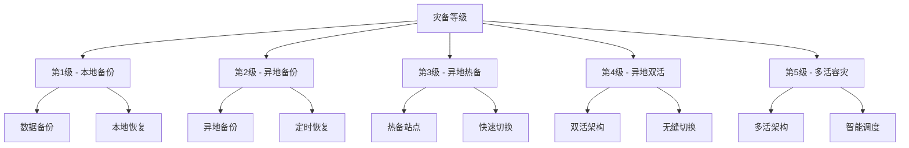
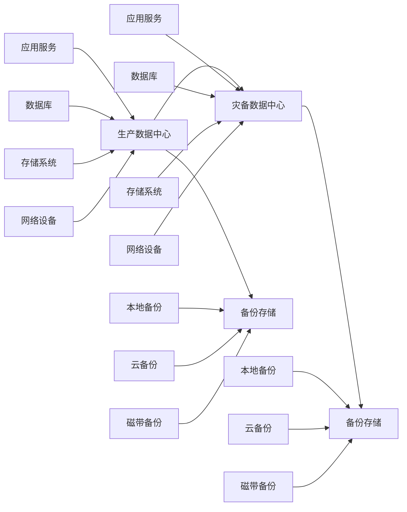

# 统一智能数据应用平台(UDAP) - 灾备和恢复策略

## 1. 灾备和恢复策略概述

统一智能数据应用平台(UDAP)采用全面的灾备和恢复策略，确保在发生自然灾害、硬件故障、人为错误或安全事件等意外情况下，能够快速恢复业务，最大限度减少数据丢失和业务中断时间。通过建立完善的灾备体系、备份策略、恢复流程和演练机制，保障平台的业务连续性和数据安全性。

### 1.1 灾备目标
- **业务连续性**: 确保核心业务7x24小时不间断运行
- **数据保护**: 最大限度保护数据完整性和一致性
- **快速恢复**: 在最短时间内恢复系统正常运行
- **风险控制**: 有效控制各类灾难风险
- **合规要求**: 满足相关法律法规和行业标准

### 1.2 恢复目标
- **RTO(恢复时间目标)**: ≤ 30分钟(核心业务) ≤ 2小时(一般业务)
- **RPO(恢复点目标)**: ≤ 5分钟(核心数据) ≤ 30分钟(一般数据)
- **恢复成功率**: ≥ 99.9%
- **数据完整性**: 100%数据可恢复
- **业务验证**: 恢复后业务功能完整可用

### 1.3 核心原则
- **预防为主**: 通过预防措施降低灾难发生概率
- **快速响应**: 建立快速响应机制，缩短恢复时间
- **全面覆盖**: 灾备覆盖所有关键系统和数据
- **定期演练**: 定期进行灾备演练，验证有效性
- **持续改进**: 持续优化灾备策略和流程

## 2. 灾备体系架构

### 2.1 灾备等级划分

### 2.2 灾备架构模式

#### 2.2.1 冷备模式
- **特点**: 备份环境不运行，需要时启动
- **恢复时间**: 较长(数小时到数天)
- **成本**: 较低
- **适用场景**: 非核心系统或成本敏感场景

#### 2.2.2 热备模式
- **特点**: 备份环境随时可切换运行
- **恢复时间**: 较短(数分钟到数小时)
- **成本**: 中等
- **适用场景**: 重要业务系统

#### 2.2.3 双活模式
- **特点**: 两个数据中心同时对外提供服务
- **恢复时间**: 几乎为零
- **成本**: 较高
- **适用场景**: 核心业务系统

### 2.3 灾备技术架构

## 3. 备份策略

### 3.1 数据备份策略

#### 3.1.1 备份类型
- **完全备份**: 完整备份所有数据
- **增量备份**: 只备份自上次备份以来变化的数据
- **差异备份**: 备份自上次完全备份以来变化的数据
- **快照备份**: 基于存储快照的备份

#### 3.1.2 备份频率
- **核心数据**: 每5分钟增量备份，每日完全备份
- **重要数据**: 每小时增量备份，每日完全备份
- **一般数据**: 每日增量备份，每周完全备份
- **归档数据**: 每月完全备份

#### 3.1.3 备份保留
- **本地备份**: 保留7天
- **异地备份**: 保留30天
- **长期备份**: 保留1年
- **归档备份**: 保留7年

### 3.2 应用备份策略

#### 3.2.1 代码备份
- **版本控制**: 所有代码纳入Git版本控制
- **分支管理**: 主分支、开发分支、发布分支
- **标签管理**: 重要版本打标签
- **镜像备份**: Docker镜像推送到镜像仓库

#### 3.2.2 配置备份
- **配置文件**: 所有配置文件外部化管理
- **环境变量**: 环境变量统一管理
- **密钥管理**: 敏感配置使用密钥管理服务
- **版本控制**: 配置文件纳入版本控制

#### 3.2.3 数据库备份
- **物理备份**: 数据库文件级别备份
- **逻辑备份**: SQL脚本级别备份
- **在线备份**: 数据库在线热备份
- **离线备份**: 数据库关闭冷备份

### 3.3 备份存储策略

#### 3.3.1 存储介质
- **磁盘阵列**: 高性能磁盘阵列存储
- **对象存储**: 云对象存储服务
- **磁带库**: 长期归档磁带存储
- **分布式存储**: 分布式文件系统存储

#### 3.3.2 存储位置
- **本地存储**: 同一数据中心本地存储
- **同城存储**: 同城不同机房存储
- **异地存储**: 不同城市机房存储
- **云存储**: 公有云存储服务

#### 3.3.3 存储加密
- **传输加密**: 备份数据传输过程加密
- **存储加密**: 备份数据存储过程加密
- **密钥管理**: 统一密钥管理服务
- **访问控制**: 严格的访问权限控制

## 4. 恢复流程

### 4.1 恢复触发条件

#### 4.1.1 自动触发
- **系统故障**: 系统宕机或严重故障
- **数据损坏**: 数据库或文件系统损坏
- **安全事件**: 重大安全事件导致数据丢失
- **监控告警**: 监控系统检测到异常

#### 4.1.2 人工触发
- **维护操作**: 计划内系统维护和升级
- **数据回滚**: 需要回滚到历史数据状态
- **测试验证**: 灾备演练和测试验证
- **管理决策**: 管理层决策触发恢复

### 4.2 恢复决策流程

#### 4.2.1 故障评估
1. **故障确认**: 确认故障真实性和影响范围
2. **影响分析**: 分析故障对业务的影响程度
3. **恢复评估**: 评估不同恢复方案的可行性和时间
4. **决策审批**: 根据影响程度进行相应层级审批

#### 4.2.2 恢复方案
1. **方案制定**: 制定详细的恢复执行方案
2. **资源准备**: 准备恢复所需的资源和工具
3. **人员安排**: 安排恢复执行人员和职责
4. **时间规划**: 制定恢复时间计划和里程碑

### 4.3 恢复执行流程

#### 4.3.1 数据恢复
1. **备份验证**: 验证备份数据的完整性和可用性
2. **环境准备**: 准备数据恢复的目标环境
3. **数据恢复**: 执行数据恢复操作
4. **数据验证**: 验证恢复数据的正确性

#### 4.3.2 应用恢复
1. **环境部署**: 部署应用运行环境
2. **配置恢复**: 恢复应用配置信息
3. **服务启动**: 启动应用服务
4. **功能验证**: 验证应用功能正常

#### 4.3.3 业务恢复
1. **服务切换**: 将流量切换到恢复环境
2. **业务验证**: 验证业务功能正常
3. **性能监控**: 监控系统性能指标
4. **用户通知**: 通知用户系统恢复正常

### 4.4 恢复验证流程

#### 4.4.1 功能验证
- **核心功能**: 验证核心业务功能正常
- **接口测试**: 验证对外接口正常
- **数据一致性**: 验证数据一致性
- **用户体验**: 验证用户体验正常

#### 4.4.2 性能验证
- **响应时间**: 验证系统响应时间达标
- **吞吐量**: 验证系统处理能力达标
- **资源使用**: 验证系统资源使用正常
- **稳定性**: 验证系统运行稳定

#### 4.4.3 安全验证
- **访问控制**: 验证访问权限控制正常
- **数据安全**: 验证数据安全保护措施
- **日志审计**: 验证日志记录和审计功能
- **合规检查**: 验证符合相关合规要求

## 5. 灾备演练计划

### 5.1 演练类型

#### 5.1.1 桌面演练
- **频率**: 每季度一次
- **参与人员**: 灾备相关人员
- **内容**: 讨论灾备流程和预案
- **目标**: 提高人员灾备意识和协调能力

#### 5.1.2 功能演练
- **频率**: 每半年一次
- **参与人员**: 技术团队和业务团队
- **内容**: 验证灾备功能和技术方案
- **目标**: 验证灾备技术方案可行性

#### 5.1.3 完整演练
- **频率**: 每年一次
- **参与人员**: 全体相关人员
- **内容**: 完整模拟灾难场景和恢复过程
- **目标**: 验证完整灾备体系有效性

### 5.2 演练场景

#### 5.2.1 硬件故障
- **服务器故障**: 关键服务器宕机
- **存储故障**: 存储设备损坏
- **网络故障**: 网络设备故障
- **电源故障**: 电力供应中断

#### 5.2.2 软件故障
- **系统崩溃**: 操作系统崩溃
- **数据库故障**: 数据库服务异常
- **应用故障**: 应用服务异常
- **中间件故障**: 中间件服务异常

#### 5.2.3 安全事件
- **数据泄露**: 敏感数据泄露
- **恶意攻击**: 黑客攻击导致系统瘫痪
- **病毒传播**: 病毒感染导致系统异常
- **内部威胁**: 内部人员恶意操作

#### 5.2.4 自然灾害
- **火灾**: 数据中心发生火灾
- **洪水**: 数据中心被洪水淹没
- **地震**: 地震导致数据中心损坏
- **台风**: 台风导致网络中断

### 5.3 演练执行

#### 5.3.1 演练准备
1. **方案制定**: 制定详细的演练方案
2. **资源准备**: 准备演练所需的资源
3. **人员培训**: 对参与人员进行培训
4. **风险评估**: 评估演练可能带来的风险

#### 5.3.2 演练实施
1. **场景模拟**: 模拟设定的灾难场景
2. **响应执行**: 按照预案执行响应操作
3. **过程记录**: 记录演练全过程
4. **问题发现**: 发现演练中暴露的问题

#### 5.3.3 演练总结
1. **效果评估**: 评估演练效果和达成目标
2. **问题分析**: 分析演练中发现的问题
3. **改进建议**: 提出改进和完善建议
4. **文档更新**: 更新相关文档和预案

## 6. 异地多活架构

### 6.1 多活架构设计

#### 6.1.1 架构模式
- **双活架构**: 两个数据中心同时提供服务
- **三活架构**: 三个数据中心同时提供服务
- **多活架构**: 多个数据中心同时提供服务
- **智能调度**: 根据负载和健康状态智能调度

#### 6.1.2 数据同步
- **实时同步**: 数据实时同步到多个数据中心
- **最终一致**: 保证数据最终一致性
- **冲突解决**: 解决数据冲突和不一致问题
- **同步监控**: 实时监控数据同步状态

### 6.2 多活实现方案

#### 6.2.1 应用层多活
- **无状态服务**: 应用服务设计为无状态
- **会话管理**: 统一会话管理机制
- **负载均衡**: 智能负载均衡策略
- **故障切换**: 自动故障检测和切换

#### 6.2.2 数据层多活
- **数据库同步**: 数据库主从同步或集群
- **缓存同步**: 分布式缓存数据同步
- **消息同步**: 消息队列数据同步
- **文件同步**: 分布式文件系统同步

#### 6.2.3 网络层多活
- **多线路接入**: 多个网络运营商接入
- **智能DNS**: 智能DNS解析和调度
- **CDN加速**: 内容分发网络加速
- **链路监控**: 网络链路状态监控

### 6.3 多活运维管理

#### 6.3.1 健康检查
- **服务健康**: 实时检查服务健康状态
- **数据健康**: 实时检查数据一致性
- **网络健康**: 实时检查网络连通性
- **资源健康**: 实时检查资源使用情况

#### 6.3.2 流量调度
- **负载均衡**: 根据负载情况调度流量
- **故障切换**: 故障时自动切换流量
- **地域调度**: 根据用户地域调度流量
- **权重调整**: 动态调整各节点权重

#### 6.3.3 故障处理
- **故障检测**: 自动检测系统故障
- **故障隔离**: 隔离故障节点和服务
- **流量切换**: 将流量切换到健康节点
- **自动恢复**: 故障恢复后自动加入集群

## 7. 云灾备方案

### 7.1 混合云灾备

#### 7.1.1 架构模式
- **主备模式**: 主数据中心+云灾备中心
- **双活模式**: 本地数据中心+云数据中心双活
- **多活模式**: 多个云服务商+本地数据中心多活
- **混合模式**: 根据业务特点灵活组合

#### 7.1.2 技术实现
- **云原生**: 采用云原生技术和架构
- **容器化**: 应用容器化部署和管理
- **微服务**: 微服务架构支持快速迁移
- **API集成**: 标准化API实现云间集成

### 7.2 云灾备服务

#### 7.2.1 存储灾备
- **对象存储**: 云对象存储灾备
- **块存储**: 云块存储灾备
- **文件存储**: 云文件存储灾备
- **数据库服务**: 云数据库灾备服务

#### 7.2.2 计算灾备
- **虚拟机**: 云虚拟机灾备
- **容器服务**: 云容器服务灾备
- **函数计算**: 云函数计算灾备
- **弹性伸缩**: 云弹性伸缩服务

#### 7.2.3 网络灾备
- **专线连接**: 云专线连接服务
- **VPN连接**: 云VPN连接服务
- **CDN服务**: 云CDN加速服务
- **DNS服务**: 云DNS解析服务

### 7.3 云灾备管理

#### 7.3.1 成本管理
- **按需付费**: 根据实际使用量付费
- **预留实例**: 购买预留实例降低成本
- **竞价实例**: 使用竞价实例降低成本
- **成本优化**: 定期优化云资源配置

#### 7.3.2 安全管理
- **访问控制**: 严格的云资源访问控制
- **数据加密**: 云数据传输和存储加密
- **安全审计**: 云服务安全审计日志
- **合规管理**: 满足云服务合规要求

#### 7.3.3 监控管理
- **云监控**: 云服务商监控服务
- **自定义监控**: 自定义监控指标和告警
- **日志分析**: 云日志服务和分析
- **性能优化**: 云资源性能监控和优化

## 8. 灾备组织管理

### 8.1 组织架构

#### 8.1.1 灾备委员会
- **组成**: 高层领导、技术负责人、业务负责人
- **职责**: 制定灾备策略、审批重大决策
- **会议**: 定期召开灾备管理会议
- **报告**: 定期向管理层汇报灾备情况

#### 8.1.2 灾备执行团队
- **技术组**: 负责技术方案实施和维护
- **运维组**: 负责日常运维和监控
- **测试组**: 负责灾备测试和演练
- **协调组**: 负责内外部协调和沟通

#### 8.1.3 业务恢复团队
- **业务组**: 负责业务恢复和验证
- **客服组**: 负责客户服务和沟通
- **公关组**: 负责对外公关和信息发布
- **法务组**: 负责法律和合规事务

### 8.2 职责分工

#### 8.2.1 管理层职责
- **战略制定**: 制定灾备战略和目标
- **资源配置**: 提供必要的资源支持
- **决策审批**: 审批重大灾备决策
- **监督检查**: 监督检查灾备工作执行

#### 8.2.2 技术团队职责
- **方案设计**: 设计灾备技术方案
- **系统实施**: 实施灾备系统和环境
- **日常维护**: 维护灾备系统正常运行
- **技术支持**: 提供灾备技术支持

#### 8.2.3 业务团队职责
- **需求分析**: 分析业务灾备需求
- **影响评估**: 评估灾难对业务的影响
- **恢复验证**: 验证业务恢复效果
- **用户沟通**: 与用户沟通恢复情况

### 8.3 培训和意识

#### 8.3.1 培训计划
- **新员工培训**: 新员工入职灾备培训
- **定期培训**: 定期组织灾备知识培训
- **专项培训**: 针对特定技术专项培训
- **外部培训**: 参加外部灾备专业培训

#### 8.3.2 意识提升
- **宣传推广**: 通过多种渠道宣传灾备重要性
- **案例分享**: 分享灾备成功和失败案例
- **经验交流**: 组织灾备经验交流活动
- **文化建设**: 建立灾备文化氛围

## 9. 灾备文档管理

### 9.1 文档分类

#### 9.1.1 策略文档
- **总体策略**: 灾备总体策略和目标
- **技术策略**: 灾备技术策略和方案
- **管理策略**: 灾备管理策略和流程
- **合规策略**: 灾备合规要求和标准

#### 9.1.2 方案文档
- **技术方案**: 详细技术实施方案
- **部署方案**: 系统部署和配置方案
- **切换方案**: 灾难切换和恢复方案
- **演练方案**: 灾备演练实施方案

#### 9.1.3 操作文档
- **操作手册**: 日常操作和维护手册
- **应急手册**: 应急响应和处理手册
- **恢复手册**: 系统恢复和验证手册
- **测试手册**: 测试和验证操作手册

### 9.2 文档管理

#### 9.2.1 版本管理
- **版本控制**: 所有文档纳入版本控制
- **变更记录**: 记录文档变更历史
- **审批流程**: 文档变更审批流程
- **发布管理**: 文档发布和分发管理

#### 9.2.2 权限管理
- **访问控制**: 严格的文档访问权限控制
- **分级管理**: 根据敏感程度分级管理
- **审计日志**: 记录文档访问和操作日志
- **安全存储**: 安全存储重要文档

#### 9.2.3 更新维护
- **定期更新**: 定期更新文档内容
- **动态维护**: 根据变化动态维护文档
- **质量检查**: 定期检查文档质量
- **清理归档**: 及时清理和归档过期文档

## 10. 合规和审计

### 10.1 合规要求

#### 10.1.1 法律法规
- **网络安全法**: 符合网络安全法要求
- **数据安全法**: 符合数据安全法要求
- **个人信息保护法**: 符合个人信息保护法要求
- **行业标准**: 符合相关行业标准要求

#### 10.1.2 行业规范
- **金融行业**: 符合金融行业监管要求
- **医疗行业**: 符合医疗行业数据保护要求
- **教育行业**: 符合教育行业信息安全要求
- **政府机构**: 符合政府机构安全要求

### 10.2 审计管理

#### 10.2.1 内部审计
- **定期审计**: 定期进行灾备内部审计
- **专项审计**: 针对特定方面专项审计
- **问题整改**: 审计发现问题整改
- **持续改进**: 基于审计结果持续改进

#### 10.2.2 外部审计
- **第三方审计**: 委托第三方进行审计
- **监管审计**: 配合监管部门审计检查
- **认证审计**: 通过相关认证审计
- **合规审计**: 满足合规要求审计

### 10.3 持续改进

#### 10.3.1 改进机制
- **问题反馈**: 建立问题反馈机制
- **改进建议**: 收集改进建议和意见
- **优化实施**: 实施优化改进措施
- **效果评估**: 评估改进效果

#### 10.3.2 最佳实践
- **经验总结**: 总结灾备最佳实践
- **技术更新**: 跟踪灾备技术发展趋势
- **案例学习**: 学习行业优秀案例
- **创新应用**: 创新应用新技术和方法

通过实施以上全面的灾备和恢复策略，统一智能数据应用平台(UDAP)能够有效应对各类灾难风险，确保业务连续性和数据安全，为平台的稳定运行提供坚实保障。