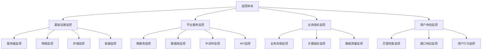
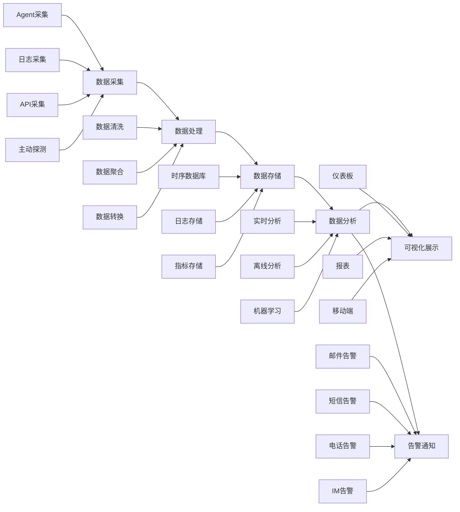

# 统一智能数据应用平台(UDAP) - 监控和运维策略

## 1. 监控和运维策略概述

统一智能数据应用平台(UDAP)采用全面的监控和运维策略，确保系统的高可用性、高性能和高可靠性。通过建立完善的监控体系、日志管理机制、告警机制和故障处理流程，实现对平台运行状态的实时掌控，快速发现和解决问题，保障业务连续性。

### 1.1 监控目标
- **系统可用性**: 确保系统7x24小时稳定运行
- **性能监控**: 实时监控系统性能指标
- **故障预警**: 及时发现潜在问题并预警
- **根因分析**: 快速定位问题根本原因
- **容量规划**: 为系统扩容提供数据支撑

### 1.2 运维目标
- **自动化运维**: 提高运维效率，减少人工干预
- **标准化流程**: 建立标准化运维流程和规范
- **安全保障**: 确保系统和数据安全
- **成本控制**: 优化资源配置，控制运维成本
- **持续改进**: 持续优化运维体系和流程

### 1.3 核心原则
- **全面覆盖**: 监控覆盖所有关键组件和服务
- **实时性**: 实时采集和分析监控数据
- **可操作性**: 监控指标具有明确的操作指导意义
- **可扩展性**: 监控系统支持横向扩展
- **高可用性**: 监控系统本身具备高可用性

## 2. 监控体系架构

### 2.1 监控层次结构

### 2.2 监控数据流

### 2.3 监控技术栈

#### 2.3.1 数据采集层
- **Prometheus Exporters**: 各类系统和应用指标采集
- **Telegraf**: 通用数据采集代理
- **Fluentd/Fluent Bit**: 日志采集和转发
- **SkyWalking Agent**: 应用性能监控探针

#### 2.3.2 数据处理层
- **Kafka**: 实时数据流处理
- **Flink**: 流式数据处理引擎
- **Spark**: 批处理和流处理框架

#### 2.3.3 数据存储层
- **Prometheus**: 时序数据库
- **Elasticsearch**: 日志和搜索引擎
- **InfluxDB**: 时序数据库
- **VictoriaMetrics**: 高性能时序数据库

#### 2.3.4 数据展示层
- **Grafana**: 数据可视化平台
- **Kibana**: 日志分析和可视化
- **Alertmanager**: 告警管理平台

## 3. 基础设施监控

### 3.1 服务器监控

#### 3.1.1 CPU监控
- **CPU使用率**: 整体和各核心使用率
- **CPU负载**: 系统负载情况
- **进程CPU**: 关键进程CPU使用情况
- **上下文切换**: 系统上下文切换次数

#### 3.1.2 内存监控
- **内存使用率**: 物理内存和虚拟内存使用情况
- **内存分布**: 各类型内存使用分布
- **Swap使用**: Swap空间使用情况
- **内存泄漏**: 内存增长趋势分析

#### 3.1.3 磁盘监控
- **磁盘使用率**: 各分区使用情况
- **IO性能**: 读写IOPS和吞吐量
- **磁盘健康**: SMART信息监控
- **inode使用**: inode使用情况

#### 3.1.4 网络监控
- **网络流量**: 入站和出站流量
- **连接数**: TCP连接数统计
- **网络延迟**: 网络延迟监控
- **丢包率**: 网络丢包情况

### 3.2 容器监控

#### 3.2.1 Kubernetes监控
- **集群状态**: 集群健康状态
- **节点监控**: 节点资源使用情况
- **Pod监控**: Pod运行状态和资源使用
- **服务监控**: Service访问情况

#### 3.2.2 Docker监控
- **容器状态**: 容器运行状态
- **资源使用**: 容器CPU、内存、网络、磁盘使用
- **镜像管理**: 镜像拉取和使用情况
- **容器日志**: 容器标准输出日志

### 3.3 网络监控

#### 3.3.1 网络设备监控
- **路由器监控**: 路由器状态和性能
- **交换机监控**: 交换机端口状态
- **防火墙监控**: 防火墙规则和流量
- **负载均衡监控**: 负载均衡器状态

#### 3.3.2 网络质量监控
- **网络延迟**: 端到端延迟监控
- **网络抖动**: 网络延迟变化情况
- **丢包监控**: 数据包丢失情况
- **带宽使用**: 网络带宽利用率

## 4. 平台服务监控

### 4.1 微服务监控

#### 4.1.1 服务健康监控
- **服务状态**: 服务运行状态检查
- **接口可用性**: 服务接口可用性监控
- **依赖服务**: 依赖服务状态监控
- **服务注册**: 服务注册中心状态

#### 4.1.2 性能监控
- **响应时间**: 接口响应时间统计
- **吞吐量**: 服务处理能力监控
- **错误率**: 接口错误率统计
- **并发数**: 服务并发处理能力

#### 4.1.3 调用链监控
- **请求追踪**: 全链路请求追踪
- **服务调用**: 服务间调用关系
- **性能瓶颈**: 调用链性能分析
- **异常定位**: 异常调用链定位

### 4.2 数据库监控

#### 4.2.1 MySQL监控
- **连接数**: 数据库连接数监控
- **查询性能**: SQL查询性能分析
- **锁等待**: 数据库锁等待情况
- **慢查询**: 慢查询日志分析

#### 4.2.2 Redis监控
- **内存使用**: Redis内存使用情况
- **命中率**: 缓存命中率统计
- **连接数**: 客户端连接数监控
- **持久化**: RDB和AOF持久化状态

#### 4.2.3 Elasticsearch监控
- **集群状态**: ES集群健康状态
- **索引性能**: 索引创建和查询性能
- **节点资源**: 节点CPU、内存、磁盘使用
- **分片分布**: 分片分布和均衡情况

### 4.3 中间件监控

#### 4.3.1 消息队列监控
- **Kafka监控**: Topic、Partition、Consumer Group状态
- **RabbitMQ监控**: 队列深度、消费者状态
- **RocketMQ监控**: Topic、Consumer状态

#### 4.3.2 定时任务监控
- **Quartz监控**: 任务执行状态和性能
- **XXL-JOB监控**: 任务调度状态
- **Cron监控**: 系统Cron任务执行情况

## 5. 业务指标监控

### 5.1 业务流程监控

#### 5.1.1 用户行为监控
- **用户活跃度**: 日活跃用户、月活跃用户
- **用户留存率**: 用户留存情况分析
- **用户转化率**: 关键业务流程转化率
- **用户画像**: 用户行为特征分析

#### 5.1.2 业务流程监控
- **流程耗时**: 关键业务流程耗时统计
- **流程成功率**: 业务流程成功率监控
- **异常流程**: 异常业务流程识别
- **流程瓶颈**: 业务流程瓶颈分析

### 5.2 关键指标监控

#### 5.2.1 收入指标
- **GMV**: 商品交易总额
- **收入**: 平台收入统计
- **订单量**: 订单数量统计
- **客单价**: 平均客单价

#### 5.2.2 成本指标
- **获客成本**: 用户获取成本
- **运营成本**: 平台运营成本
- **技术成本**: 技术投入成本
- **ROI**: 投资回报率

### 5.3 数据质量监控

#### 5.3.1 数据完整性
- **数据缺失**: 关键数据缺失监控
- **数据重复**: 数据重复检测
- **数据一致性**: 数据一致性校验
- **数据时效性**: 数据更新时效性

#### 5.3.2 数据准确性
- **数据校验**: 数据准确性校验
- **异常检测**: 数据异常检测
- **数据漂移**: 数据分布变化监控
- **业务规则**: 业务规则符合性检查

## 6. 用户体验监控

### 6.1 页面性能监控

#### 6.1.1 前端性能
- **页面加载时间**: 首屏加载时间
- **资源加载**: JS、CSS、图片加载时间
- **渲染性能**: 页面渲染性能
- **交互响应**: 用户交互响应时间

#### 6.1.2 移动端性能
- **启动时间**: App启动时间
- **页面切换**: 页面切换流畅度
- **内存使用**: App内存使用情况
- **电量消耗**: App电量消耗

### 6.2 接口响应监控

#### 6.2.1 API性能
- **响应时间**: API接口响应时间
- **成功率**: API调用成功率
- **错误率**: API错误率统计
- **吞吐量**: API处理能力

#### 6.2.2 第三方接口
- **第三方API**: 外部服务接口监控
- **依赖服务**: 依赖服务性能监控
- **超时监控**: 接口超时情况监控
- **重试机制**: 接口重试情况统计

### 6.3 用户行为监控

#### 6.3.1 用户路径分析
- **用户旅程**: 用户使用路径分析
- **功能使用**: 功能模块使用情况
- **用户流失**: 用户流失节点分析
- **热点功能**: 热门功能识别

#### 6.3.2 用户满意度
- **NPS**: 净推荐值监控
- **用户反馈**: 用户反馈收集和分析
- **投诉处理**: 用户投诉处理情况
- **客服指标**: 客服响应时间和服务质量

## 7. 日志管理策略

### 7.1 日志分类

#### 7.1.1 应用日志
- **业务日志**: 业务逻辑执行日志
- **访问日志**: 用户访问行为日志
- **错误日志**: 系统错误和异常日志
- **审计日志**: 用户操作审计日志

#### 7.1.2 系统日志
- **操作系统日志**: Linux/Windows系统日志
- **中间件日志**: 数据库、消息队列等日志
- **容器日志**: Docker/Kubernetes容器日志
- **网络设备日志**: 路由器、交换机等设备日志

### 7.2 日志收集

#### 7.2.1 收集方式
- **文件收集**: 通过文件tail方式收集
- **标准输出**: 容器标准输出日志收集
- **API收集**: 通过API接口收集日志
- **SDK集成**: 通过SDK主动上报日志

#### 7.2.2 收集工具
- **Fluentd**: 统一日志收集器
- **Filebeat**: 轻量级日志收集器
- **Logstash**: 日志处理管道
- **Promtail**: Loki日志收集器

### 7.3 日志处理

#### 7.3.1 数据清洗
- **格式化**: 统一日志格式
- **字段提取**: 提取关键字段信息
- **数据过滤**: 过滤无效和重复日志
- **敏感信息**: 脱敏处理敏感信息

#### 7.3.2 数据丰富
- **上下文信息**: 添加请求上下文信息
- **用户信息**: 关联用户身份信息
- **地理位置**: 添加用户地理位置信息
- **设备信息**: 添加用户设备信息

### 7.4 日志存储

#### 7.4.1 存储策略
- **热数据**: 近期日志热存储，快速查询
- **温数据**: 30天内日志温存储，较快速查询
- **冷数据**: 历史日志冷存储，归档保存
- **生命周期**: 自动化数据生命周期管理

#### 7.4.2 存储技术
- **Elasticsearch**: 全文检索和分析引擎
- **Loki**: 轻量级日志聚合系统
- **HDFS**: 大规模日志存储
- **S3**: 对象存储归档

### 7.5 日志分析

#### 7.5.1 实时分析
- **异常检测**: 实时异常日志检测
- **指标计算**: 实时计算业务指标
- **告警触发**: 实时告警触发
- **事件关联**: 多源日志事件关联

#### 7.5.2 离线分析
- **趋势分析**: 历史日志趋势分析
- **模式挖掘**: 日志模式挖掘和发现
- **根因分析**: 问题根因深度分析
- **报表生成**: 定期生成分析报表

## 8. 告警机制

### 8.1 告警分类

#### 8.1.1 紧急告警(P0)
- **系统宕机**: 核心服务不可用
- **数据丢失**: 关键数据丢失
- **安全事件**: 重大安全漏洞
- **业务中断**: 核心业务中断

#### 8.1.2 高优先级告警(P1)
- **性能下降**: 系统性能显著下降
- **容量预警**: 资源使用率过高
- **错误率上升**: 接口错误率异常
- **依赖故障**: 关键依赖服务故障

#### 8.1.3 中优先级告警(P2)
- **警告信息**: 系统警告级别信息
- **性能波动**: 系统性能轻微波动
- **资源紧张**: 资源使用率较高
- **次要功能**: 非核心功能异常

#### 8.1.4 低优先级告警(P3)
- **信息提醒**: 系统信息级别提醒
- **常规维护**: 系统常规维护提醒
- **使用建议**: 系统使用优化建议
- **监控项**: 监控项状态变化

### 8.2 告警规则

#### 8.2.1 阈值告警
- **静态阈值**: 固定阈值告警规则
- **动态阈值**: 基于历史数据动态阈值
- **多维度阈值**: 多维度组合阈值
- **分级阈值**: 不同级别不同阈值

#### 8.2.2 趋势告警
- **异常检测**: 基于机器学习异常检测
- **预测告警**: 基于趋势预测告警
- **模式识别**: 基于模式识别告警
- **关联分析**: 多指标关联告警

### 8.3 告警通知

#### 8.3.1 通知渠道
- **邮件通知**: 通过邮件发送告警
- **短信通知**: 通过短信发送告警
- **电话通知**: 通过电话拨打告警
- **IM通知**: 通过即时通讯工具告警

#### 8.3.2 通知策略
- **分级通知**: 不同级别不同通知方式
- **时间窗口**: 不同时段不同通知策略
- **重复通知**: 告警未处理重复通知
- **升级机制**: 告警未处理自动升级

### 8.4 告警管理

#### 8.4.1 告警抑制
- **重复告警**: 相同告警去重
- **依赖告警**: 依赖故障抑制下游告警
- **维护窗口**: 维护期间告警抑制
- **静默规则**: 特定条件告警静默

#### 8.4.2 告警收敛
- **聚合告警**: 相似告警聚合显示
- **根因告警**: 只显示根因告警
- **影响范围**: 告警影响范围评估
- **告警摘要**: 告警信息摘要展示

## 9. 故障处理流程

### 9.1 故障发现

#### 9.1.1 自动发现
- **监控告警**: 监控系统自动告警
- **日志分析**: 日志异常自动检测
- **用户反馈**: 用户反馈问题收集
- **第三方监控**: 第三方服务监控

#### 9.1.2 人工发现
- **巡检发现**: 定期巡检发现问题
- **业务反馈**: 业务部门反馈问题
- **测试发现**: 测试过程中发现问题
- **经验判断**: 基于经验判断问题

### 9.2 故障响应

#### 9.2.1 响应机制
- **值班制度**: 7x24小时值班响应
- **应急小组**: 专业技术应急小组
- **响应时间**: 不同级别故障响应时间
- **升级机制**: 故障未解决自动升级

#### 9.2.2 响应流程
1. **故障确认**: 确认故障真实性和影响范围
2. **信息收集**: 收集故障相关信息和日志
3. **初步分析**: 初步分析故障原因
4. **应急处理**: 执行应急处理措施
5. **根因定位**: 深入分析定位根因
6. **修复验证**: 验证修复措施有效性
7. **恢复确认**: 确认系统恢复正常
8. **总结复盘**: 故障总结和经验沉淀

### 9.3 故障处理

#### 9.3.1 应急措施
- **服务降级**: 临时关闭非核心功能
- **流量控制**: 限制系统访问流量
- **资源扩容**: 临时扩容系统资源
- **故障转移**: 切换到备用系统

#### 9.3.2 根因修复
- **代码修复**: 修复导致故障的代码
- **配置调整**: 调整系统配置参数
- **数据修复**: 修复损坏或丢失数据
- **架构优化**: 优化系统架构设计

### 9.4 故障复盘

#### 9.4.1 复盘流程
1. **故障回顾**: 回顾故障发生和处理过程
2. **原因分析**: 深入分析故障根本原因
3. **影响评估**: 评估故障对业务的影响
4. **改进措施**: 制定预防和改进措施
5. **经验总结**: 总结故障处理经验
6. **文档归档**: 归档故障处理文档

#### 9.4.2 改进措施
- **监控完善**: 完善相关监控指标
- **告警优化**: 优化告警规则和策略
- **流程改进**: 改进故障处理流程
- **预案制定**: 制定类似故障预案

## 10. 容量规划

### 10.1 容量评估

#### 10.1.1 业务容量
- **用户规模**: 当前和预测用户规模
- **业务增长**: 业务增长率预测
- **峰值流量**: 系统峰值流量评估
- **数据增长**: 数据量增长趋势

#### 10.1.2 技术容量
- **计算资源**: CPU、内存资源需求
- **存储资源**: 磁盘、数据库存储需求
- **网络资源**: 带宽、连接数需求
- **中间件资源**: 消息队列、缓存需求

### 10.2 容量监控

#### 10.2.1 资源使用率
- **CPU使用率**: 实时监控CPU使用情况
- **内存使用率**: 实时监控内存使用情况
- **磁盘使用率**: 实时监控磁盘使用情况
- **网络使用率**: 实时监控网络使用情况

#### 10.2.2 容量预警
- **阈值预警**: 资源使用率阈值预警
- **趋势预警**: 资源使用趋势预警
- **预测预警**: 基于预测模型预警
- **瓶颈预警**: 系统瓶颈识别预警

### 10.3 容量扩展

#### 10.3.1 水平扩展
- **服务扩容**: 增加服务实例数量
- **数据库分片**: 数据库水平分片扩展
- **负载均衡**: 增加负载均衡节点
- **容器扩容**: 增加容器实例数量

#### 10.3.2 垂直扩展
- **硬件升级**: 升级服务器硬件配置
- **数据库优化**: 数据库性能优化
- **应用优化**: 应用性能优化
- **架构优化**: 系统架构优化

### 10.4 容量优化

#### 10.4.1 资源优化
- **资源回收**: 回收闲置资源
- **资源调度**: 优化资源调度策略
- **资源共享**: 实现资源共享复用
- **资源隔离**: 合理资源隔离分配

#### 10.4.2 成本优化
- **按需使用**: 按实际需求使用资源
- **弹性伸缩**: 实现资源弹性伸缩
- **混合部署**: 公有云和私有云混合部署
- **成本分析**: 定期进行成本分析优化

## 11. 性能优化策略

### 11.1 性能分析

#### 11.1.1 性能监控
- **响应时间**: 系统响应时间监控
- **吞吐量**: 系统处理能力监控
- **并发数**: 系统并发处理能力
- **资源使用**: 系统资源使用情况

#### 11.1.2 性能测试
- **基准测试**: 建立性能基准线
- **负载测试**: 模拟实际负载测试
- **压力测试**: 极限压力性能测试
- **稳定性测试**: 长时间稳定性测试

### 11.2 性能优化

#### 11.2.1 应用优化
- **代码优化**: 优化关键代码性能
- **算法优化**: 优化核心算法效率
- **缓存优化**: 合理使用缓存机制
- **异步处理**: 异步处理耗时操作

#### 11.2.2 数据库优化
- **SQL优化**: 优化慢查询SQL语句
- **索引优化**: 合理设计数据库索引
- **分库分表**: 数据库分库分表优化
- **读写分离**: 数据库读写分离优化

#### 11.2.3 架构优化
- **微服务拆分**: 合理拆分微服务
- **服务治理**: 服务治理策略优化
- **负载均衡**: 负载均衡策略优化
- **容错设计**: 系统容错能力优化

### 11.3 性能调优

#### 11.3.1 JVM调优
- **内存配置**: 合理配置JVM内存参数
- **垃圾回收**: 优化垃圾回收策略
- **线程池**: 合理配置线程池参数
- **性能参数**: 调优JVM性能参数

#### 11.3.2 数据库调优
- **参数配置**: 优化数据库配置参数
- **连接池**: 优化数据库连接池配置
- **缓存配置**: 优化数据库缓存配置
- **查询优化**: 优化数据库查询执行计划

## 12. 自动化运维

### 12.1 基础设施即代码(IaC)

#### 12.1.1 配置管理
- **Terraform**: 基础设施自动化管理
- **Ansible**: 配置管理和应用部署
- **SaltStack**: 自动化运维平台
- **Puppet**: 配置管理工具

#### 12.1.2 容器编排
- **Kubernetes**: 容器编排和管理
- **Docker Compose**: 容器编排工具
- **Helm**: Kubernetes包管理工具
- **Operator**: 自定义资源控制器

### 12.2 持续集成/持续部署(CI/CD)

#### 12.2.1 CI/CD流程
- **代码提交**: 代码提交自动触发构建
- **自动化测试**: 自动执行测试用例
- **镜像构建**: 自动构建Docker镜像
- **自动部署**: 自动部署到目标环境

#### 12.2.2 部署策略
- **蓝绿部署**: 蓝绿部署策略
- **滚动更新**: 滚动更新部署策略
- **金丝雀发布**: 金丝雀发布策略
- **A/B测试**: A/B测试部署策略

### 12.3 自动化运维工具

#### 12.3.1 监控自动化
- **自动发现**: 自动发现监控目标
- **自动告警**: 自动配置告警规则
- **自动修复**: 自动执行修复脚本
- **自动扩容**: 自动执行扩容操作

#### 12.3.2 运维自动化
- **自动巡检**: 自动执行系统巡检
- **自动备份**: 自动执行数据备份
- **自动清理**: 自动清理过期数据
- **自动维护**: 自动执行维护任务

## 13. 安全运维

### 13.1 安全监控

#### 13.1.1 漏洞扫描
- **静态扫描**: 代码静态安全分析
- **动态扫描**: 运行时安全漏洞检测
- **依赖扫描**: 第三方组件安全漏洞检测
- **配置扫描**: 系统配置安全检查

#### 13.1.2 入侵检测
- **网络入侵**: 网络层面入侵检测
- **主机入侵**: 主机层面入侵检测
- **应用入侵**: 应用层面入侵检测
- **行为分析**: 用户行为异常分析

### 13.2 安全加固

#### 13.2.1 系统加固
- **补丁管理**: 系统安全补丁管理
- **配置加固**: 系统安全配置加固
- **访问控制**: 系统访问权限控制
- **日志审计**: 系统操作日志审计

#### 13.2.2 应用加固
- **代码审计**: 应用代码安全审计
- **权限控制**: 应用权限访问控制
- **数据加密**: 敏感数据加密存储
- **安全传输**: 数据传输安全加密

### 13.3 应急响应

#### 13.3.1 安全事件
- **事件发现**: 安全事件自动发现
- **事件分析**: 安全事件深入分析
- **事件处理**: 安全事件应急处理
- **事件报告**: 安全事件处理报告

#### 13.3.2 恢复措施
- **系统恢复**: 受损系统恢复
- **数据恢复**: 丢失数据恢复
- **服务恢复**: 中断服务恢复
- **信任恢复**: 用户信任恢复

## 14. 成本管理

### 14.1 成本监控

#### 14.1.1 资源成本
- **计算成本**: CPU、内存使用成本
- **存储成本**: 磁盘、数据库存储成本
- **网络成本**: 带宽、流量使用成本
- **服务成本**: 第三方服务使用成本

#### 14.1.2 成本分析
- **成本分布**: 各项成本分布情况
- **成本趋势**: 成本变化趋势分析
- **成本优化**: 成本优化空间分析
- **预算控制**: 成本预算控制管理

### 14.2 成本优化

#### 14.2.1 资源优化
- **资源回收**: 回收闲置资源
- **资源调度**: 优化资源调度策略
- **资源共享**: 实现资源共享复用
- **弹性伸缩**: 实现资源弹性伸缩

#### 14.2.2 架构优化
- **混合部署**: 公有云和私有云混合部署
- **按需使用**: 按实际需求使用资源
- **预留实例**: 购买预留实例降低成本
- ** Spot实例**: 使用竞价实例降低成本

通过实施以上全面的监控和运维策略，统一智能数据应用平台(UDAP)能够确保系统的高可用性、高性能和高可靠性，为业务发展提供强有力的支撑。