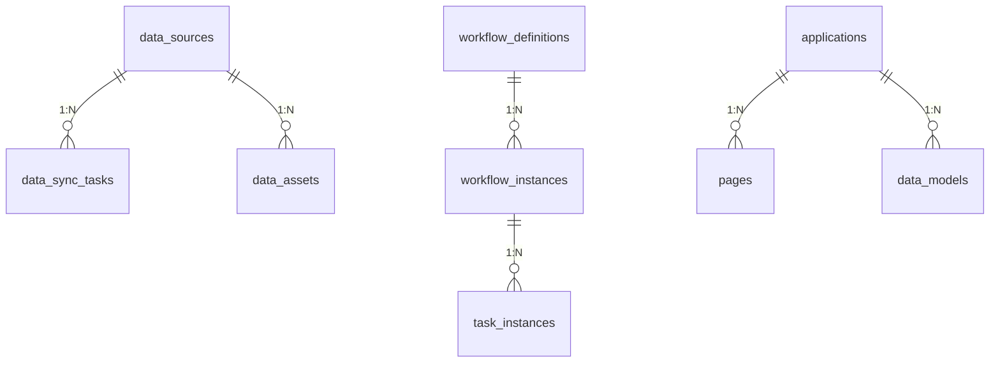

# 统一智能数据应用平台(UDAP) - 详细数据库设计

## 1. 大数据平台

### 1.1. 数据集成上下文

#### 1.1.1. 数据源配置表 (data_sources)
| 字段名称 | 字段类型 | 长度 | 是否必填 | 是否主键 | 中文注释 |
| :--- | :--- | :--- | :--- | :--- | :--- |
| id | VARCHAR | 64 | 是 | 是 | 主键ID |
| tenant_id | VARCHAR | 64 | 否 | 否 | 租户ID |
| name | VARCHAR | 128 | 是 | 否 | 数据源名称 |
| type | VARCHAR | 32 | 是 | 否 | 数据源类型 (e.g., PostgreSQL, PostgreSQL, Redis, ES) |
| connection_url | VARCHAR | 512 | 是 | 否 | 连接URL |
| username | VARCHAR | 128 | 否 | 否 | 用户名 |
| password | VARCHAR | 255 | 否 | 否 | 密码 (加密存储) |
| config_json | JSON | - | 否 | 否 | 其他配置 (JSON格式) |
| description | VARCHAR | 255 | 否 | 否 | 描述 |
| status | TINYINT | 1 | 是 | 否 | 状态 (1: 启用, 0: 禁用) |
| creator | VARCHAR | 64 | 否 | 否 | 创建人 |
| created_time | DATETIME | - | 否 | 否 | 创建时间 |
| updater | VARCHAR | 64 | 否 | 否 | 更新人 |
| updated_time | DATETIME | - | 否 | 否 | 更新时间 |
| deleted | TINYINT | 1 | 是 | 否 | 是否删除 (1: 是, 0: 否) |

#### 1.1.2. 数据同步任务表 (data_sync_tasks)
| 字段名称 | 字段类型 | 长度 | 是否必填 | 是否主键 | 中文注释 |
| :--- | :--- | :--- | :--- | :--- | :--- |
| id | VARCHAR | 64 | 是 | 是 | 主键ID |
| tenant_id | VARCHAR | 64 | 否 | 否 | 租户ID |
| task_code | VARCHAR | 128 | 是 | 是 | 任务编码 (唯一) |
| task_name | VARCHAR | 128 | 是 | 否 | 任务名称 |
| source_ds_id | VARCHAR | 64 | 是 | 否 | 源数据源ID (外键) |
| target_ds_id | VARCHAR | 64 | 是 | 否 | 目标数据源ID (外键) |
| sync_type | VARCHAR | 32 | 是 | 否 | 同步类型 (FULL, INCREMENTAL) |
| sync_strategy | VARCHAR | 32 | 是 | 否 | 同步策略 (SCHEDULED, REALTIME_CDC) |
| table_mapping_json | JSON | - | 是 | 否 | 表/字段映射 (JSON) |
| cron_expression | VARCHAR | 128 | 否 | 否 | Cron表达式 (定时同步) |
| description | VARCHAR | 255 | 否 | 否 | 描述 |
| status | TINYINT | 1 | 是 | 否 | 状态 (1: 启用, 0: 禁用) |
| last_sync_time | DATETIME | - | 否 | 否 | 最后同步时间 |
| creator | VARCHAR | 64 | 否 | 否 | 创建人 |
| created_time | DATETIME | - | 否 | 否 | 创建时间 |
| updater | VARCHAR | 64 | 否 | 否 | 更新人 |
| updated_time | DATETIME | - | 否 | 否 | 更新时间 |
| deleted | TINYINT | 1 | 是 | 否 | 是否删除 (1: 是, 0: 否) |

### 1.2. 数据治理上下文

#### 1.2.1. 数据资产表 (data_assets)
| 字段名称 | 字段类型 | 长度 | 是否必填 | 是否主键 | 中文注释 |
| :--- | :--- | :--- | :--- | :--- | :--- |
| id | VARCHAR | 64 | 是 | 是 | 主键ID |
| tenant_id | VARCHAR | 64 | 否 | 否 | 租户ID |
| name | VARCHAR | 128 | 是 | 否 | 资产名称 |
| description | VARCHAR | 255 | 否 | 否 | 描述 |
| location | VARCHAR | 255 | 是 | 否 | 资产位置 |
| type | VARCHAR | 32 | 是 | 否 | 资产类型 |
| status | VARCHAR | 32 | 是 | 否 | 资产状态 |
| metadata_json | JSON | - | 否 | 否 | 元数据信息 |
| creator | VARCHAR | 64 | 否 | 否 | 创建人 |
| created_time | DATETIME | - | 否 | 否 | 创建时间 |
| updater | VARCHAR | 64 | 否 | 否 | 更新人 |
| updated_time | DATETIME | - | 否 | 否 | 更新时间 |
| deleted | TINYINT | 1 | 是 | 否 | 是否删除 (1: 是, 0: 否) |

## 2. 工作流引擎平台

### 2.1. 流程自动化上下文

#### 2.1.1. 流程定义表 (workflow_definitions)
| 字段名称 | 字段类型 | 长度 | 是否必填 | 是否主键 | 中文注释 |
| :--- | :--- | :--- | :--- | :--- | :--- |
| id | VARCHAR | 64 | 是 | 是 | 主键ID |
| tenant_id | VARCHAR | 64 | 否 | 否 | 租户ID |
| name | VARCHAR | 128 | 是 | 否 | 流程名称 |
| description | VARCHAR | 255 | 否 | 否 | 描述 |
| definition | LONGTEXT | - | 是 | 否 | 流程定义内容 |
| version | VARCHAR | 32 | 否 | 否 | 版本号 |
| status | VARCHAR | 32 | 是 | 否 | 流程状态 |
| creator | VARCHAR | 64 | 否 | 否 | 创建人 |
| created_time | DATETIME | - | 否 | 否 | 创建时间 |
| updater | VARCHAR | 64 | 否 | 否 | 更新人 |
| updated_time | DATETIME | - | 否 | 否 | 更新时间 |
| deleted | TINYINT | 1 | 是 | 否 | 是否删除 (1: 是, 0: 否) |

#### 2.1.2. 流程实例表 (workflow_instances)
| 字段名称 | 字段类型 | 长度 | 是否必填 | 是否主键 | 中文注释 |
| :--- | :--- | :--- | :--- | :--- | :--- |
| id | VARCHAR | 64 | 是 | 是 | 主键ID |
| tenant_id | VARCHAR | 64 | 否 | 否 | 租户ID |
| definition_id | VARCHAR | 64 | 是 | 否 | 流程定义ID |
| business_key | VARCHAR | 128 | 否 | 否 | 业务标识 |
| status | VARCHAR | 32 | 是 | 否 | 实例状态 |
| start_time | DATETIME | - | 是 | 否 | 开始时间 |
| end_time | DATETIME | - | 否 | 否 | 结束时间 |
| starter | VARCHAR | 64 | 是 | 否 | 发起人 |
| variables_json | JSON | - | 否 | 否 | 流程变量 |
| creator | VARCHAR | 64 | 否 | 否 | 创建人 |
| created_time | DATETIME | - | 否 | 否 | 创建时间 |
| updater | VARCHAR | 64 | 否 | 否 | 更新人 |
| updated_time | DATETIME | - | 否 | 否 | 更新时间 |
| deleted | TINYINT | 1 | 是 | 否 | 是否删除 (1: 是, 0: 否) |

#### 2.1.3. 任务实例表 (task_instances)
| 字段名称 | 字段类型 | 长度 | 是否必填 | 是否主键 | 中文注释 |
| :--- | :--- | :--- | :--- | :--- | :--- |
| id | VARCHAR | 64 | 是 | 是 | 主键ID |
| tenant_id | VARCHAR | 64 | 否 | 否 | 租户ID |
| instance_id | VARCHAR | 64 | 是 | 否 | 流程实例ID |
| node_id | VARCHAR | 64 | 是 | 否 | 节点ID |
| assignee | VARCHAR | 64 | 否 | 否 | 处理人 |
| status | VARCHAR | 32 | 是 | 否 | 任务状态 |
| priority | VARCHAR | 32 | 否 | 否 | 优先级 |
| create_time | DATETIME | - | 是 | 否 | 创建时间 |
| due_time | DATETIME | - | 否 | 否 | 到期时间 |
| finish_time | DATETIME | - | 否 | 否 | 完成时间 |
| variables_json | JSON | - | 否 | 否 | 任务变量 |
| creator | VARCHAR | 64 | 否 | 否 | 创建人 |
| created_time | DATETIME | - | 否 | 否 | 创建时间 |
| updater | VARCHAR | 64 | 否 | 否 | 更新人 |
| updated_time | DATETIME | - | 否 | 否 | 更新时间 |
| deleted | TINYINT | 1 | 是 | 否 | 是否删除 (1: 是, 0: 否) |

## 3. 零代码应用平台

### 3.1. 低代码应用构建上下文

#### 3.1.1. 应用表 (applications)
| 字段名称 | 字段类型 | 长度 | 是否必填 | 是否主键 | 中文注释 |
| :--- | :--- | :--- | :--- | :--- | :--- |
| id | VARCHAR | 64 | 是 | 是 | 主键ID |
| tenant_id | VARCHAR | 64 | 否 | 否 | 租户ID |
| name | VARCHAR | 128 | 是 | 否 | 应用名称 |
| description | VARCHAR | 255 | 否 | 否 | 描述 |
| config_json | JSON | - | 是 | 否 | 应用配置 (JSON) |
| status | VARCHAR | 32 | 是 | 否 | 应用状态 |
| creator | VARCHAR | 64 | 否 | 否 | 创建人 |
| created_time | DATETIME | - | 否 | 否 | 创建时间 |
| updater | VARCHAR | 64 | 否 | 否 | 更新人 |
| updated_time | DATETIME | - | 否 | 否 | 更新时间 |
| deleted | TINYINT | 1 | 是 | 否 | 是否删除 (1: 是, 0: 否) |

#### 3.1.2. 页面表 (pages)
| 字段名称 | 字段类型 | 长度 | 是否必填 | 是否主键 | 中文注释 |
| :--- | :--- | :--- | :--- | :--- | :--- |
| id | VARCHAR | 64 | 是 | 是 | 主键ID |
| tenant_id | VARCHAR | 64 | 否 | 否 | 租户ID |
| app_id | VARCHAR | 64 | 是 | 否 | 应用ID |
| name | VARCHAR | 128 | 是 | 否 | 页面名称 |
| path | VARCHAR | 128 | 是 | 否 | 页面路径 |
| layout_json | JSON | - | 是 | 否 | 页面布局 (JSON) |
| components_json | JSON | - | 是 | 否 | 组件配置 (JSON) |
| status | TINYINT | 1 | 是 | 否 | 状态 (1: 启用, 0: 禁用) |
| creator | VARCHAR | 64 | 否 | 否 | 创建人 |
| created_time | DATETIME | - | 否 | 否 | 创建时间 |
| updater | VARCHAR | 64 | 否 | 否 | 更新人 |
| updated_time | DATETIME | - | 否 | 否 | 更新时间 |
| deleted | TINYINT | 1 | 是 | 否 | 是否删除 (1: 是, 0: 否) |

#### 3.1.3. 数据模型表 (data_models)
| 字段名称 | 字段类型 | 长度 | 是否必填 | 是否主键 | 中文注释 |
| :--- | :--- | :--- | :--- | :--- | :--- |
| id | VARCHAR | 64 | 是 | 是 | 主键ID |
| tenant_id | VARCHAR | 64 | 否 | 否 | 租户ID |
| app_id | VARCHAR | 64 | 是 | 否 | 应用ID |
| name | VARCHAR | 128 | 是 | 否 | 模型名称 |
| table_name | VARCHAR | 128 | 是 | 否 | 数据库表名 |
| fields_json | JSON | - | 是 | 否 | 字段定义 (JSON) |
| relations_json | JSON | - | 否 | 否 | 关联关系 (JSON) |
| indexes_json | JSON | - | 否 | 否 | 索引定义 (JSON) |
| status | TINYINT | 1 | 是 | 否 | 状态 (1: 启用, 0: 禁用) |
| creator | VARCHAR | 64 | 否 | 否 | 创建人 |
| created_time | DATETIME | - | 否 | 否 | 创建时间 |
| updater | VARCHAR | 64 | 否 | 否 | 更新人 |
| updated_time | DATETIME | - | 否 | 否 | 更新时间 |
| deleted | TINYINT | 1 | 是 | 否 | 是否删除 (1: 是, 0: 否) |

## 4. 实体关系图



## 5. 索引设计

### 5.1. 大数据平台索引
```sql
-- data_sources表索引
CREATE INDEX idx_data_sources_tenant_id ON data_sources(tenant_id);
CREATE INDEX idx_data_sources_type ON data_sources(type);
CREATE INDEX idx_data_sources_status ON data_sources(status);

-- data_sync_tasks表索引
CREATE INDEX idx_data_sync_tasks_tenant_id ON data_sync_tasks(tenant_id);
CREATE INDEX idx_data_sync_tasks_source_ds_id ON data_sync_tasks(source_ds_id);
CREATE INDEX idx_data_sync_tasks_target_ds_id ON data_sync_tasks(target_ds_id);
CREATE INDEX idx_data_sync_tasks_status ON data_sync_tasks(status);
CREATE INDEX idx_data_sync_tasks_last_sync_time ON data_sync_tasks(last_sync_time);

-- data_assets表索引
CREATE INDEX idx_data_assets_tenant_id ON data_assets(tenant_id);
CREATE INDEX idx_data_assets_type ON data_assets(type);
CREATE INDEX idx_data_assets_status ON data_assets(status);
```

### 5.2. 工作流平台索引
```sql
-- workflow_definitions表索引
CREATE INDEX idx_workflow_definitions_tenant_id ON workflow_definitions(tenant_id);
CREATE INDEX idx_workflow_definitions_status ON workflow_definitions(status);

-- workflow_instances表索引
CREATE INDEX idx_workflow_instances_tenant_id ON workflow_instances(tenant_id);
CREATE INDEX idx_workflow_instances_definition_id ON workflow_instances(definition_id);
CREATE INDEX idx_workflow_instances_status ON workflow_instances(status);
CREATE INDEX idx_workflow_instances_starter ON workflow_instances(starter);
CREATE INDEX idx_workflow_instances_start_time ON workflow_instances(start_time);

-- task_instances表索引
CREATE INDEX idx_task_instances_tenant_id ON task_instances(tenant_id);
CREATE INDEX idx_task_instances_instance_id ON task_instances(instance_id);
CREATE INDEX idx_task_instances_assignee ON task_instances(assignee);
CREATE INDEX idx_task_instances_status ON task_instances(status);
CREATE INDEX idx_task_instances_create_time ON task_instances(create_time);
```

### 5.3. 零代码平台索引
```sql
-- applications表索引
CREATE INDEX idx_applications_tenant_id ON applications(tenant_id);
CREATE INDEX idx_applications_status ON applications(status);

-- pages表索引
CREATE INDEX idx_pages_tenant_id ON pages(tenant_id);
CREATE INDEX idx_pages_app_id ON pages(app_id);
CREATE INDEX idx_pages_status ON pages(status);

-- data_models表索引
CREATE INDEX idx_data_models_tenant_id ON data_models(tenant_id);
CREATE INDEX idx_data_models_app_id ON data_models(app_id);
CREATE INDEX idx_data_models_status ON data_models(status);
```