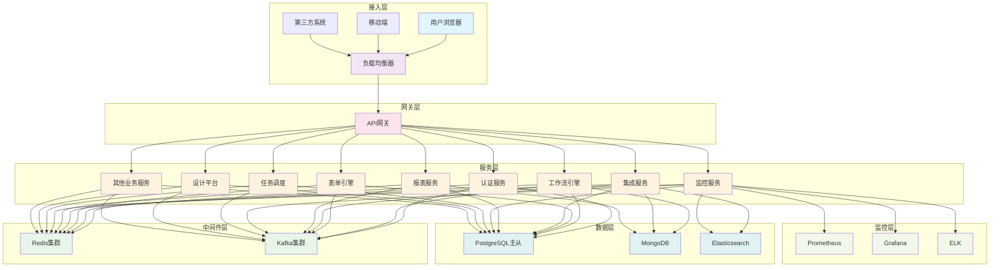

# 统一智能数据应用平台(UDAP) - 部署架构设计

## 1. 整体架构概述

统一智能数据应用平台(UDAP)采用微服务架构设计，将系统功能拆分为多个独立的服务模块，每个模块可独立开发、部署和扩展。整体架构分为以下几个层次：

1. **接入层**: 负责用户接入和请求分发
2. **网关层**: 负责API网关和安全控制
3. **服务层**: 包含所有业务微服务
4. **中间件层**: 提供公共基础服务
5. **数据层**: 负责数据存储和管理
6. **监控层**: 负责系统监控和运维

## 2. 部署环境规划

### 2.1 环境分类

#### 2.1.1 开发环境 (DEV)
- **用途**: 开发人员日常开发和调试
- **特点**: 
  - 配置相对较低
  - 数据可随意修改
  - 支持快速部署和重启
- **资源配置**:
  - 应用服务器: 2台 (4核8GB)
  - 数据库服务器: 1台 (4核8GB)
  - 缓存服务器: 1台 (2核4GB)
  - 消息队列: 1台 (2核4GB)

#### 2.1.2 测试环境 (TEST)
- **用途**: 功能测试、集成测试、性能测试
- **特点**:
  - 配置接近生产环境
  - 数据定期刷新
  - 支持自动化测试
- **资源配置**:
  - 应用服务器: 3台 (8核16GB)
  - 数据库服务器: 2台主从 (8核16GB)
  - 缓存服务器: 2台集群 (4核8GB)
  - 消息队列: 3台集群 (4核8GB)
  - 监控服务器: 1台 (4核8GB)

#### 2.1.3 预生产环境 (STAGING)
- **用途**: 生产环境部署前的最终验证
- **特点**:
  - 配置与生产环境完全一致
  - 使用生产环境的备份数据
  - 严格的变更控制流程
- **资源配置**:
  - 应用服务器: 4台 (16核32GB)
  - 数据库服务器: 3台主从 (16核32GB)
  - 缓存服务器: 3台集群 (8核16GB)
  - 消息队列: 5台集群 (8核16GB)
  - 监控服务器: 2台 (8核16GB)

#### 2.1.4 生产环境 (PROD)
- **用途**: 对外提供正式服务
- **特点**:
  - 高可用、高可靠
  - 严格的安全控制
  - 完善的监控和告警
- **资源配置**:
  - 负载均衡器: 2台 (8核16GB)
  - API网关: 4台 (16核32GB)
  - 应用服务器: 8台 (32核64GB)
  - 数据库服务器: 5台主从+2台只读 (32核64GB)
  - 缓存服务器: 6台集群 (16核32GB)
  - 消息队列: 8台集群 (16核32GB)
  - 监控服务器: 3台 (16核32GB)
  - 日志服务器: 2台 (16核32GB)

### 2.2 网络规划

#### 2.2.1 网络区域划分
- **DMZ区**: 对外提供服务的组件，如负载均衡器、API网关
- **应用区**: 业务应用服务部署区域
- **数据区**: 数据库、缓存等数据存储组件
- **监控区**: 监控、日志等运维组件
- **管理区**: 运维管理、备份等后台组件

#### 2.2.2 网络安全策略
- **访问控制**: 各区域间设置访问控制策略，仅开放必要端口
- **流量监控**: 对关键网络流量进行监控和分析
- **入侵检测**: 部署入侵检测系统，及时发现安全威胁

## 3. 核心组件部署方案

### 3.1 API网关部署

#### 3.1.1 部署架构
- **负载均衡**: 使用Nginx或HAProxy实现负载均衡
- **高可用**: 部署至少2个网关实例
- **SSL终止**: 在网关层处理SSL加密和解密
- **限流控制**: 实现API请求限流和熔断机制

#### 3.1.2 配置要求
- **硬件配置**: 16核CPU，32GB内存
- **软件环境**: Nginx/OpenResty + Lua脚本
- **部署方式**: Docker容器化部署
- **监控指标**: QPS、响应时间、错误率

### 3.2 认证服务部署

#### 3.2.1 部署架构
- **集群部署**: 部署3个实例实现高可用
- **会话管理**: 使用Redis存储会话信息
- **令牌管理**: JWT Token生成和验证
- **LDAP集成**: 支持LDAP认证集成

#### 3.2.2 配置要求
- **硬件配置**: 8核CPU，16GB内存
- **软件环境**: Spring Boot + Spring Security
- **依赖组件**: Redis、PostgreSQL
- **监控指标**: 认证成功率、响应时间、并发用户数

### 3.3 工作流引擎部署

#### 3.3.1 部署架构
- **分布式部署**: 支持水平扩展
- **任务分发**: 使用消息队列分发任务
- **状态管理**: 使用数据库存储流程状态
- **历史数据**: 历史数据归档存储

#### 3.3.2 配置要求
- **硬件配置**: 16核CPU，32GB内存
- **软件环境**: Spring Boot + Activiti/Camunda
- **依赖组件**: PostgreSQL、Redis、Kafka
- **监控指标**: 流程实例数、任务处理速度、错误率

### 3.4 表单引擎部署

#### 3.4.1 部署架构
- **无状态服务**: 支持多实例部署
- **模板缓存**: 使用Redis缓存表单模板
- **数据存储**: 表单数据存储到数据库
- **版本管理**: 支持表单版本管理

#### 3.4.2 配置要求
- **硬件配置**: 8核CPU，16GB内存
- **软件环境**: Spring Boot + Vue.js
- **依赖组件**: PostgreSQL、Redis
- **监控指标**: 表单渲染时间、并发请求数、缓存命中率

### 3.5 集成服务部署

#### 3.5.1 部署架构
- **连接器模式**: 支持多种数据源连接器
- **任务调度**: 集成任务调度服务
- **数据转换**: 提供数据转换和映射功能
- **错误处理**: 完善的错误处理和重试机制

#### 3.5.2 配置要求
- **硬件配置**: 16核CPU，32GB内存
- **软件环境**: Spring Boot + Apache Camel
- **依赖组件**: PostgreSQL、Redis、Kafka
- **监控指标**: 数据同步速度、错误率、任务完成率

### 3.6 报表服务部署

#### 3.6.1 部署架构
- **图表引擎**: 集成ECharts等图表库
- **数据源支持**: 支持多种数据源
- **缓存机制**: 使用Redis缓存报表数据
- **导出功能**: 支持PDF、Excel等格式导出

#### 3.6.2 配置要求
- **硬件配置**: 8核CPU，16GB内存
- **软件环境**: Spring Boot + ECharts
- **依赖组件**: PostgreSQL、Redis、Elasticsearch
- **监控指标**: 报表生成时间、并发请求数、缓存命中率

### 3.7 监控服务部署

#### 3.7.1 部署架构
- **指标采集**: 使用Prometheus采集指标
- **日志收集**: 使用ELK收集和分析日志
- **可视化展示**: 使用Grafana展示监控数据
- **告警通知**: 集成多种告警通知方式

#### 3.7.2 配置要求
- **硬件配置**: 16核CPU，32GB内存
- **软件环境**: Prometheus + Grafana + ELK
- **依赖组件**: Kafka、Elasticsearch
- **监控指标**: 系统资源使用率、服务健康状态、告警触发次数

## 4. 数据库部署方案

### 4.1 主从复制架构

#### 4.1.1 PostgreSQL主从复制
- **主库**: 处理写操作和部分读操作
- **从库**: 处理读操作，分担主库压力
- **复制方式**: 基于Binlog的异步复制
- **故障切换**: 支持自动故障检测和切换

#### 4.1.2 配置要求
- **主库配置**: 32核CPU，64GB内存，SSD存储
- **从库配置**: 16核CPU，32GB内存，SSD存储
- **备份策略**: 每日全量备份 + 实时增量备份
- **监控指标**: 主从延迟、QPS、连接数

### 4.2 分库分表策略

#### 4.2.1 水平分片
- **分片键**: 根据业务特点选择合适的分片键
- **分片算法**: 一致性哈希或范围分片
- **路由策略**: 中间件实现SQL路由
- **扩容方案**: 支持动态增加分片

#### 4.2.2 垂直分库
- **业务分库**: 按业务模块划分数据库
- **数据隔离**: 不同业务数据物理隔离
- **独立维护**: 各业务库可独立维护和扩展

### 4.3 NoSQL数据库部署

#### 4.3.1 Redis集群
- **集群模式**: 6节点3主3从集群
- **持久化**: RDB和AOF双重持久化
- **数据分片**: 自动数据分片和负载均衡
- **高可用**: 支持主从切换和故障恢复

#### 4.3.2 MongoDB副本集
- **副本集**: 5节点副本集（3个数据节点+2个仲裁节点）
- **分片集群**: 支持水平分片扩展
- **读写分离**: 支持读写分离和负载均衡
- **备份恢复**: 支持快照备份和增量备份

#### 4.3.3 Elasticsearch集群
- **集群规模**: 5节点集群
- **索引策略**: 按时间分索引
- **副本机制**: 1个主分片+1个副本
- **监控告警**: 集成监控和告警机制

## 5. 中间件部署方案

### 5.1 消息队列部署

#### 5.1.1 Kafka集群
- **集群规模**: 5节点集群
- **分区策略**: 合理设置主题分区数
- **副本机制**: 3副本保证数据安全
- **性能调优**: 根据业务需求调优参数

#### 5.1.2 配置要求
- **硬件配置**: 16核CPU，32GB内存，SSD存储
- **网络要求**: 千兆网络，低延迟
- **监控指标**: 消息吞吐量、延迟、堆积情况

### 5.2 缓存系统部署

#### 5.2.1 Redis部署
- **部署模式**: 集群模式部署
- **内存管理**: 合理设置内存淘汰策略
- **持久化**: 根据业务需求选择持久化方式
- **监控告警**: 实时监控内存使用和命中率

#### 5.2.2 配置要求
- **硬件配置**: 8核CPU，16GB内存
- **存储要求**: 内存充足，支持持久化存储
- **网络要求**: 低延迟网络连接
- **监控指标**: 内存使用率、命中率、QPS

## 6. 容器化部署方案

### 6.1 Kubernetes集群部署

#### 6.1.1 集群架构
- **控制平面**: 3个master节点
- **工作节点**: 动态扩展的worker节点
- **网络插件**: Calico或Flannel
- **存储插件**: CSI存储插件

#### 6.1.2 资源规划
- **Master节点**: 8核CPU，16GB内存
- **Worker节点**: 32核CPU，64GB内存
- **存储**: 每节点至少1TB SSD存储
- **网络**: 千兆网络，支持VLAN

### 6.2 Helm Charts部署

#### 6.2.1 微服务部署
- **Chart模板**: 为每个微服务创建Helm Chart
- **配置管理**: 使用ConfigMap和Secret管理配置
- **服务发现**: 集成Kubernetes服务发现
- **滚动更新**: 支持滚动更新和回滚

#### 6.2.2 基础设施部署
- **数据库**: 使用Helm部署PostgreSQL、Redis等
- **中间件**: 使用Helm部署Kafka、Elasticsearch等
- **监控组件**: 使用Helm部署Prometheus、Grafana等

### 6.3 持续集成/持续部署(CI/CD)

#### 6.3.1 流水线设计
- **代码构建**: 自动化代码构建和测试
- **镜像构建**: 自动构建Docker镜像
- **镜像推送**: 推送镜像到私有仓库
- **自动部署**: 根据环境自动部署应用

#### 6.3.2 工具链
- **代码仓库**: GitLab
- **CI/CD工具**: Jenkins或GitLab CI
- **镜像仓库**: Harbor
- **部署工具**: Helm + Kubernetes

## 7. 安全部署方案

### 7.1 网络安全

#### 7.1.1 防火墙配置
- **边界防护**: 部署边界防火墙
- **访问控制**: 实施严格的访问控制策略
- **入侵检测**: 部署入侵检测系统(IDS)
- **流量监控**: 实时监控网络流量

#### 7.1.2 VPN接入
- **远程访问**: 为运维人员提供VPN接入
- **权限控制**: 基于角色的VPN访问控制
- **审计日志**: 记录所有VPN访问日志
- **加密传输**: VPN连接采用强加密

### 7.2 应用安全

#### 7.2.1 身份认证
- **多因素认证**: 支持多因素认证(MFA)
- **单点登录**: 集成SSO认证系统
- **会话管理**: 安全的会话管理和超时控制
- **密码策略**: 强密码策略和定期更换

#### 7.2.2 授权控制
- **RBAC模型**: 基于角色的访问控制
- **数据权限**: 行级和列级数据权限控制
- **API权限**: 细粒度的API访问控制
- **审计日志**: 记录所有权限相关操作

### 7.3 数据安全

#### 7.3.1 数据传输
- **HTTPS加密**: 所有外部通信使用HTTPS
- **内部加密**: 内部服务间通信加密
- **证书管理**: 统一证书管理和更新
- **密钥轮换**: 定期轮换加密密钥

#### 7.3.2 数据存储
- **数据加密**: 敏感数据加密存储
- **密钥管理**: 专用密钥管理系统
- **备份加密**: 备份数据加密存储
- **访问控制**: 严格的数据访问控制

## 8. 监控与运维部署方案

### 8.1 监控系统部署

#### 8.1.1 Prometheus监控
- **指标采集**: 采集系统和应用指标
- **告警规则**: 配置合理的告警规则
- **数据存储**: 长期存储监控数据
- **查询接口**: 提供PromQL查询接口

#### 8.1.2 Grafana可视化
- **仪表板**: 创建各类监控仪表板
- **告警面板**: 可视化告警信息
- **自定义视图**: 支持自定义监控视图
- **权限控制**: 基于角色的访问控制

#### 8.1.3 ELK日志分析
- **日志收集**: 收集各组件日志
- **日志存储**: Elasticsearch存储日志
- **日志分析**: Kibana分析和可视化日志
- **告警集成**: 与告警系统集成

### 8.2 运维工具部署

#### 8.2.1 自动化运维
- **配置管理**: Ansible进行配置管理
- **批量操作**: 支持批量执行运维操作
- **任务编排**: 编排复杂的运维任务
- **审计日志**: 记录所有自动化操作

#### 8.2.2 容器管理
- **集群管理**: Kubernetes集群管理
- **资源调度**: 资源分配和调度
- **故障恢复**: 自动故障检测和恢复
- **性能优化**: 集群性能监控和优化

## 9. 灾备与恢复方案

### 9.1 数据备份策略

#### 9.1.1 备份类型
- **全量备份**: 每日执行全量数据库备份
- **增量备份**: 每小时执行增量备份
- **日志备份**: 实时备份数据库日志
- **应用备份**: 备份应用配置和代码

#### 9.1.2 备份存储
- **本地存储**: 本地高速存储保留近期备份
- **异地存储**: 异地存储保留长期备份
- **云存储**: 云端存储作为额外备份
- **介质管理**: 磁带库等离线存储介质

### 9.2 灾难恢复方案

#### 9.2.1 容灾架构
- **同城容灾**: 同城双活数据中心
- **异地容灾**: 异地灾备数据中心
- **数据同步**: 实时数据同步机制
- **切换演练**: 定期进行切换演练

#### 9.2.2 恢复流程
- **故障检测**: 自动故障检测机制
- **决策流程**: 灾难恢复决策流程
- **切换操作**: 自动化切换操作
- **验证恢复**: 恢复后业务验证

## 10. 部署流程与规范

### 10.1 部署流程

#### 10.1.1 环境准备
1. 硬件资源申请和分配
2. 操作系统安装和配置
3. 网络环境配置
4. 安全策略实施

#### 10.1.2 组件部署
1. 基础设施组件部署(数据库、缓存、消息队列等)
2. 中间件组件部署(Kubernetes、监控组件等)
3. 业务服务部署(各微服务)
4. 网关和接入层部署

#### 10.1.3 配置管理
1. 环境配置文件准备
2. 配置项注入和验证
3. 服务间连接配置
4. 安全配置检查

#### 10.1.4 测试验证
1. 基础功能测试
2. 性能压力测试
3. 安全性测试
4. 高可用性测试

### 10.2 部署规范

#### 10.2.1 命名规范
- **主机命名**: 按照业务+环境+序号命名
- **服务命名**: 按照业务域+服务名命名
- **端口分配**: 统一端口分配规范
- **标签管理**: Kubernetes资源标签规范

#### 10.2.2 配置规范
- **配置分离**: 配置与代码分离
- **环境变量**: 使用环境变量管理配置
- **密钥管理**: 敏感信息使用Secret管理
- **版本控制**: 配置文件纳入版本控制

#### 10.2.3 日志规范
- **日志格式**: 统一日志输出格式
- **日志级别**: 合理设置日志级别
- **日志轮转**: 配置日志轮转策略
- **日志收集**: 统一日志收集方案

通过以上详细的部署架构设计，可以确保统一智能数据应用平台(UDAP)在各种环境下稳定、高效地运行，并具备良好的可扩展性和可维护性。