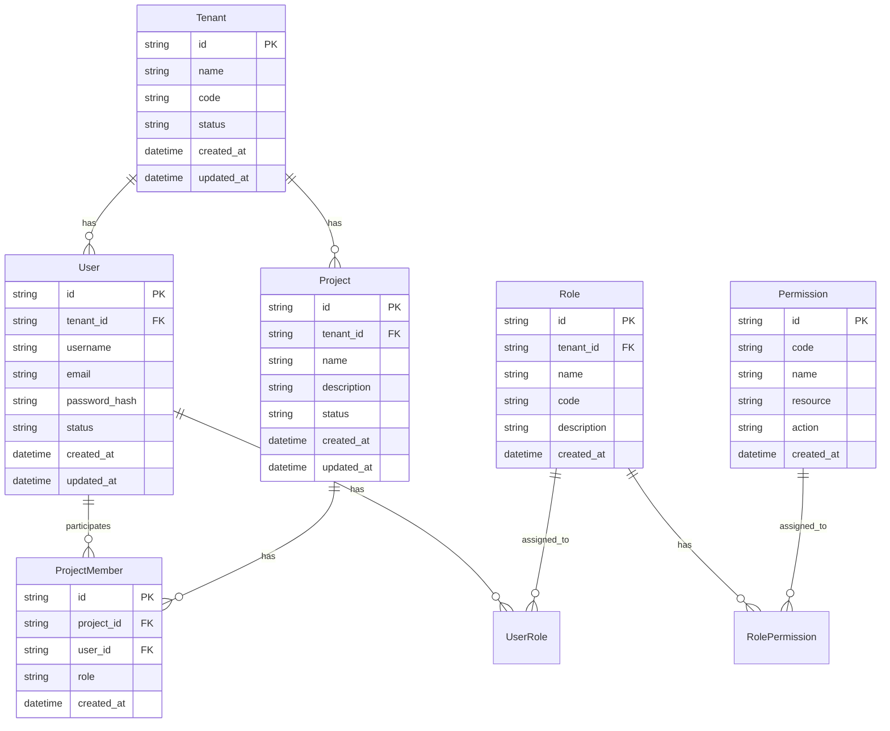
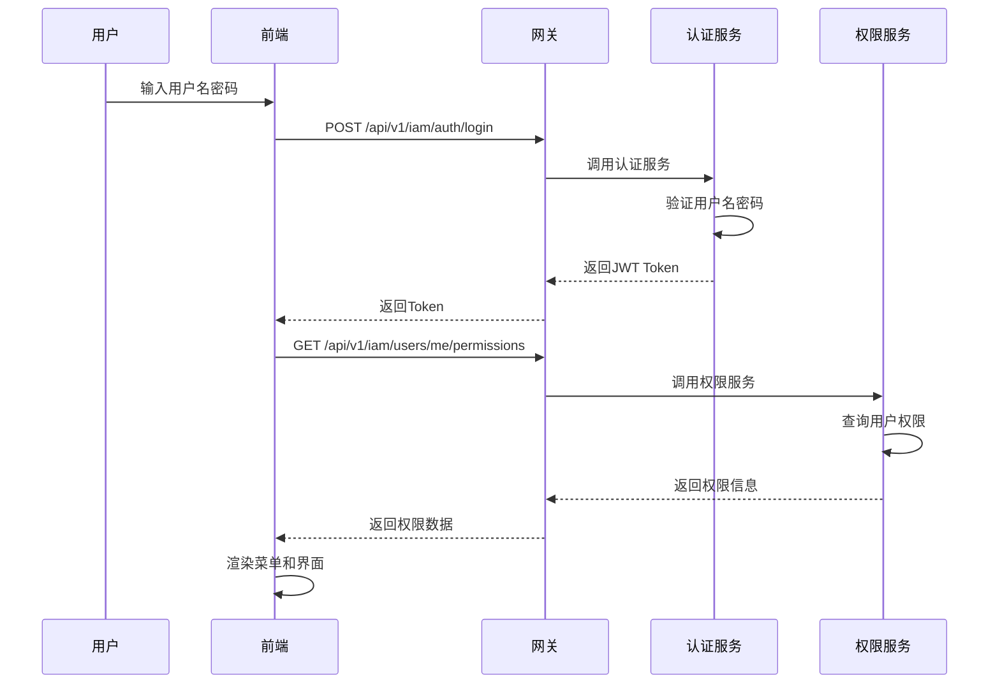
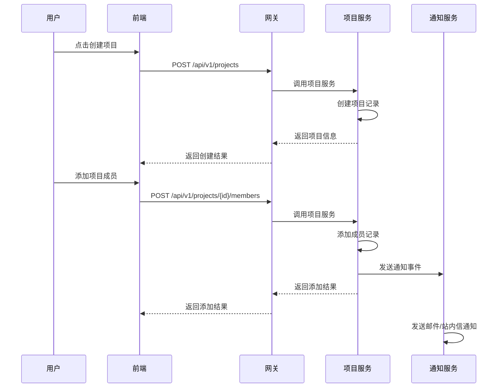
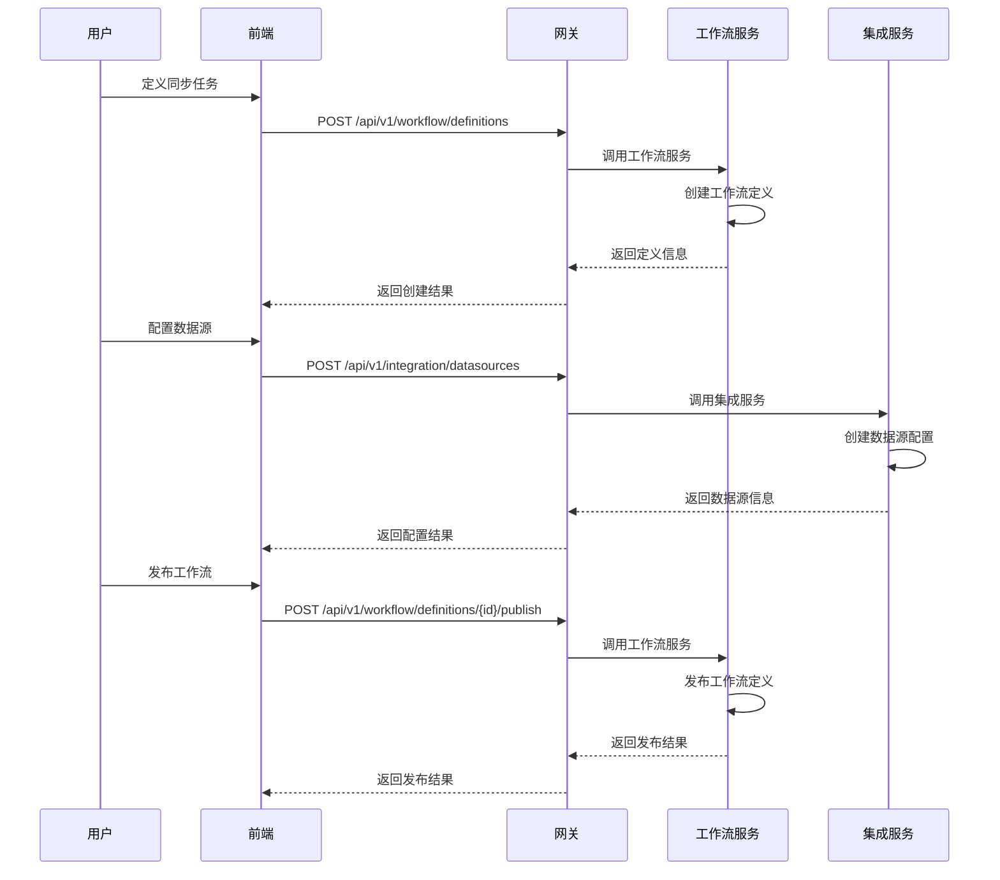
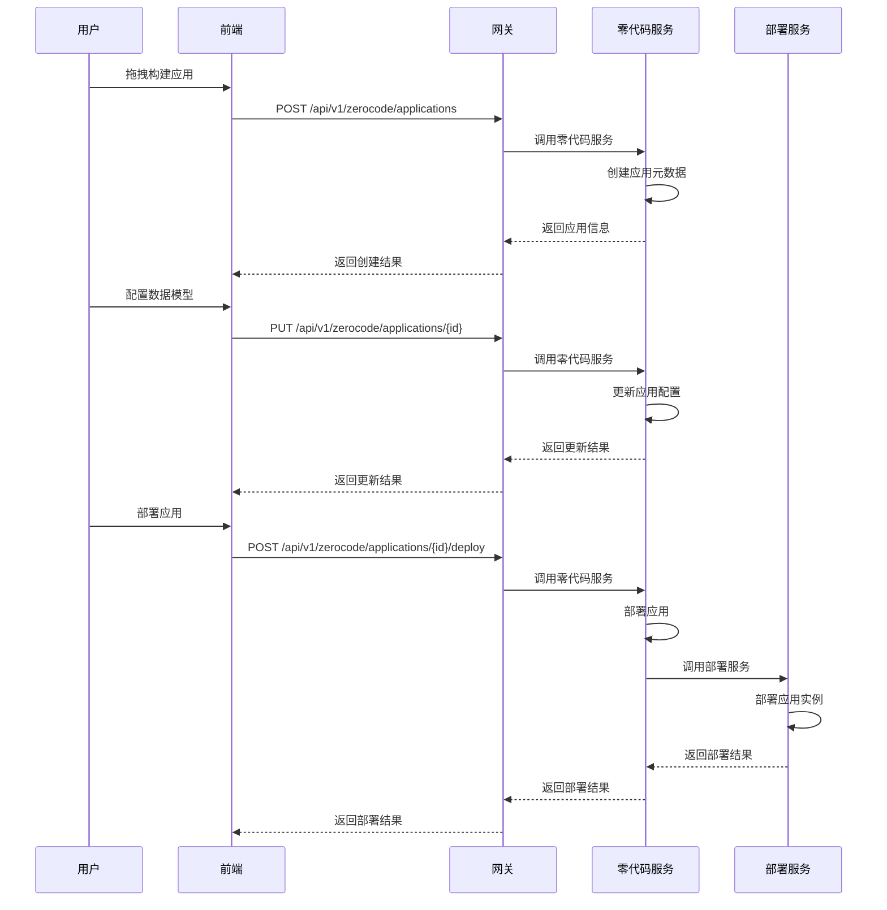

### **统一智能数据应用平台 (UDAP) - 软件详细设计文档**

| 文档版本 | 修订日期 | 修订人 | 修订说明 |
| :--- | :--- | :--- | :--- |
| V1.0 | 2025-09-11 | Gemini | 初始版本，整合所有上下文并进行详细设计 |
| V2.0 | 2025-08-04 | 开发助手 | 完善技术细节，补充开发指导内容 |

-----

### **目录**

1.  **引言**
    1.1. 文档目的
    1.2. 项目背景与愿景
    1.3. 设计范围
    1.4. 术语表
2.  **系统总体架构**
    2.1. 架构原则
    2.2. 功能架构与微服务划分
    2.3. 技术架构栈
    2.4. 部署架构
3.  **通用设计规范 (Cross-Cutting Concerns)**
    3.1. API 设计规范 (RESTful & Versioning)
    3.2. 统一响应与异常处理
    3.3. 认证与授权机制 (JWT Flow)
    3.4. 多租户实现策略
    3.5. 日志与链路追踪规范
4.  **数据库设计**
    4.1. 核心实体关系图 (E-R Diagram)
    4.2. 核心物理表结构
    4.3. 数据库设计规范
5.  **核心领域与微服务详细设计**
    5.1. **统一支撑平台**
    5.1.1. IAM上下文 (`udap-iam-service`)
    5.1.2. 项目协作上下文 (`udap-project-service`)
    5.1.3. 系统可观测性上下文 (`udap-monitoring-service`)
    5.2. **大数据平台**
    5.2.1. 数据集成上下文 (`udap-integration-service`)
    5.2.2. 数据治理上下文 (`udap-metadata-service`)
    5.3. **工作流引擎平台**
    5.3.1. 流程自动化上下文 (`udap-workflow-service`)
    5.4. **零代码应用平台**
    5.4.1. 低代码应用构建上下文 (`udac-zerocode-service`)
6.  **核心业务流程详细设计**
    6.1. 流程一：用户登录、鉴权与菜单加载
    6.2. 流程二：创建项目并添加成员
    6.3. 流程三：创建并发布一个数据同步工作流
    6.4. 流程四：零代码应用构建与部署
7.  **前端设计概要**
    7.1. 前端架构模式
    7.2. 核心目录结构
    7.3. 权限控制方案
    7.4. 状态管理
    7.5. 组件设计规范
8.  **非功能性需求设计**
    8.1. 性能与扩展性
    8.2. 高可用与容灾
    8.3. 安全性
    8.4. 监控与运维
9.  **开发规范与工具链**
    9.1. 代码规范
    9.2. 分支管理策略
    9.3. CI/CD流程
    9.4. 测试策略

-----

### **1. 引言**

#### **1.1. 文档目的**

本⽂档旨在为"统一智能数据应用平台 (UDAP)"项⽬提供全⾯、详细的设计⽅案，作为开发团队进⾏编码、测试和部署的主要依据。本文档详细描述了系统架构、领域模型、接⼝设计、数据结构和核⼼业务流程，确保开发⼯作的⼀致性、规范性和⾼效率。

#### **1.2. 项目背景与愿景**

统一智能数据应用平台 (UDAP) 是一个面向企业的云原生数据应用平台，通过零代码/低代码方式，帮助企业快速构建数据驱动的业务应用。平台提供统一的数据集成、治理、分析和应用构建能力，支持多租户、高并发、高可用的企业级应用场景。

#### **1.3. 设计范围**

本设计覆盖了UDAP平台的完整技术栈：
- 后端：基于Spring Cloud的微服务架构
- 前端：基于Vue 3 + TypeScript的SPA应用
- 数据库：PostgreSQL主库 + Redis缓存
- 中间件：Kafka消息队列、Nacos注册配置中心
- 基础设施：Docker容器化 + Kubernetes编排

#### **1.4. 术语表**

| 术语 | 英文 | 解释 |
| :--- | :--- | :--- |
| 租户 | Tenant | 系统的独立使用实例，拥有隔离的用户、项目和数据 |
| 项目 | Project | 租户内的一个逻辑工作空间，用于隔离和管理资源 |
| 应用 | Application | 基于零代码平台构建的业务应用 |
| 工作流 | Workflow | 由用户定义的自动化业务流程 |
| RBAC | Role-Based Access Control | 基于角色的访问控制 |
| DDD | Domain-Driven Design | 领域驱动设计 |
| 限界上下文 | Bounded Context | DDD术语，一个清晰的业务边界 |
| 聚合根 | Aggregate Root | 聚合的主要入口实体 |
| DTO | Data Transfer Object | 数据传输对象 |
| API | Application Programming Interface | 应用程序接口 |

-----

### **2. 系统总体架构**

#### **2.1. 架构原则**

1. **云原生优先**：所有服务容器化，支持Kubernetes编排
2. **领域驱动设计**：基于DDD划分微服务边界
3. **事件驱动架构**：服务间通过领域事件解耦
4. **前后端分离**：独立开发、部署、扩展
5. **安全优先**：零信任安全模型，全链路加密
6. **可观测性**：全面的监控、日志、链路追踪

#### **2.2. 功能架构与微服务划分**

| 限界上下文 | 微服务名称 | 主要职责 | 技术栈 |
| :--- | :--- | :--- | :--- |
| **统一支撑平台** |
| 身份与访问管理 | `udap-iam-service` | 租户、用户、角色、权限管理，OAuth2/JWT认证 | Spring Boot + Spring Security |
| 项目协作 | `udap-project-service` | 项目创建、成员管理、资源配额 | Spring Boot + JPA |
| 系统可观测性 | `udap-monitoring-service` | 告警规则管理、告警事件处理 | Spring Boot + Micrometer |
| **大数据平台** |
| 数据集成 | `udap-integration-service` | 数据源管理，数据同步任务执行 | Spring Boot + Quartz |
| 数据治理 | `udap-metadata-service` | 元数据采集、数据血缘、数据资产目录 | Spring Boot + Neo4j |
| **工作流引擎平台** |
| 流程自动化 | `udap-workflow-service` | 工作流定义与实例管理，任务编排 | Spring Boot + Activiti |
| **零代码应用平台** |
| 低代码应用构建 | `udac-zerocode-service` | 零代码数据模型、页面、逻辑元数据管理 | Spring Boot + MongoDB |
| **网关层** |
| API网关 | `udap-gateway` | 统一入口，路由、鉴权、限流 | Spring Cloud Gateway |

#### **2.3. 技术架构栈**

**后端技术栈**
- **框架**：Spring Boot 3.2.x, Spring Cloud 2023.x
- **安全**：Spring Security 6.x, JWT (jjwt)
- **数据访问**：Spring Data JPA, MyBatis-Plus, Hibernate 6.x
- **数据库**：PostgreSQL 15.x (主库), Redis 7.x (缓存)
- **消息队列**：Apache Kafka 3.x
- **注册中心**：Nacos 2.x
- **监控**：Micrometer + Prometheus + Grafana
- **链路追踪**：OpenTelemetry + Jaeger

**前端技术栈**
- **框架**：Vue 3.4.x + TypeScript 5.x
- **构建工具**：Vite 5.x
- **UI组件库**：Element Plus 2.x
- **状态管理**：Pinia 2.x
- **路由**：Vue Router 4.x
- **HTTP客户端**：Axios 1.x
- **图表**：ECharts 5.x

**基础设施**
- **容器化**：Docker + Docker Compose
- **编排**：Kubernetes 1.28+
- **CI/CD**：GitLab CI/CD
- **代码质量**：SonarQube

#### **2.4. 部署架构**

```yaml
# 部署架构图（概念）
Internet
    |
    v
[Load Balancer (Nginx)]
    |
    v
[API Gateway (udap-gateway)]
    |
    +---> [Microservices Cluster]
    |       ├── udap-iam-service
    |       ├── udap-project-service
    |       ├── udap-integration-service
    |       ├── udap-workflow-service
    |       └── ...
    |
    +---> [Data Layer]
    |       ├── PostgreSQL (HA)
    |       ├── Redis Cluster
    |       └── MongoDB ReplicaSet
    |
    +---> [Message Queue]
    |       └── Kafka Cluster
    |
    +---> [Monitoring]
        ├── Prometheus
        ├── Grafana
        └── Jaeger
```

-----

### **3. 通用设计规范 (Cross-Cutting Concerns)**

#### **3.1. API 设计规范 (RESTful & Versioning)**

**基础规范**
- **协议**：HTTPS
- **基础路径**：`https://domain.com/api/v1`
- **版本管理**：URL路径版本控制
- **命名规范**：
  - 使用小写字母和连字符
  - 资源使用复数名词：`/users`, `/projects`
  - 动词使用HTTP方法：GET, POST, PUT, DELETE, PATCH

**HTTP状态码规范**
| 状态码 | 场景 | 响应格式 |
| --- | --- | --- |
| 200 | 成功 | `{code: 0, message: "Success", data: {...}}` |
| 201 | 创建成功 | `{code: 0, message: "Created", data: {...}}` |
| 400 | 参数错误 | `{code: 400, message: "Invalid parameters", data: null}` |
| 401 | 未认证 | `{code: 401, message: "Unauthorized", data: null}` |
| 403 | 无权限 | `{code: 403, message: "Forbidden", data: null}` |
| 404 | 资源不存在 | `{code: 404, message: "Not found", data: null}` |
| 500 | 服务器错误 | `{code: 500, message: "Internal server error", data: null}` |

#### **3.2. 统一响应与异常处理**

**统一响应结构**
```json
{
  "code": 0,
  "message": "Success",
  "data": {},
  "timestamp": "2024-08-04T14:30:00Z",
  "requestId": "uuid"
}
```

**全局异常处理**
```java
@RestControllerAdvice
public class GlobalExceptionHandler {
    
    @ExceptionHandler(BusinessException.class)
    public ResponseEntity<ApiResponse<?>> handleBusinessException(BusinessException e) {
        return ResponseEntity.status(e.getStatus())
            .body(ApiResponse.error(e.getCode(), e.getMessage()));
    }
    
    @ExceptionHandler(ValidationException.class)
    public ResponseEntity<ApiResponse<?>> handleValidationException(ValidationException e) {
        return ResponseEntity.badRequest()
            .body(ApiResponse.error(400, e.getMessage()));
    }
}
```

#### **3.3. 认证与授权机制 (JWT Flow)**

**JWT Token结构**
```json
{
  "header": {
    "alg": "HS256",
    "typ": "JWT"
  },
  "payload": {
    "userId": "123456",
    "username": "admin",
    "tenantId": "tenant_001",
    "roles": ["admin", "user"],
    "exp": 1691234567,
    "iat": 1691230967
  }
}
```

**认证流程**
1. 用户登录：`POST /api/v1/iam/auth/login`
2. 返回JWT：包含access_token和refresh_token
3. 后续请求：在Header中添加 `Authorization: Bearer <token>`
4. 网关验证：统一在API网关层验证JWT
5. 权限传递：将用户信息透传给下游服务

#### **3.4. 多租户实现策略**

**租户隔离方案**
- **数据隔离**：PostgreSQL Schema隔离
- **应用隔离**：通过租户ID字段实现
- **配置隔离**：Nacos配置中心按租户分组

**技术实现**
```java
// 租户上下文
public class TenantContext {
    private static final ThreadLocal<String> currentTenant = new ThreadLocal<>();
    
    public static void setCurrentTenant(String tenantId) {
        currentTenant.set(tenantId);
    }
    
    public static String getCurrentTenant() {
        return currentTenant.get();
    }
}

// JPA多租户配置
@Entity
@Table(name = "users")
@Multitenancy
@TenantDiscriminatorColumn(name = "tenant_id")
public class User {
    // ...
}
```

#### **3.5. 日志与链路追踪规范**

**日志规范**
- **格式**：JSON结构化日志
- **级别**：ERROR, WARN, INFO, DEBUG, TRACE
- **内容**：时间戳、线程、类名、traceId、业务标识

**链路追踪配置**
```yaml
# application.yml
management:
  tracing:
    sampling:
      probability: 1.0
  zipkin:
    tracing:
      endpoint: http://jaeger:14268/api/v2/spans
```

**日志示例**
```json
{
  "timestamp": "2024-08-04T14:30:00.123Z",
  "level": "INFO",
  "thread": "http-nio-8080-exec-1",
  "logger": "com.udap.iam.controller.AuthController",
  "message": "User login successful",
  "traceId": "a1b2c3d4e5f6",
  "spanId": "g7h8i9j0",
  "tenantId": "tenant_001",
  "userId": "123456"
}
```

-----

### **4. 数据库设计**

#### **4.1. 核心实体关系图 (E-R Diagram)**



#### **4.2. 核心物理表结构**

**租户表 (tenants)**
```sql
CREATE TABLE tenants (
    id VARCHAR(36) PRIMARY KEY,
    name VARCHAR(100) NOT NULL,
    code VARCHAR(50) UNIQUE NOT NULL,
    description TEXT,
    status VARCHAR(20) DEFAULT 'ACTIVE',
    max_users INT DEFAULT 100,
    max_projects INT DEFAULT 10,
    created_at TIMESTAMP DEFAULT CURRENT_TIMESTAMP,
    updated_at TIMESTAMP DEFAULT CURRENT_TIMESTAMP,
    created_by VARCHAR(36),
    updated_by VARCHAR(36)
);
```

**用户表 (users)**
```sql
CREATE TABLE users (
    id VARCHAR(36) PRIMARY KEY,
    tenant_id VARCHAR(36) NOT NULL REFERENCES tenants(id),
    username VARCHAR(50) NOT NULL,
    email VARCHAR(100) NOT NULL,
    password_hash VARCHAR(255) NOT NULL,
    full_name VARCHAR(100),
    phone VARCHAR(20),
    avatar_url VARCHAR(500),
    status VARCHAR(20) DEFAULT 'ACTIVE',
    last_login_at TIMESTAMP,
    created_at TIMESTAMP DEFAULT CURRENT_TIMESTAMP,
    updated_at TIMESTAMP DEFAULT CURRENT_TIMESTAMP,
    UNIQUE(tenant_id, username),
    UNIQUE(tenant_id, email)
);
```

**项目表 (projects)**
```sql
CREATE TABLE projects (
    id VARCHAR(36) PRIMARY KEY,
    tenant_id VARCHAR(36) NOT NULL REFERENCES tenants(id),
    name VARCHAR(100) NOT NULL,
    description TEXT,
    status VARCHAR(20) DEFAULT 'ACTIVE',
    owner_id VARCHAR(36) NOT NULL REFERENCES users(id),
    settings JSONB,
    created_at TIMESTAMP DEFAULT CURRENT_TIMESTAMP,
    updated_at TIMESTAMP DEFAULT CURRENT_TIMESTAMP,
    UNIQUE(tenant_id, name)
);
```

**角色权限表 (roles, permissions, role_permissions)**
```sql
CREATE TABLE roles (
    id VARCHAR(36) PRIMARY KEY,
    tenant_id VARCHAR(36) NOT NULL REFERENCES tenants(id),
    name VARCHAR(50) NOT NULL,
    code VARCHAR(50) NOT NULL,
    description TEXT,
    type VARCHAR(20) DEFAULT 'CUSTOM',
    created_at TIMESTAMP DEFAULT CURRENT_TIMESTAMP,
    UNIQUE(tenant_id, code)
);

CREATE TABLE permissions (
    id VARCHAR(36) PRIMARY KEY,
    code VARCHAR(100) UNIQUE NOT NULL,
    name VARCHAR(100) NOT NULL,
    resource VARCHAR(50) NOT NULL,
    action VARCHAR(50) NOT NULL,
    description TEXT
);

CREATE TABLE role_permissions (
    role_id VARCHAR(36) REFERENCES roles(id),
    permission_id VARCHAR(36) REFERENCES permissions(id),
    PRIMARY KEY (role_id, permission_id)
);
```

**数据字典表 (data_dictionary, data_dictionary_item)**
```sql
CREATE TABLE data_dictionary (
    id BIGSERIAL PRIMARY KEY,
    name VARCHAR(100) NOT NULL,
    code VARCHAR(100) NOT NULL,
    type INT NOT NULL DEFAULT 0,
    status INT NOT NULL DEFAULT 0,
    description VARCHAR(255),
    tenant_id BIGINT NOT NULL,
    create_by VARCHAR(50),
    create_time TIMESTAMP NOT NULL DEFAULT CURRENT_TIMESTAMP,
    update_by VARCHAR(50),
    update_time TIMESTAMP NOT NULL DEFAULT CURRENT_TIMESTAMP,
    deleted INT NOT NULL DEFAULT 0,
    UNIQUE(code, tenant_id)
);

CREATE TABLE data_dictionary_item (
    id BIGSERIAL PRIMARY KEY,
    dictionary_id BIGINT NOT NULL,
    code VARCHAR(100) NOT NULL,
    name VARCHAR(100) NOT NULL,
    value VARCHAR(255),
    sort INT NOT NULL DEFAULT 0,
    status INT NOT NULL DEFAULT 0,
    description VARCHAR(255),
    tenant_id BIGINT NOT NULL,
    create_by VARCHAR(50),
    create_time TIMESTAMP NOT NULL DEFAULT CURRENT_TIMESTAMP,
    update_by VARCHAR(50),
    update_time TIMESTAMP NOT NULL DEFAULT CURRENT_TIMESTAMP,
    deleted INT NOT NULL DEFAULT 0
);
```

**流程定义表 (flow_definition)**
```sql
CREATE TABLE flow_definition (
    id BIGINT NOT NULL,
    name VARCHAR(255) NOT NULL,
    code VARCHAR(64) NOT NULL,
    category VARCHAR(64),
    version INT NOT NULL DEFAULT 1,
    description TEXT,
    flow_json TEXT,
    form_id BIGINT,
    status TINYINT NOT NULL DEFAULT 0,
    is_default BOOLEAN NOT NULL DEFAULT FALSE,
    tenant_id BIGINT NOT NULL,
    create_by VARCHAR(64),
    create_time DATETIME NOT NULL,
    update_by VARCHAR(64),
    update_time DATETIME NOT NULL,
    deleted TINYINT NOT NULL DEFAULT 0,
    PRIMARY KEY (id),
    UNIQUE KEY uk_code_version (code, version, tenant_id),
    INDEX idx_tenant_status (tenant_id, status)
);
```

**流程实例表 (flow_instance)**
```sql
CREATE TABLE flow_instance (
    id BIGINT NOT NULL,
    definition_id BIGINT NOT NULL,
    definition_name VARCHAR(255) NOT NULL,
    definition_code VARCHAR(64) NOT NULL,
    business_key VARCHAR(64),
    business_data TEXT,
    current_node_id VARCHAR(64),
    current_node_name VARCHAR(255),
    status TINYINT NOT NULL,
    start_user_id BIGINT NOT NULL,
    start_user_name VARCHAR(64) NOT NULL,
    start_time DATETIME NOT NULL,
    end_time DATETIME,
    tenant_id BIGINT NOT NULL,
    create_by VARCHAR(64),
    create_time DATETIME NOT NULL,
    update_by VARCHAR(64),
    update_time DATETIME NOT NULL,
    deleted TINYINT NOT NULL DEFAULT 0,
    PRIMARY KEY (id),
    INDEX idx_definition_id (definition_id),
    INDEX idx_tenant_status (tenant_id, status),
    INDEX idx_start_user (start_user_id)
);
```

**流程任务表 (flow_task)**
```sql
CREATE TABLE flow_task (
    id BIGINT NOT NULL,
    instance_id BIGINT NOT NULL,
    instance_name VARCHAR(255) NOT NULL,
    definition_id BIGINT NOT NULL,
    node_id VARCHAR(64) NOT NULL,
    node_name VARCHAR(255) NOT NULL,
    node_type TINYINT NOT NULL,
    status TINYINT NOT NULL,
    priority TINYINT NOT NULL DEFAULT 0,
    assignee_id BIGINT,
    assignee_name VARCHAR(64),
    candidate_ids TEXT,
    candidate_names TEXT,
    create_time DATETIME NOT NULL,
    start_time DATETIME,
    handle_time DATETIME,
    complete_time DATETIME,
    handle_user_id BIGINT,
    handle_user_name VARCHAR(64),
    comment TEXT,
    variables TEXT,
    tenant_id BIGINT NOT NULL,
    create_by VARCHAR(64),
    update_by VARCHAR(64),
    update_time DATETIME NOT NULL,
    deleted TINYINT NOT NULL DEFAULT 0,
    PRIMARY KEY (id),
    INDEX idx_assignee_id (assignee_id),
    INDEX idx_tenant_status (tenant_id, status)
);
```

**表单定义表 (form_definition)**
```sql
CREATE TABLE form_definition (
    id BIGINT NOT NULL,
    name VARCHAR(255) NOT NULL,
    code VARCHAR(64) NOT NULL,
    type TINYINT NOT NULL DEFAULT 0,
    status TINYINT NOT NULL DEFAULT 0,
    config_json TEXT,
    items_json TEXT NOT NULL,
    data_source_id BIGINT,
    flow_id BIGINT,
    version INT NOT NULL DEFAULT 1,
    is_default BOOLEAN NOT NULL DEFAULT FALSE,
    tenant_id BIGINT NOT NULL,
    create_by VARCHAR(64),
    create_time DATETIME NOT NULL,
    update_by VARCHAR(64),
    update_time DATETIME NOT NULL,
    deleted TINYINT NOT NULL DEFAULT 0,
    PRIMARY KEY (id),
    UNIQUE KEY uk_code_version (code, version, tenant_id),
    INDEX idx_tenant_status (tenant_id, status)
);
```

#### **4.3. 数据库设计规范**

**命名规范**
- 表名：使用小写下划线命名，复数形式：`users`, `projects`
- 字段名：使用小写下划线命名：`created_at`, `user_id`
- 索引名：`idx_表名_字段名`

**字段规范**
- 主键：UUID字符串，字段名`id`
- 时间戳：统一使用`created_at`, `updated_at`
- 软删除：使用`deleted_at`字段，NULL表示未删除
- JSON字段：使用PostgreSQL的JSONB类型存储复杂数据

**索引规范**
- 主键：自动创建
- 外键：自动创建索引
- 查询字段：高频查询字段创建复合索引
- 唯一约束：业务唯一字段创建唯一索引

-----

### **5. 核心领域与微服务详细设计**

#### **5.1. 统一支撑平台**

##### **5.1.1. IAM上下文 (`udap-iam-service`)**

**领域模型**
```java
// 聚合根：Tenant
@Entity
@Table(name = "tenants")
public class Tenant extends AggregateRoot {
    @Id
    private String id;
    
    @Embedded
    private TenantInfo info;
    
    @Embedded
    private TenantLimits limits;
    
    @Enumerated(EnumType.STRING)
    private TenantStatus status;
    
    @OneToMany(mappedBy = "tenant", cascade = CascadeType.ALL)
    private Set<User> users = new HashSet<>();
    
    // 领域行为
    public void activate() {
        if (this.status == TenantStatus.ACTIVE) {
            throw new BusinessException("Tenant already active");
        }
        this.status = TenantStatus.ACTIVE;
        registerEvent(new TenantActivatedEvent(this.id));
    }
}

// 值对象：用户名
@Embeddable
public class Username {
    private final String value;
    
    public Username(String value) {
        if (value == null || !value.matches("^[a-zA-Z0-9_]{3,20}$")) {
            throw new ValidationException("Invalid username format");
        }
        this.value = value;
    }
}
```

**核心API接口**

**认证相关**
```java
@RestController
@RequestMapping("/api/v1/iam/auth")
@Tag(name = "认证管理", description = "用户认证相关接口")
public class AuthController {

    @PostMapping("/login")
    @Operation(summary = "用户登录")
    public ResponseEntity<ApiResponse<LoginResponse>> login(
            @Valid @RequestBody LoginRequest request) {
        LoginResponse response = authService.login(request);
        return ResponseEntity.ok(ApiResponse.success(response));
    }

    @PostMapping("/logout")
    @Operation(summary = "用户登出")
    public ResponseEntity<ApiResponse<Void>> logout(
            @RequestHeader("Authorization") String token) {
        authService.logout(token);
        return ResponseEntity.ok(ApiResponse.success());
    }

    @PostMapping("/refresh")
    @Operation(summary = "刷新Token")
    public ResponseEntity<ApiResponse<LoginResponse>> refresh(
            @Valid @RequestBody RefreshTokenRequest request) {
        LoginResponse response = authService.refreshToken(request);
        return ResponseEntity.ok(ApiResponse.success(response));
    }
}
```

**用户管理**
```java
@RestController
@RequestMapping("/api/v1/iam/users")
@Tag(name = "用户管理", description = "用户管理接口")
public class UserController {

    @GetMapping("/me")
    @Operation(summary = "获取当前用户信息")
    public ResponseEntity<ApiResponse<UserProfileResponse>> getCurrentUser() {
        UserProfileResponse response = userService.getCurrentUser();
        return ResponseEntity.ok(ApiResponse.success(response));
    }

    @PutMapping("/me")
    @Operation(summary = "更新当前用户信息")
    public ResponseEntity<ApiResponse<UserProfileResponse>> updateCurrentUser(
            @Valid @RequestBody UpdateUserRequest request) {
        UserProfileResponse response = userService.updateCurrentUser(request);
        return ResponseEntity.ok(ApiResponse.success(response));
    }

    @GetMapping("/me/permissions")
    @Operation(summary = "获取当前用户权限")
    public ResponseEntity<ApiResponse<UserPermissionResponse>> getCurrentUserPermissions() {
        UserPermissionResponse response = permissionService.getCurrentUserPermissions();
        return ResponseEntity.ok(ApiResponse.success(response));
    }
}
```

**数据访问层**
```java
@Repository
public interface UserRepository extends JpaRepository<User, String>, JpaSpecificationExecutor<User> {
    
    Optional<User> findByTenantIdAndUsername(String tenantId, String username);
    
    Optional<User> findByTenantIdAndEmail(String tenantId, String email);
    
    boolean existsByTenantIdAndUsername(String tenantId, String username);
    
    Page<User> findByTenantId(String tenantId, Pageable pageable);
    
    @Query("SELECT u FROM User u WHERE u.tenantId = :tenantId AND u.status = :status")
    List<User> findActiveUsersByTenantId(@Param("tenantId") String tenantId, @Param("status") UserStatus status);
}
```

##### **5.1.2. 项目协作上下文 (`udap-project-service`)**

**领域模型**
```java
// 聚合根：Project
@Entity
@Table(name = "projects")
public class Project extends AggregateRoot {
    @Id
    private String id;
    
    private String tenantId;
    
    @Embedded
    private ProjectInfo info;
    
    @OneToMany(mappedBy = "project", cascade = CascadeType.ALL)
    private Set<ProjectMember> members = new HashSet<>();
    
    @Enumerated(EnumType.STRING)
    private ProjectStatus status;
    
    // 领域行为
    public void addMember(User user, ProjectRole role) {
        if (members.size() >= getMaxMembers()) {
            throw new BusinessException("Project member limit reached");
        }
        
        ProjectMember member = new ProjectMember(this, user, role);
        members.add(member);
        registerEvent(new ProjectMemberAddedEvent(this.id, user.getId(), role));
    }
}
```

**核心API接口**
```java
@RestController
@RequestMapping("/api/v1/projects")
@Tag(name = "项目管理", description = "项目管理接口")
public class ProjectController {
    
    @PostMapping
    @Operation(summary = "创建项目")
    public ResponseEntity<ApiResponse<ProjectResponse>> createProject(
            @Valid @RequestBody CreateProjectRequest request) {
        ProjectResponse response = projectService.createProject(request);
        return ResponseEntity.ok(ApiResponse.success(response));
    }
    
    @GetMapping("/{id}")
    @Operation(summary = "获取项目详情")
    public ResponseEntity<ApiResponse<ProjectResponse>> getProject(
            @PathVariable String id) {
        ProjectResponse response = projectService.getProject(id);
        return ResponseEntity.ok(ApiResponse.success(response));
    }
    
    @PutMapping("/{id}")
    @Operation(summary = "更新项目信息")
    public ResponseEntity<ApiResponse<ProjectResponse>> updateProject(
            @PathVariable String id,
            @Valid @RequestBody UpdateProjectRequest request) {
        ProjectResponse response = projectService.updateProject(id, request);
        return ResponseEntity.ok(ApiResponse.success(response));
    }
    
    @DeleteMapping("/{id}")
    @Operation(summary = "删除项目")
    public ResponseEntity<ApiResponse<Void>> deleteProject(
            @PathVariable String id) {
        projectService.deleteProject(id);
        return ResponseEntity.ok(ApiResponse.success());
    }
    
    @PostMapping("/{id}/members")
    @Operation(summary = "添加项目成员")
    public ResponseEntity<ApiResponse<Void>> addMember(
            @PathVariable String id,
            @Valid @RequestBody AddMemberRequest request) {
        projectService.addMember(id, request);
        return ResponseEntity.ok(ApiResponse.success());
    }
}
```

##### **5.1.3. 系统可观测性上下文 (`udap-monitoring-service`)**

**领域模型**
```java
// 聚合根：AlertRule
@Entity
@Table(name = "alert_rules")
public class AlertRule extends AggregateRoot {
    @Id
    private String id;
    
    private String tenantId;
    
    private String name;
    
    private String description;
    
    @Embedded
    private AlertCondition condition;
    
    @Enumerated(EnumType.STRING)
    private AlertSeverity severity;
    
    @Enumerated(EnumType.STRING)
    private AlertStatus status;
    
    // 领域行为
    public void enable() {
        this.status = AlertStatus.ENABLED;
        registerEvent(new AlertRuleEnabledEvent(this.id));
    }
    
    public void disable() {
        this.status = AlertStatus.DISABLED;
        registerEvent(new AlertRuleDisabledEvent(this.id));
    }
}
```

#### **5.2. 大数据平台**

##### **5.2.1. 数据集成上下文 (`udap-integration-service`)**

**领域模型**
```java
// 聚合根：DataSource
@Entity
@Table(name = "data_sources")
public class DataSource extends AggregateRoot {
    @Id
    private String id;
    
    private String tenantId;
    
    private String name;
    
    private String type;
    
    @Embedded
    private ConnectionConfig config;
    
    @Enumerated(EnumType.STRING)
    private DataSourceStatus status;
    
    // 领域行为
    public void testConnection() {
        // 测试数据源连接逻辑
        registerEvent(new DataSourceConnectionTestedEvent(this.id));
    }
}
```

**核心API接口**
```java
@RestController
@RequestMapping("/api/v1/integration/datasources")
@Tag(name = "数据源管理", description = "数据源管理接口")
public class DataSourceController {
    
    @PostMapping
    @Operation(summary = "创建数据源")
    public ResponseEntity<ApiResponse<DataSourceResponse>> createDataSource(
            @Valid @RequestBody CreateDataSourceRequest request) {
        DataSourceResponse response = dataSourceService.createDataSource(request);
        return ResponseEntity.ok(ApiResponse.success(response));
    }
    
    @GetMapping("/{id}")
    @Operation(summary = "获取数据源详情")
    public ResponseEntity<ApiResponse<DataSourceResponse>> getDataSource(
            @PathVariable String id) {
        DataSourceResponse response = dataSourceService.getDataSource(id);
        return ResponseEntity.ok(ApiResponse.success(response));
    }
    
    @PutMapping("/{id}")
    @Operation(summary = "更新数据源")
    public ResponseEntity<ApiResponse<DataSourceResponse>> updateDataSource(
            @PathVariable String id,
            @Valid @RequestBody UpdateDataSourceRequest request) {
        DataSourceResponse response = dataSourceService.updateDataSource(id, request);
        return ResponseEntity.ok(ApiResponse.success(response));
    }
    
    @DeleteMapping("/{id}")
    @Operation(summary = "删除数据源")
    public ResponseEntity<ApiResponse<Void>> deleteDataSource(
            @PathVariable String id) {
        dataSourceService.deleteDataSource(id);
        return ResponseEntity.ok(ApiResponse.success());
    }
    
    @PostMapping("/{id}/test")
    @Operation(summary = "测试数据源连接")
    public ResponseEntity<ApiResponse<Void>> testConnection(
            @PathVariable String id) {
        dataSourceService.testConnection(id);
        return ResponseEntity.ok(ApiResponse.success());
    }
}
```

##### **5.2.2. 数据治理上下文 (`udap-metadata-service`)**

**领域模型**
```java
// 聚合根：DataAsset
@Entity
@Table(name = "data_assets")
public class DataAsset extends AggregateRoot {
    @Id
    private String id;
    
    private String tenantId;
    
    private String name;
    
    private String description;
    
    @Embedded
    private AssetLocation location;
    
    @Enumerated(EnumType.STRING)
    private AssetType type;
    
    @Enumerated(EnumType.STRING)
    private AssetStatus status;
    
    // 领域行为
    public void updateMetadata(Map<String, Object> metadata) {
        // 更新元数据逻辑
        registerEvent(new DataAssetMetadataUpdatedEvent(this.id, metadata));
    }
}
```

#### **5.3. 工作流引擎平台**

##### **5.3.1. 流程自动化上下文 (`udap-workflow-service`)**

**领域模型**
```java
// 聚合根：WorkflowDefinition
@Entity
@Table(name = "workflow_definitions")
public class WorkflowDefinition extends AggregateRoot {
    @Id
    private String id;
    
    private String tenantId;
    
    private String name;
    
    private String description;
    
    @Lob
    private String definition;
    
    @Enumerated(EnumType.STRING)
    private WorkflowStatus status;
    
    // 领域行为
    public void publish() {
        this.status = WorkflowStatus.PUBLISHED;
        registerEvent(new WorkflowDefinitionPublishedEvent(this.id));
    }
    
    public void suspend() {
        this.status = WorkflowStatus.SUSPENDED;
        registerEvent(new WorkflowDefinitionSuspendedEvent(this.id));
    }
}
```

**核心API接口**
```java
@RestController
@RequestMapping("/api/v1/workflow/definitions")
@Tag(name = "流程定义", description = "流程定义管理接口")
public class WorkflowDefinitionController {
    
    @PostMapping
    @Operation(summary = "创建流程定义")
    public ResponseEntity<ApiResponse<WorkflowDefinitionResponse>> createDefinition(
            @Valid @RequestBody CreateWorkflowDefinitionRequest request) {
        WorkflowDefinitionResponse response = workflowService.createDefinition(request);
        return ResponseEntity.ok(ApiResponse.success(response));
    }
    
    @GetMapping("/{id}")
    @Operation(summary = "获取流程定义详情")
    public ResponseEntity<ApiResponse<WorkflowDefinitionResponse>> getDefinition(
            @PathVariable String id) {
        WorkflowDefinitionResponse response = workflowService.getDefinition(id);
        return ResponseEntity.ok(ApiResponse.success(response));
    }
    
    @PutMapping("/{id}")
    @Operation(summary = "更新流程定义")
    public ResponseEntity<ApiResponse<WorkflowDefinitionResponse>> updateDefinition(
            @PathVariable String id,
            @Valid @RequestBody UpdateWorkflowDefinitionRequest request) {
        WorkflowDefinitionResponse response = workflowService.updateDefinition(id, request);
        return ResponseEntity.ok(ApiResponse.success(response));
    }
    
    @DeleteMapping("/{id}")
    @Operation(summary = "删除流程定义")
    public ResponseEntity<ApiResponse<Void>> deleteDefinition(
            @PathVariable String id) {
        workflowService.deleteDefinition(id);
        return ResponseEntity.ok(ApiResponse.success());
    }
    
    @PostMapping("/{id}/publish")
    @Operation(summary = "发布流程定义")
    public ResponseEntity<ApiResponse<Void>> publishDefinition(
            @PathVariable String id) {
        workflowService.publishDefinition(id);
        return ResponseEntity.ok(ApiResponse.success());
    }
}
```

#### **5.4. 零代码应用平台**

##### **5.4.1. 低代码应用构建上下文 (`udac-zerocode-service`)**

**领域模型**
```java
// 聚合根：Application
@Entity
@Table(name = "applications")
public class Application extends AggregateRoot {
    @Id
    private String id;
    
    private String tenantId;
    
    private String name;
    
    private String description;
    
    @Embedded
    private ApplicationConfig config;
    
    @Enumerated(EnumType.STRING)
    private ApplicationStatus status;
    
    // 领域行为
    public void deploy() {
        this.status = ApplicationStatus.DEPLOYED;
        registerEvent(new ApplicationDeployedEvent(this.id));
    }
    
    public void undeploy() {
        this.status = ApplicationStatus.UNDEPLOYED;
        registerEvent(new ApplicationUndeployedEvent(this.id));
    }
}
```

**核心API接口**
```java
@RestController
@RequestMapping("/api/v1/zerocode/applications")
@Tag(name = "零代码应用", description = "零代码应用管理接口")
public class ApplicationController {
    
    @PostMapping
    @Operation(summary = "创建应用")
    public ResponseEntity<ApiResponse<ApplicationResponse>> createApplication(
            @Valid @RequestBody CreateApplicationRequest request) {
        ApplicationResponse response = applicationService.createApplication(request);
        return ResponseEntity.ok(ApiResponse.success(response));
    }
    
    @GetMapping("/{id}")
    @Operation(summary = "获取应用详情")
    public ResponseEntity<ApiResponse<ApplicationResponse>> getApplication(
            @PathVariable String id) {
        ApplicationResponse response = applicationService.getApplication(id);
        return ResponseEntity.ok(ApiResponse.success(response));
    }
    
    @PutMapping("/{id}")
    @Operation(summary = "更新应用")
    public ResponseEntity<ApiResponse<ApplicationResponse>> updateApplication(
            @PathVariable String id,
            @Valid @RequestBody UpdateApplicationRequest request) {
        ApplicationResponse response = applicationService.updateApplication(id, request);
        return ResponseEntity.ok(ApiResponse.success(response));
    }
    
    @DeleteMapping("/{id}")
    @Operation(summary = "删除应用")
    public ResponseEntity<ApiResponse<Void>> deleteApplication(
            @PathVariable String id) {
        applicationService.deleteApplication(id);
        return ResponseEntity.ok(ApiResponse.success());
    }
    
    @PostMapping("/{id}/deploy")
    @Operation(summary = "部署应用")
    public ResponseEntity<ApiResponse<Void>> deployApplication(
            @PathVariable String id) {
        applicationService.deployApplication(id);
        return ResponseEntity.ok(ApiResponse.success());
    }
}
```

### **6. 核心业务流程详细设计**

#### **6.1. 流程一：用户登录、鉴权与菜单加载**

**流程概述**
用户通过用户名密码登录系统，系统验证身份后返回JWT Token，前端使用Token获取用户权限信息和菜单配置。

**时序图**


#### **6.2. 流程二：创建项目并添加成员**

**流程概述**
用户创建新项目，设置项目基本信息，然后添加团队成员并分配角色。

**时序图**


#### **6.3. 流程三：创建并发布一个数据同步工作流**

**流程概述**
用户定义数据同步任务，配置源和目标数据源，设置同步策略，然后发布工作流。

**时序图**


#### **6.4. 流程四：零代码应用构建与部署**

**流程概述**
用户通过拖拽方式构建应用界面，配置数据模型和业务逻辑，最后部署应用供使用。

**时序图**


### **7. 前端设计概要**

#### **7.1. 前端架构模式**

采用Vue 3 + TypeScript + Vite的技术栈，使用Pinia进行状态管理，Element Plus作为UI组件库。

#### **7.2. 核心目录结构**

```
src/
├── api/              # API接口
├── assets/           # 静态资源
├── components/       # 公共组件
├── composables/      # 组合式函数
├── layouts/          # 页面布局
├── locales/          # 国际化
├── modules/          # 功能模块
├── pages/            # 页面组件
├── plugins/          # 插件
├── router/           # 路由配置
├── stores/           # 状态管理
├── styles/           # 样式文件
├── types/            # 类型定义
├── utils/            # 工具函数
└── App.vue           # 根组件
```

#### **7.3. 权限控制方案**

基于RBAC模型，通过路由守卫和组件级权限控制实现细粒度权限管理。

#### **7.4. 状态管理**

使用Pinia进行全局状态管理，每个模块拥有独立的store。

#### **7.5. 组件设计规范**

遵循Element Plus设计规范，统一组件风格和交互方式。

### **8. 非功能性需求设计**

#### **8.1. 性能与扩展性**

- 响应时间：95%的请求响应时间小于1秒
- 并发用户：支持10000并发用户在线
- 扩展性：支持水平扩展，可通过增加节点提升处理能力

#### **8.2. 高可用与容灾**

- 服务可用性：99.9%
- 数据备份：每日自动备份，支持手动备份
- 容灾恢复：支持快速恢复，RTO<30分钟

#### **8.3. 安全性**

- 认证授权：OAuth2 + JWT
- 数据加密：敏感数据加密存储
- 安全审计：完整的操作日志记录

#### **8.4. 监控与运维**

- 系统监控：Prometheus + Grafana
- 链路追踪：OpenTelemetry + Jaeger
- 日志管理：ELK Stack

### **9. 开发规范与工具链**

#### **9.1. 代码规范**

遵循Google Java Style Guide和Vue官方编码规范。

#### **9.2. 分支管理策略**

采用Git Flow分支管理模型。

#### **9.3. CI/CD流程**

使用GitLab CI/CD实现自动化构建和部署。

#### **9.4. 测试策略**

- 单元测试：覆盖率不低于80%
- 集成测试：核心业务流程100%覆盖
- 端到端测试：关键用户场景100%覆盖